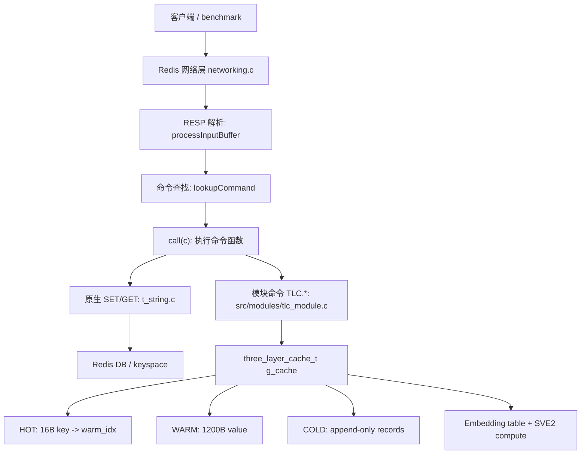
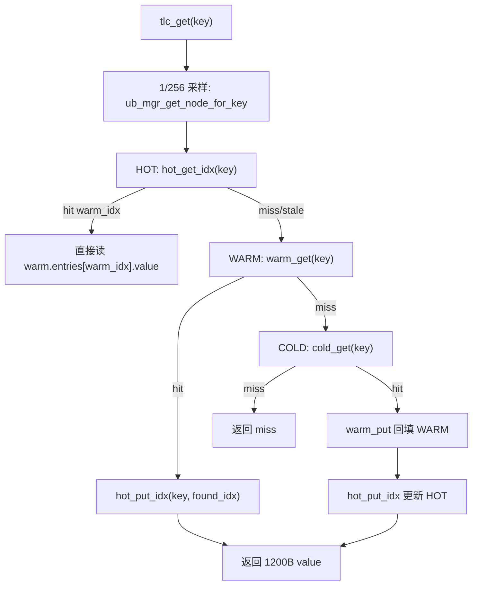
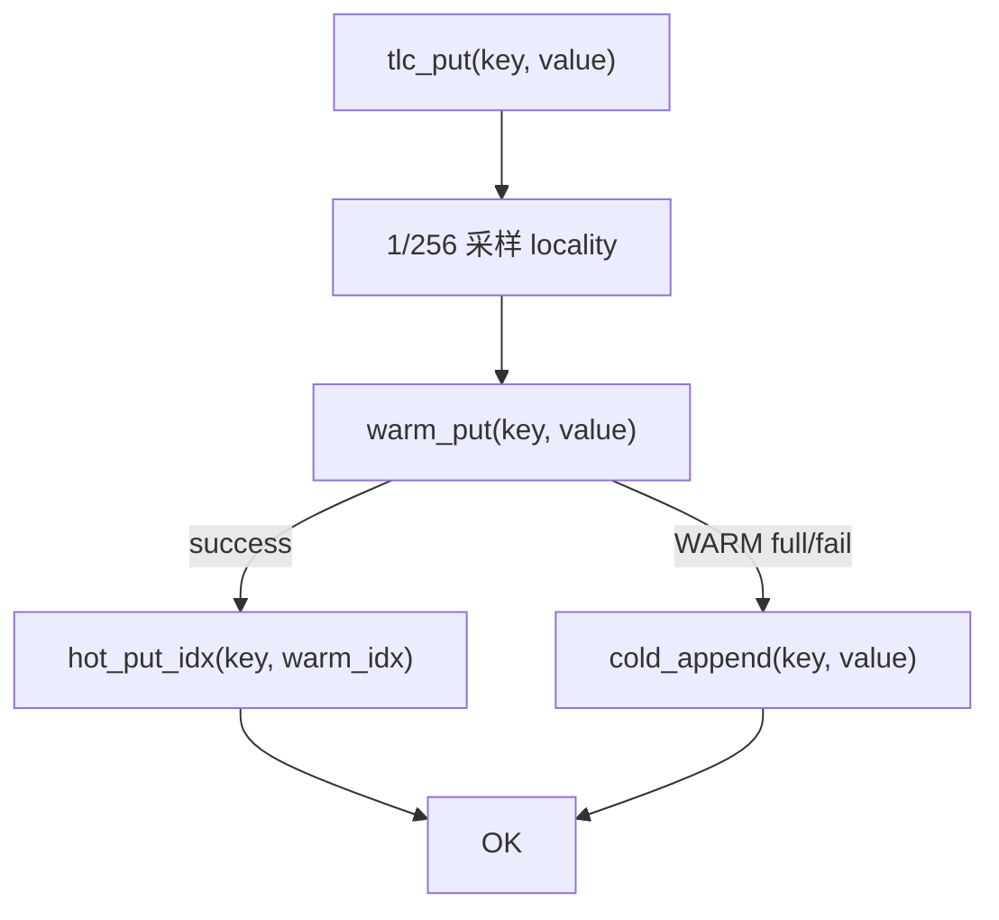
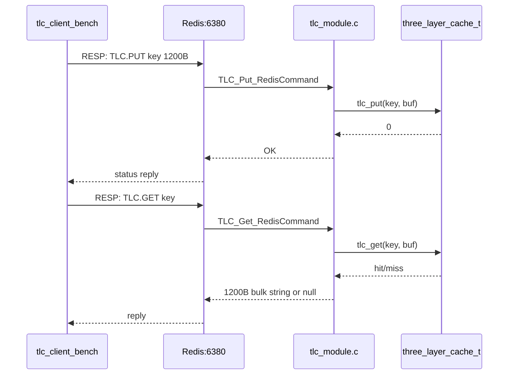
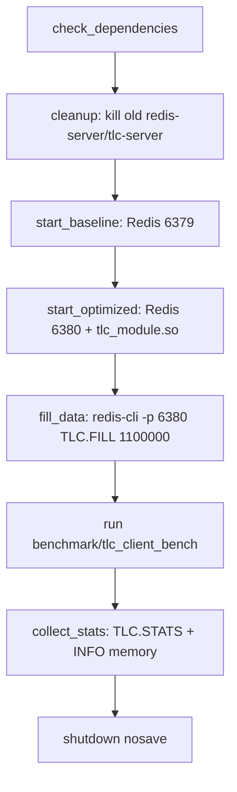

# HPC-Redis 项目代码导览与实现原理

本文面向两类读者：

- 对 Redis 本身还不熟，希望先知道请求怎么进来、命令怎么执行、数据最终放在哪里。
- 想理解这个仓库新增的 HPC-Redis / Three-Layer Cache / UB / SVE2 / benchmark 体系到底怎么组织。

文档里的路径都按仓库根目录书写。建议一边打开文件一边阅读。

## 0. 先建立整体心智模型

这个仓库可以分成两层：

1. **Redis 原生内核**：网络连接、RESP 协议解析、命令查找、事件循环、原生 `SET/GET`、RDB/AOF、集群、模块系统等。
2. **HPC-Redis 新增实验层**：`TLC` 三层缓存模块、UB memory 模拟、SVE2 向量计算核、Aeron/UDS/SHM/KCP 等传输实验，以及一批 benchmark。

最重要的区别：

- 原生 Redis `SET/GET` 走 Redis 自己的 keyspace：`redisDb -> kvstore/dict -> robj/SDS`。
- `TLC.PUT/TLC.GET` 是 Redis module 命令，数据放进模块内的全局 `three_layer_cache_t g_cache`，不放进普通 Redis keyspace。
- SVE2 指令主要用于 `float` embedding / similarity / GEMM / Adam 这类向量计算路径；普通 `TLC.GET` 读取 1200B value 的路径本身没有直接调用 SVE2 intrinsic。



## 1. Redis 基础指引

如果你以前不太了解 Redis，先记住这条主链路：

```text
main()
  -> initServer()
  -> aeMain(event loop)
  -> networking.c 读 socket
  -> processInputBuffer() 解析 RESP/inline 命令
  -> processCommand() 做命令查找、权限、集群、事务等检查
  -> call()
  -> c->cmd->proc(c) 执行具体命令
  -> addReply* 写响应缓冲
  -> writeToClient() 发回客户端
```

关键跳转：

| 主题 | 代码入口 |
|---|---|
| Redis 进程入口 | `src/server.c:7566` `main` |
| 初始化服务器状态 | `src/server.c:2842` `initServer` |
| 启动事件循环 | `src/server.c:7909` `aeMain(server.el)` |
| 解析客户端输入 | `src/networking.c:3428` `processInputBuffer` |
| 命令查找 | `src/server.c:3461` `lookupCommandLogic` |
| 命令执行入口 | `src/server.c:3808` `call` |
| 真正调用命令函数 | `src/server.c:3854` `c->cmd->proc(c)` |
| `processCommand` 调用 `call` | `src/server.c:4624` |
| 写响应给客户端 | `src/networking.c:2623` `writeToClient` |

### 1.1 RESP 不是 HTTP

本项目 benchmark 里常说 GET/PUT，但它不是 HTTP 的 `POST / GET`。客户端通过 Redis 协议发送命令。

例如 hiredis 发：

```c
redisCommand(c, "SET %s %b", keybuf, value, VALUE_SIZE);
redisCommand(c, "GET %s", keybuf);
redisCommand(c, "TLC.PUT %llu %b", key, value, VALUE_SIZE);
redisCommand(c, "TLC.GET %llu", key);
```

Redis 收到的是 RESP 格式命令，大致长这样：

```text
*3\r\n$3\r\nSET\r\n$3\r\nkey\r\n$5\r\nvalue\r\n
```

`src/networking.c:3428` 的 `processInputBuffer` 会判断是 inline 还是 multibulk RESP，然后把参数放进 `client->argv/client->argc`。

### 1.2 原生 SET/GET 怎么走

原生字符串命令在 `src/t_string.c`：

| 命令 | 入口 |
|---|---|
| `SET` | `src/t_string.c:412` `setCommand` |
| SET 通用逻辑 | `src/t_string.c:85` `setGenericCommand` |
| 写入 DB | `src/t_string.c:154` `setKeyByLink` |
| `GET` | `src/t_string.c:452` `getCommand` |
| GET 通用逻辑 | `src/t_string.c:438` `getGenericCommand` |

原生 Redis 对象大致是：

```text
Redis key string
  -> redisDb
  -> keyspace dictionary / kvstore
  -> robj
  -> SDS/string encoding
```

你读 `SET/GET` 时，建议先从 `src/t_string.c:408` 开始，而不是一上来读整个 Redis。

### 1.3 Redis Module 怎么接入

模块命令和原生命令最终都被注册到 Redis command table，只是命令处理函数来自模块。

本项目的模块入口在：

- `src/modules/tlc_module.c:246` `RedisModule_OnLoad`
- `src/modules/tlc_module.c:271` 注册 `TLC.PUT`
- `src/modules/tlc_module.c:275` 注册 `TLC.GET`
- `src/modules/tlc_module.c:279` 注册 `TLC.MPUT`
- `src/modules/tlc_module.c:283` 注册 `TLC.MGET`
- `src/modules/tlc_module.c:287` 注册 `TLC.FILL`
- `src/modules/tlc_module.c:291` 注册 `TLC.STATS`

注意：文件顶部注释提到了 `TLC.SIM`，但当前代码实际只注册了 6 个命令，没有注册 `TLC.SIM`。

## 2. HPC-Redis 新增层概览

新增层的核心是 Three-Layer Cache：

```text
TLC.PUT/TLC.GET
  -> src/modules/tlc_module.c
  -> tlc_put/tlc_get
  -> src/three_layer_cache_ub.c
  -> HOT/WARM/COLD
  -> 可选 embedding/SVE2 compute
```

主要文件：

| 文件 | 作用 |
|---|---|
| `src/modules/tlc_module.c` | Redis module，暴露 `TLC.*` 命令 |
| `src/three_layer_cache_ub.h` | 三层缓存、UB manager、SVE2 API 的结构定义 |
| `src/three_layer_cache_ub.c` | UB memory 后端 + HOT/WARM/COLD + SVE2 wrapper |
| `src/sve2_gemm.h` | SVE2 GEMV/GEMM/dot/similarity/gather 内核 |
| `src/sve2_adam.h` | SVE2 Adam/AdamW 优化器 |
| `src/aeron_ipc.h` | Aeron 风格共享内存 SPSC ring |
| `src/tlc_*_server.c` | 多种独立 TLC server / transport 实验 |
| `benchmark/*.c` | 各类压测与对比 |

## 3. 三层缓存的基本原理

三层缓存定义在 `src/three_layer_cache_ub.h`。

核心容量参数：

- `TLC_HOT_CAPACITY = 1 << 17`：128K HOT index entries。
- `TLC_WARM_CAPACITY = 1 << 20`：1M WARM value entries。
- `TLC_VALUE_SIZE = 1200`：每个 value 固定 1200B。
- `UB_NUM_NODES = 4`：模拟 4 个 UB memory node。
- `UB_NODE_MEM_SIZE = 2GB`：每个 node 2GB mmap 区域。
- `SVE2_EMB_DIM_DEFAULT = 300`：embedding 默认 300 维。

### 3.1 HOT 层：小索引，尽量不碰大 value

定义：

- `src/three_layer_cache_ub.h:96` `hot_index_t`
- `src/three_layer_cache_ub.h:103` `hot_layer_t`

`hot_index_t` 只有 16B：

```c
typedef struct {
    uint64_t key;
    int32_t  warm_idx;
    uint32_t _pad;
} hot_index_t;
```

HOT 不存 value，只存 `key -> warm_idx`。命中后直接跳到 WARM 数组下标读取 value。

为什么这样快：

- 16B entry 比 1200B value 小很多，更容易待在 cache。
- HOT 查找最多线性探测 4 个槽。
- 读路径不加大锁。
- 探测时预取下一个槽。

代码：

- `src/three_layer_cache_ub.c:168` `hot_init_ub`
- `src/three_layer_cache_ub.c:198` `hot_get_idx`
- `src/three_layer_cache_ub.c:215` `hot_put_idx`

### 3.2 WARM 层：真正保存 1200B value

定义：

- `src/three_layer_cache_ub.h:112` `warm_entry_t`
- `src/three_layer_cache_ub.h:122` `warm_layer_t`

`warm_entry_t` 里保存：

```text
key
value[1200]
state
write_ts_ns
ttl_ns
access_count
```

WARM 有两块核心内存：

- `entries`：真正的 value 数组。
- `hash_table`：key hash 后映射到 `entries` 下标。

优化点：

- 用 bitmap CAS 锁，而不是一个大 mutex。
- hash table 操作在锁内。
- 1200B `memcpy` 尽量放在锁外。
- lookup 前先 `__builtin_prefetch` hash slot。

代码：

- `src/three_layer_cache_ub.c:233` `warm_init_ub`
- `src/three_layer_cache_ub.c:274` `warm_get`
- `src/three_layer_cache_ub.c:303` `warm_put`
- `src/three_layer_cache_ub.h:65` `bmp_lock_acquire`
- `src/three_layer_cache_ub.h:83` `bmp_lock_release`

### 3.3 COLD 层：append-only 后备层

定义：

- `src/three_layer_cache_ub.h:133` `cold_record_t`
- `src/three_layer_cache_ub.h:136` `cold_layer_t`

COLD 的定位类似后备存储：

- 写满 WARM 或 WARM 写入失败时 append 到 COLD。
- 通过 `offset_index` 从 key hash 到 append offset。
- 读 COLD 命中后，会 read-through 回填 WARM，再更新 HOT。

代码：

- `src/three_layer_cache_ub.c:346` `cold_init_ub`
- `src/three_layer_cache_ub.c:380` `cold_append`
- `src/three_layer_cache_ub.c:407` `cold_get`

### 3.4 GET 路径

`tlc_get` 在 `src/three_layer_cache_ub.c:546`：



关键代码：

- `src/three_layer_cache_ub.c:547` 统计读请求。
- `src/three_layer_cache_ub.c:550` 每 256 次采样一次 UB locality。
- `src/three_layer_cache_ub.c:554` 查 HOT。
- `src/three_layer_cache_ub.c:566` 查 WARM。
- `src/three_layer_cache_ub.c:572` 查 COLD 并 read-through。

### 3.5 PUT 路径

`tlc_put` 在 `src/three_layer_cache_ub.c:583`：



关键点：

- 正常写入 WARM。
- 成功后 HOT 只记录 `key -> warm_idx`。
- WARM 失败时追加 COLD。

### 3.6 UB memory 模拟

UB manager 定义在：

- `src/three_layer_cache_ub.h:166` `ub_mem_node_t`
- `src/three_layer_cache_ub.h:181` `ub_hash_ring_t`
- `src/three_layer_cache_ub.h:187` `ub_mem_manager_t`

初始化在 `src/three_layer_cache_ub.c:78` `ub_mgr_init`。

当前实现用 `mmap` 模拟 UB memory：

- 先尝试 `MAP_HUGETLB`。
- 失败则 fallback 到普通 anonymous mmap。
- 每个 node 2GB。
- 一致性哈希 ring 负责 key 到 node 的映射。
- local node 会有更多 vnode，`UB_LOCAL_VNODE_WEIGHT = 4`，偏向本地访问。

这更像 benchmark-friendly 的 UB memory 模拟层，不是完整真实硬件总线驱动。

## 4. SVE2 指令放在哪里

先说结论：

- 普通 `TLC.PUT/TLC.GET` 的 1200B value 缓存路径没有直接执行 `svld1_f32/svmla_f32_m` 等 SVE2 intrinsic。
- SVE2 主要在 `src/sve2_gemm.h` 和 `src/sve2_adam.h`。
- `src/three_layer_cache_ub.c` 负责把 UB memory 里的 embedding table 接到 SVE2 wrapper。
- 一些 transport benchmark 的 MGET 注释写着 “SVE2 Gather”，但实际代码多是 HOT prefetch + 循环 `tlc_get`；真正的 SVE2 intrinsic 在 float embedding/GEMM/Adam 代码里。

### 4.1 SVE2 GEMV/GEMM

入口：

- `src/sve2_gemm.h:83` `sve2_gemv_f32`
- `src/sve2_gemm.h:171` `sve2_gemm_f32`

核心 intrinsic：

- `svcntw()`：当前 SVE vector 能装多少个 32-bit lane。
- `svwhilelt_b32_u64()`：生成 predicate mask，处理尾部不足一整个 vector 的情况。
- `svld1_f32()`：按 predicate load float vector。
- `svmla_f32_m()`：masked fused multiply-add。
- `svst1_f32()`：store float vector。

GEMV 的优化思路：

- 针对 batch 很小的 MoE cold expert 场景。
- 一个输入 row 乘 W 矩阵。
- 内层 K 维 4-way unroll，用 4 个 accumulator 隐藏 FMA latency。
- 对 W 预取，尽量让 L3/L1 pipeline 不断。

GEMM 的优化思路：

- `K` 维按 `SVE2_TILE_K = 256` 分块，让 B panel 尽量留在 L3。
- `M` 维每次处理 4 行，形成 4 条独立 accumulator chain。
- `N` 维由 SVE vector lane 并行。

### 4.2 SVE2 dot/norm/cosine

入口：

- `src/sve2_gemm.h:255` `sve2_dot_f32`
- `src/sve2_gemm.h:270` `sve2_norm_f32`
- `src/sve2_gemm.h:286` `sve2_cosine_similarity`

它们是向量相似度基础操作。

### 4.3 fused gather + similarity

入口：

- `src/sve2_gemm.h:311` `sve2_fused_gather_similarity`
- `src/three_layer_cache_ub.c:707` `tlc_sve2_similarity`

流程：

```text
indices[] 给出 embedding id
  -> emb_base + id * dim 找到 embedding row
  -> prefetch 后续 row
  -> SVE2 计算 dot 和 norm
  -> 输出 cosine similarity
```

这里的 “gather” 不是单条 SVE gather intrinsic，而是按 embedding id 访问分散的 row，然后 row 内用 SVE contiguous vector load/FMA。

### 4.4 fused gather + GEMM

入口：

- `src/sve2_gemm.h:345` `sve2_fused_gather_gemm`
- `src/three_layer_cache_ub.c:725` `tlc_sve2_gemm`

两种路径：

- `n_rows <= 4`：逐行走 `sve2_gemv_f32`。
- 大 batch：先把分散 row copy 到 contiguous buffer，再调用 `sve2_gemm_f32`。

### 4.5 batch gather load

入口：

- `src/sve2_gemm.h:376` `sve2_batch_gather_load`
- `src/three_layer_cache_ub.c:745` `tlc_sve2_gather`

作用：

- 给一组 embedding id。
- 从 embedding table 复制对应 row 到输出 buffer。
- AArch64 下 row 内用 `svld1_f32` + `svst1_f32`。

### 4.6 SVE2 Adam

入口：

- `src/sve2_adam.h` `sve2_adam_update`
- `benchmark/three_layer_benchmark_ub.c:148` `cpu_adam_worker`
- `benchmark/three_layer_benchmark_ub.c:160` `run_cpu_adam`

它模拟把 optimizer state 放到 CPU/UB memory，由 CPU SVE2 执行 Adam 更新，释放 NPU HBM。

## 5. Redis module 数据流：TLC.PUT / TLC.GET / TLC.FILL

### 5.1 模块初始化

`src/modules/tlc_module.c:246`：

```text
RedisModule_OnLoad
  -> RedisModule_Init(ctx, "tlc", ...)
  -> tlc_init(&g_cache, 0, 0)
  -> tlc_emb_init(&g_cache, SVE2_EMB_TABLE_SIZE, SVE2_EMB_DIM_DEFAULT)
  -> RedisModule_CreateCommand("TLC.PUT", ...)
  -> RedisModule_CreateCommand("TLC.GET", ...)
  -> ...
```

`g_cache` 是模块内全局变量：

```c
static three_layer_cache_t g_cache;
```

所以 TLC 数据不在 Redis 普通 DB 中。

### 5.2 `TLC.PUT`

入口：`src/modules/tlc_module.c:41`

流程：

```text
TLC.PUT <key_id> <value_bytes>
  -> parse key_id 为 long long
  -> RedisModule_StringPtrLen 取 value
  -> pad/truncate 到 1200B
  -> tlc_put(&g_cache, key_id, buf)
  -> 返回 OK
```

### 5.3 `TLC.GET`

入口：`src/modules/tlc_module.c:75`

流程：

```text
TLC.GET <key_id>
  -> parse key_id
  -> tlc_get(&g_cache, key_id, buf)
  -> 命中: RedisModule_ReplyWithStringBuffer(ctx, buf, 1200)
  -> 未命中: RedisModule_ReplyWithNull(ctx)
```

### 5.4 `TLC.FILL`

入口：`src/modules/tlc_module.c:163`

流程：

```text
TLC.FILL <count>
  -> for i in 0..count-1:
       生成 1200B 随机 value
       tlc_put(&g_cache, i, value)
  -> 返回填充耗时和 ops/s
```

这就是 `benchmark/run_tlc_client_bench.sh` 的 TLC 预载方式。

## 6. Benchmark 体系

这个仓库 benchmark 可以分成两代。

### 6.1 早期统一 benchmark_common 体系

公共头：`benchmark/benchmark_common.h`

用途：

- 定义 embedding 维度、UID/Item 规模、Redis/SuperNode 规模。
- 提供 `benchmark_stats_t`。
- 提供纳秒计时、延迟统计、随机 embedding、hash。

代表文件：

| 文件 | 作用 |
|---|---|
| `benchmark/redis_traditional_benchmark.c` | 用 hiredis 连真实 Redis，测传统 Redis baseline |
| `benchmark/supernode_benchmark.c` | 模拟 SuperNode + UB.mem + SVE2 batch gather |
| `benchmark/supernode_real_benchmark.c` | 更真实的 SuperNode 性能测试 |
| `benchmark/compare_results.c` | 解析输出并生成对比报告 |

这组更像“架构级估算”：传统 Redis 集群 vs SuperNode 架构。

### 6.2 Three-Layer Cache 内核 benchmark

| 文件 | 测什么 |
|---|---|
| `benchmark/three_layer_benchmark.c` | 本地内存版三层缓存，读多/写多/failover/recovery |
| `benchmark/three_layer_benchmark_ub.c` | UB + SVE2 + Adam/GEMM/NPU proxy 综合测试 |
| `benchmark/gemm_compare.c` | GEMM v7 vs v8 micro-kernel 对比 |

`benchmark/three_layer_benchmark_ub.c` 是最综合的一个：

- `:118` `run_cache` 测 cache read-heavy。
- `:160` `run_cpu_adam` 测 CPU SVE2 Adam。
- `:343` `run_cpu_gemm` 测 CPU GEMM。
- `:430` pre-fill WARM。
- `:448` Section A: Cache + SVE2 regression。
- `:467` Section B: Adam offload。
- `:502` Section C: cold expert GEMV/GEMM。
- `:513` Section D: NPU+CPU event-driven pipeline。

### 6.3 Redis 网络入口 benchmark

代表文件：`benchmark/tlc_client_bench.c`

这是最适合理解“Redis 数据怎么进来”的 benchmark。

脚本：`benchmark/run_tlc_client_bench.sh`

脚本流程：

- `:111` 启动 baseline Redis `6379`。
- `:143` 启动 Redis + `tlc_module.so` `6380`。
- `:176` 执行 `redis-cli -p 6380 TLC.FILL 1100000`。
- `:188` 运行 `benchmark/tlc_client_bench`。
- `:209` 收集 `TLC.STATS` 和 `INFO memory`。

client 流程：

- `benchmark/tlc_client_bench.c:46` `bench_worker` 跑 `TLC.PUT/TLC.GET`。
- `benchmark/tlc_client_bench.c:72` 非 pipeline `TLC.PUT`。
- `benchmark/tlc_client_bench.c:77` 非 pipeline `TLC.GET`。
- `benchmark/tlc_client_bench.c:97` pipeline `TLC.PUT`。
- `benchmark/tlc_client_bench.c:100` pipeline `TLC.GET`。
- `benchmark/tlc_client_bench.c:173` `std_worker` 跑原生 `SET/GET`。
- `benchmark/tlc_client_bench.c:300` baseline Redis 预填充。
- `benchmark/tlc_client_bench.c:311` TLC 80R/20W no pipeline。
- `benchmark/tlc_client_bench.c:312` TLC 80R/20W pipeline。
- `benchmark/tlc_client_bench.c:313` TLC 100% GET。
- `benchmark/tlc_client_bench.c:320` optimized Redis 原生 SET 预填充。

数据流：



### 6.4 Aeron / UDS / SHM / transport benchmark

这些 benchmark 不一定走 Redis server，它们更多是给独立 `tlc-*server` 做 transport 对比。

| 文件 | 重点 |
|---|---|
| `benchmark/tlc_aeron_bench.c` | UDS 控制面 + Aeron SPSC ring 数据面 |
| `benchmark/tlc_transport_bench.c` | TCP vs UDS vs SHM |
| `benchmark/tlc_all_transport_bench.c` | TCP/UDS/SHM/io_uring 风格综合 |
| `benchmark/tlc_raw_bench.c` | raw TCP-like 二进制协议 |
| `benchmark/tlc_kcp_bench.c` | UDP + KCP |
| `benchmark/bench_unified_client.c` | unified server client |
| `benchmark/bench_dpdk_client.c` | DPDK-style client |
| `benchmark/tlc_v10_bench.c` | V10 zero-copy response 实验 |
| `benchmark/tlc_v13_bench.c` | V13 batch proxy 实验 |
| `benchmark/tlc_v14_bench.c` | V14 sharded batch worker 实验 |
| `benchmark/tlc_fc_bench.c` | flat combining / TTAS 实验 |

最具代表性的 transport benchmark 是 `benchmark/tlc_aeron_bench.c`：

- `:45` 连接 UDS `/tmp/tlc.sock`。
- `:54` 通过 UDS 分配 Aeron channel。
- `:63` 打开 `/aeron_tlc_req_<id>`、`/aeron_tlc_resp_<id>`、`/aeron_tlc_lresp_<id>`。
- `:100` `aeron_worker` 每线程一个 channel。
- `:132` 构造 `OP_PUT` 二进制请求。
- `:136` 构造 `OP_GET` 二进制请求。
- `:141` `aeron_publish` 写 request ring。
- `:149` `aeron_poll` 读 response ring。
- `:204` `aeron_mget_worker` 做 MGET。
- `:221` MGET 请求格式 `[0x03][4B count][N * 8B key]`。
- `:245` 从 large response ring 读批量结果。
- `:309` `fill_uds` 预填充 110 万条。

对应 server 看：

- `src/tlc_aeron_server.c`
- `src/aeron_ipc.h`

## 7. 建议读代码路线图

下面是一条比较顺的路线。不要从 README 的长分析记录开始，容易被噪音带偏。

### 路线 A：先懂 Redis 基础

1. `src/server.c:7566`：看 `main`，理解 Redis 如何启动。
2. `src/server.c:2842`：看 `initServer`，知道全局 `server` 状态怎么初始化。
3. `src/ae.c`：快速扫事件循环抽象，知道 Redis 是事件驱动。
4. `src/networking.c:3428`：看 `processInputBuffer`，知道 RESP 怎么变成 `argv/argc`。
5. `src/server.c:4280` 到 `src/server.c:4628`：看 `processCommand` 主体，知道命令查找、检查、执行。
6. `src/server.c:3808`：看 `call`，找到 `c->cmd->proc(c)`。
7. `src/t_string.c:412`、`src/t_string.c:452`：看原生 `SET/GET`。

读完这一组，你就能回答“一个 Redis 命令如何进入服务器并被执行”。

### 路线 B：再懂 TLC module 如何挂进 Redis

1. `src/modules/tlc_module.c:246`：模块加载入口。
2. `src/modules/tlc_module.c:255`：加载时初始化 `g_cache`。
3. `src/modules/tlc_module.c:271`：注册 `TLC.PUT`。
4. `src/modules/tlc_module.c:275`：注册 `TLC.GET`。
5. `src/modules/tlc_module.c:41`：`TLC.PUT` handler。
6. `src/modules/tlc_module.c:75`：`TLC.GET` handler。
7. `src/modules/tlc_module.c:163`：`TLC.FILL` handler。

读完这一组，你就能回答“benchmark 的 `TLC.PUT/TLC.GET/TLC.FILL` 进 Redis 后发生了什么”。

### 路线 C：读三层缓存结构

1. `src/three_layer_cache_ub.h:26`：容量和调优参数。
2. `src/three_layer_cache_ub.h:51`：bitmap CAS 锁。
3. `src/three_layer_cache_ub.h:96`：HOT 结构。
4. `src/three_layer_cache_ub.h:112`：WARM 结构。
5. `src/three_layer_cache_ub.h:133`：COLD 结构。
6. `src/three_layer_cache_ub.h:166`：UB node。
7. `src/three_layer_cache_ub.h:187`：UB manager。
8. `src/three_layer_cache_ub.h:210`：总结构 `three_layer_cache_t`。

读完这一组，你就能画出 HOT/WARM/COLD 的内存布局。

### 路线 D：读三层缓存运行路径

1. `src/three_layer_cache_ub.c:78`：`ub_mgr_init`。
2. `src/three_layer_cache_ub.c:168`：`hot_init_ub`。
3. `src/three_layer_cache_ub.c:233`：`warm_init_ub`。
4. `src/three_layer_cache_ub.c:346`：`cold_init_ub`。
5. `src/three_layer_cache_ub.c:486`：`tlc_init`。
6. `src/three_layer_cache_ub.c:546`：`tlc_get`。
7. `src/three_layer_cache_ub.c:583`：`tlc_put`。

读完这一组，你就能解释三层缓存的读写优化。

### 路线 E：读 SVE2 放置点

1. `src/three_layer_cache_ub.c:658`：embedding table 初始化。
2. `src/three_layer_cache_ub.c:707`：`tlc_sve2_similarity` wrapper。
3. `src/three_layer_cache_ub.c:725`：`tlc_sve2_gemm` wrapper。
4. `src/three_layer_cache_ub.c:745`：`tlc_sve2_gather` wrapper。
5. `src/sve2_gemm.h:83`：GEMV kernel。
6. `src/sve2_gemm.h:171`：GEMM kernel。
7. `src/sve2_gemm.h:311`：fused gather + similarity。
8. `src/sve2_gemm.h:345`：fused gather + GEMM。
9. `src/sve2_gemm.h:376`：batch gather load。
10. `src/sve2_adam.h`：Adam optimizer。

读完这一组，你就能回答“SVE2 到底在哪里执行，服务于什么计算”。

### 路线 F：读 benchmark

建议顺序：

1. `benchmark/run_tlc_client_bench.sh`：先看一键脚本。
2. `benchmark/tlc_client_bench.c`：理解 Redis/hiredis 入口。
3. `src/modules/tlc_module.c`：把 benchmark 命令接到模块。
4. `src/three_layer_cache_ub.c`：把模块调用接到三层缓存。
5. `benchmark/tlc_aeron_bench.c`：理解 bypass Redis 网络栈的 transport benchmark。
6. `src/tlc_aeron_server.c` 和 `src/aeron_ipc.h`：理解 Aeron 数据面。
7. `benchmark/three_layer_benchmark_ub.c`：理解 UB + SVE2 + Adam/GEMM 综合测试。

## 8. 重点 benchmark 具体原理

### 8.1 `run_tlc_client_bench.sh`

目标：用真实 Redis 服务器和 hiredis client 测三条路径。

三条路径：

1. `6379` baseline Redis 原生 `SET/GET`。
2. `6380` Redis + TLC module 的 `TLC.PUT/TLC.GET`。
3. `6380` 同一个 optimized Redis 上的原生 `SET/GET`。

流程：



注意：

- 脚本中的 `TLC.FILL` 只填充 `6380` 的 TLC cache。
- `6379` baseline 的预填充是在 `tlc_client_bench.c` 内部通过 `SET` 完成。

### 8.2 `tlc_client_bench.c`

核心变量：

- `VALUE_SIZE = 1200`
- 默认 `ops = 500000`
- 默认 `threads = 8`
- 默认 `pipeline = 16`
- `max_key = 1100000`
- key 分布是 `zipf_key`，模拟热点访问。

TLC worker：

```text
redisConnect("127.0.0.1", 6380)
生成线程本地 1200B value
for each op:
  key = zipf_key(seed, max_key)
  is_write = rand % 100 < write_pct
  if write: TLC.PUT key value
  else:     TLC.GET key
pipeline > 1 时用 redisAppendCommand + redisGetReply
```

标准 Redis worker：

```text
redisConnect(port)
key = "k:<number>"
if write: SET key value
else:     GET key
```

统计方式：

- 每个线程记录自己的耗时。
- 汇总取最慢线程耗时作为总耗时。
- `QPS = total_ops / max_thread_elapsed`。
- `Lat = max_thread_elapsed / total_ops`。

### 8.3 `tlc_aeron_bench.c`

目标：测试绕过 Redis 网络栈后的独立 TLC server transport。

数据面：

- 每个 client 线程通过 UDS 请求 server 创建一个 Aeron channel。
- request/response 用 `/dev/shm` 中的 SPSC ring。
- `aeron_publish` 和 `aeron_poll` 是共享内存 + atomic，不走 socket syscall。

控制面：

- UDS `/tmp/tlc.sock` 用于 channel allocation、fill 等。

MGET：

```text
request:  [0x03][4B count][N * 8B key]
response: [4B count][N * (1B status + 1200B value)]
```

这个 benchmark 适合研究 transport 优化，但它已经不是标准 Redis server 网络入口了。

## 9. 这个项目里“优化”的核心思想

### 9.1 减少大 value 被频繁搬运

HOT 只保存 16B index，不保存 1200B value。热路径先查小索引，命中后才按下标访问 WARM value。

### 9.2 缩小锁粒度

WARM 用 bitmap CAS 按 bucket 锁，而不是全局 mutex。HOT 读写尽量 lock-free。

### 9.3 把大 memcpy 移出锁

`warm_get/warm_put` 尽量让锁只保护 hash/index 结构，1200B value copy 放到锁外。

### 9.4 降低全局 atomic 抖动

HOT/WARM hit/miss 使用 thread-local 计数，最后 flush，避免高并发下所有线程争抢同一个 atomic counter。

### 9.5 用 prefetch 降低访存停顿

HOT/WARM lookup 和 batch/MGET 中都大量使用 `__builtin_prefetch`。

### 9.6 UB memory 模拟统一大内存池

用多 node mmap + 一致性哈希模拟统一内存池，让 HOT/WARM/COLD/embedding table 可以被统一管理。

### 9.7 SVE2 放在真正的向量计算处

SVE2 不是 Redis 字符串 `GET` 的必要优化点。它适合：

- embedding similarity
- dot/norm/cosine
- GEMV/GEMM
- Adam optimizer
- row 内连续 float vector load/FMA

### 9.8 transport benchmark 绕开 Redis 网络栈

Aeron/SHM/KCP/DPDK-style benchmark 试图把 Redis TCP/RESP 网络成本拿掉，直接测 cache 和 IPC 数据面能力。

## 10. 常见误区

### 10.1 `TLC.GET` 和 Redis `GET` 是一回事吗

不是。

- Redis `GET k` 读 Redis DB。
- `TLC.GET 123` 调模块里的 `tlc_get(&g_cache, 123, buf)`。

### 10.2 `TLC.FILL` 会填 Redis 普通 keyspace 吗

不会。它填的是模块自己的 `g_cache`。

### 10.3 普通 `TLC.GET` 是否用了 SVE2

当前代码没有。它走 HOT/WARM/COLD 的 1200B value cache lookup。SVE2 在 embedding/GEMM/Adam 路径。

### 10.4 benchmark 里的 `POST/GET` 是 HTTP 吗

不是 HTTP。这里是 Redis 命令或独立 TLC binary protocol。

### 10.5 `benchmark_common.h` 是否被所有 benchmark 复用

不是。它主要服务早期 Redis vs SuperNode 架构对比。后来的 TLC/Aeron/V10/V13/V14 benchmark 基本是各自独立 harness。

## 11. 一天内读完项目的建议计划

### 第 1 小时：Redis 主链路

读：

- `src/server.c:7566`
- `src/networking.c:3428`
- `src/server.c:4280`
- `src/server.c:3808`
- `src/t_string.c:412`
- `src/t_string.c:452`

目标：知道普通 Redis 命令怎么从 socket 到命令函数。

### 第 2 小时：TLC module

读：

- `src/modules/tlc_module.c:246`
- `src/modules/tlc_module.c:41`
- `src/modules/tlc_module.c:75`
- `src/modules/tlc_module.c:163`

目标：知道 `TLC.PUT/TLC.GET/TLC.FILL` 怎么进入 cache。

### 第 3-4 小时：三层缓存

读：

- `src/three_layer_cache_ub.h`
- `src/three_layer_cache_ub.c:78`
- `src/three_layer_cache_ub.c:198`
- `src/three_layer_cache_ub.c:274`
- `src/three_layer_cache_ub.c:303`
- `src/three_layer_cache_ub.c:546`
- `src/three_layer_cache_ub.c:583`

目标：能画出 HOT/WARM/COLD 的结构和 GET/PUT 流程。

### 第 5 小时：SVE2

读：

- `src/three_layer_cache_ub.c:658`
- `src/three_layer_cache_ub.c:707`
- `src/three_layer_cache_ub.c:725`
- `src/sve2_gemm.h:83`
- `src/sve2_gemm.h:171`
- `src/sve2_gemm.h:311`
- `src/sve2_gemm.h:376`
- `src/sve2_adam.h`

目标：区分 cache lookup 和 vector compute。

### 第 6 小时：benchmark

读：

- `benchmark/run_tlc_client_bench.sh`
- `benchmark/tlc_client_bench.c`
- `benchmark/tlc_aeron_bench.c`
- `benchmark/three_layer_benchmark_ub.c`

目标：知道每类 benchmark 到底在测什么，以及数据如何预载。

## 12. 最小调试路径

如果你想亲手跑通并验证数据流，建议用这条最小路径：

1. 编译 Redis 和模块。
2. 启动 `redis-server` 加载 `tlc_module.so`。
3. 用 `redis-cli` 手动执行：

```bash
./src/redis-server --port 6380 --loadmodule ./src/modules/tlc_module.so
./src/redis-cli -p 6380 TLC.FILL 10
./src/redis-cli -p 6380 TLC.GET 1
./src/redis-cli -p 6380 TLC.STATS
```

4. 对照代码：

```text
TLC.FILL -> src/modules/tlc_module.c:163 -> tlc_put
TLC.GET  -> src/modules/tlc_module.c:75  -> tlc_get
tlc_get  -> src/three_layer_cache_ub.c:546
```

5. 再跑 benchmark：

```bash
./benchmark/run_tlc_client_bench.sh 500000 8 16
```

## 13. 快速索引

| 你想知道 | 先看 |
|---|---|
| Redis 怎么启动 | `src/server.c:7566` |
| Redis 怎么解析请求 | `src/networking.c:3428` |
| Redis 怎么执行命令 | `src/server.c:3808`, `src/server.c:4624` |
| 原生 SET/GET | `src/t_string.c:412`, `src/t_string.c:452` |
| TLC module 如何加载 | `src/modules/tlc_module.c:246` |
| TLC.PUT | `src/modules/tlc_module.c:41` |
| TLC.GET | `src/modules/tlc_module.c:75` |
| TLC.FILL | `src/modules/tlc_module.c:163` |
| 三层缓存结构 | `src/three_layer_cache_ub.h:96`, `:112`, `:133`, `:210` |
| 三层缓存初始化 | `src/three_layer_cache_ub.c:486` |
| 三层缓存 GET | `src/three_layer_cache_ub.c:546` |
| 三层缓存 PUT | `src/three_layer_cache_ub.c:583` |
| UB memory 模拟 | `src/three_layer_cache_ub.c:78` |
| SVE2 GEMV | `src/sve2_gemm.h:83` |
| SVE2 GEMM | `src/sve2_gemm.h:171` |
| SVE2 similarity | `src/sve2_gemm.h:311` |
| SVE2 gather | `src/sve2_gemm.h:376` |
| Adam SVE2 | `src/sve2_adam.h` |
| Redis 网络 benchmark | `benchmark/tlc_client_bench.c` |
| 一键 benchmark | `benchmark/run_tlc_client_bench.sh` |
| Aeron IPC benchmark | `benchmark/tlc_aeron_bench.c` |
| UB/SVE 综合 benchmark | `benchmark/three_layer_benchmark_ub.c` |

