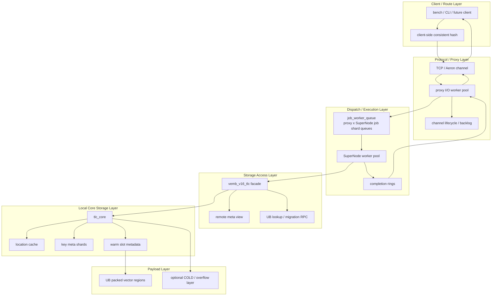
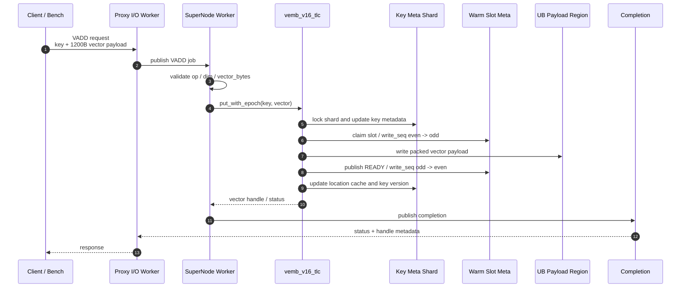
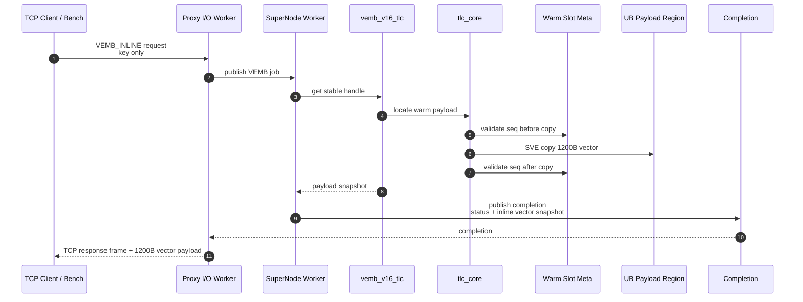
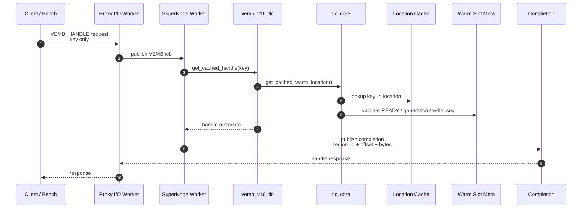
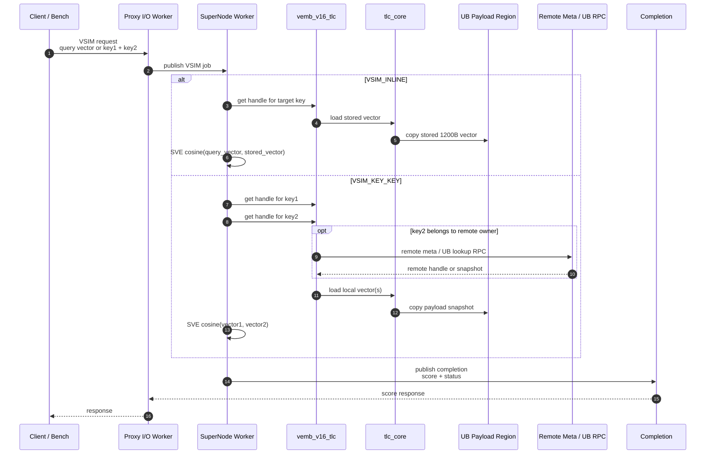

# 基于鲲鹏超节点的 hpc-redis 推荐特征引擎架构设计文档

## 1 文档修改记录

| 时间 | 内容 | 人员 |
| --- | --- | --- |
| 2026-07-22 | 梳理 hpc-redis 架构层次、核心链路与优化点 | Codex |
| 2026-07-23 | 补充关键优化设计与性能收益说明，突出当前架构自身的设计闭环 | Codex |

## 2 简介

### 2.1 目的

本文档用于概述 hpc-redis 在推荐特征向量场景下的架构设计。文档重点说明 hpc-redis 如何从原生 Redis 通用命令路径，演进为面向固定向量读写和相似度计算的 VEMB V16 专用数据面，并梳理系统分层、模块分解、关键时序、设计约束、关键优化设计与性能收益。

### 2.2 背景
hpc-redis 面向高并发推荐特征访问场景. 典型压测和业务建模场景采用 `80%` 读、`20%` 写的 mixed workload：读侧通过 `VEMB` 获取向量 handle 或 inline payload，写侧通过 `VADD` 更新已有向量。该比例用于模拟推荐特征服务中“高频召回/查询 + 持续特征更新”的主路径：大部分请求读取 embedding 参与召回、排序或相似度计算，少量请求写入或覆盖最新特征，要求读路径保持低延迟，同时写路径不能破坏已有 handle、slot generation 和迁移一致性。

原生 Redis 的优势是通用命令语义、对象模型和主线程串行一致性；但在固定形态向量负载下，RESP 解析、Redis command dispatch、module callback、blocked-client/unblock、对象封装和主线程执行面会共同限制吞吐。hpc-redis 因此把向量热路径拆出，形成：

```text
client / benchmark
  -> TCP or Aeron channel
  -> proxy I/O worker pool
  -> SuperNode worker pool
  -> TLC local storage / UB warm payload / remote meta
  -> completion / response
```

该设计不是“给 Redis 加几个线程”，而是为 `VADD`、`VEMB`、`VREM`、`VSIM` 等固定向量操作提供独立协议、独立调度、独立存储与独立返回路径。

### 2.3 Overview：多 SuperNode 与一致性 Hash

多 SuperNode 采用一一对应模型：

```text
Proxy 0 <-> SuperNode 0
Proxy 1 <-> SuperNode 1
...
Proxy N <-> SuperNode N
```

client/bench 根据 `vector_key` 构建 consistent hash ring 并选择 endpoint；server 侧保持无拓扑、无二次 hash。该模型降低 proxy 复杂度，代价是 CLI/bench/未来 client 必须共享同一 ring 规则。

## 3 设计约束

### 3.1 遵循标准/协议

- VEMB V16 自定义二进制协议：`VEMB_V16_MAGIC`、`VEMB_V16_VERSION`、固定 frame type 与 data op，定义在 `src/vemb_v16_protocol.h`。
- TCP transport 第一阶段使用 persistent connection + binary frame，支持 `HELLO/WELCOME/REQUEST/RESPONSE/STATS/CLOSE` 等 frame。
- Aeron 路径保留 handle/mmap 语义，TCP 路径下完整向量读取使用 `VEMB_V16_OP_VEMB_INLINE`。
- 多 endpoint 路由使用 client-side consistent hash，virtual node hash 使用 `vemb_v16_murmur3()`。
- 默认向量维度为 300，协议上限为 `VEMB_V16_MAX_DIM`。

### 3.2 约束/限制

- proxy 不持有全局拓扑，不读写 WARM/COLD，不执行向量计算。
- SuperNode owns execution；当前部分初始化路径仍在 proxy 创建阶段承载 storage/TLC，但语义目标是 SuperNode owns storage。
- `region_id` 是外部稳定 warm region 身份，`region_index` 是 server 本地数组下标，不能混用。
- WARM handle 永远指向 WARM data region，不直接暴露 COLD handle；COLD read-through 需要先 promote 到 WARM。
- TCP 下 `VEMB_HANDLE` 不作为跨主机读完整 vector 的语义；完整 payload 返回由 inline response 承担。
- Aeron 模式需要运行在满足 UB 直连或本机共享内存直连条件的环境中，client 必须能够 attach/mmap 对应 WARM data region；不满足该条件时应使用 TCP inline payload 语义。
- 迁移、tombstone、source fence、owner generation 必须共同防止 cutover/source-gc 期间读到旧位置。

## 3 第一层设计描述
### 3.1 架构图



- 跨 SuperNode 路由在 client/bench/CLI 侧完成，server 内 proxy 不做二次 hash。
- proxy 负责接入、channel 生命周期、frame parse、job dispatch、completion drain 和 response write。
- SuperNode worker 是真正执行 `VADD/VEMB/VREM/VSIM` 的数据面执行线程。
- TLC 是 SuperNode 的向量存储访问层，不只是传统意义上的三层缓存。
- UB region 只承载 packed vector bytes，metadata、锁、hash table、迁移状态留在 SuperNode 私有内存。

### 3.2 总体结构解释

#### 3.2.1 Client / Route

`CLI` 负责生成 `VADD/VEMB/VREM/VSIM` 请求，并在多 endpoint 场景下根据 `client-side consistent_hash(key)` 选择目标 endpoint。

#### 3.2.2 Protocol / Transport
协议层由 VEMB V16 request/response 语义与 transport 共同组成，当前主要包括 TCP 和 Aeron 两类路径。两种 transport 都使用统一的 request/response encode、decode 逻辑，只是在承载介质和 payload 返回方式上不同。
- TCP 模式: 通信协议走 TCP 协议栈；在 vemb 读取数据时 `VEMB_INLINE` 成功响应返回 response metadata 并携带完整 300 维 FP32 向量数据
- Aeron 模式: 通信协议走 UB 通信协议, 基于 ub 实现的 ring 交换 request/response。`VEMB_HANDLE` 返回 `{region_id, offset, bytes}`，client mmap warm region 后本地读取 payload。完整 vector 不随 response ring 返回，而是留在 UB payload region 中，因此更适合本机高吞吐。

#### 3.2.3 Proxy

proxy 负责接入、channel 生命周期、frame parse、job dispatch、completion drain 和 response write。

```text
vemb_v16_proxy
  proxy I/O worker pool
  per-channel lifecycle / backlog / completion boundary
```

`proxy I/O worker pool` 负责解析 TCP/Aeron frame，管理 fd/ring poll、channel 生命周期、job dispatch 和 completion drain。proxy 只搬运协议 frame、key、inline payload 或 completion snapshot，不访问 TLC metadata，也不做向量计算。

`channel lifecycle / backlog` 维护 channel id、连接关闭、慢客户端回压和待写 response。per-channel completion/backlog 保存 response frame；在 TCP inline 模式下，backlog 可能暂存约 `1200B` 的 payload snapshot。

#### 3.2.4 job_worker_queue

`job_worker_queue` 是 proxy I/O worker 与 SuperNode worker 之间的调度层，对应 `proxy_worker x supernode_worker` job shard queues。proxy 完成 request decode 和轻量校验后，将请求落到 job pool slot，并向 `job_worker_queue` 发布轻量 `job_ref`；SuperNode worker 从该队列批量 poll `job_ref`，再回到 job pool 找到完整 job 执行。

这个层次的核心目标是把 `socket -> request -> job` 压缩成 `socket -> jobs`，同时避免跨 worker 队列搬运完整 1200B vector payload。后续“数据流 batch 化与 job_ref 轻量调度”会展开 `job pool + job_ref` 的具体优化方式。

#### 3.2.5 Worker / SuperNode

执行层由 SuperNode worker pool 和 `VADD/VREM/VEMB/VSIM` handlers 组成。

`SuperNode worker pool` 执行 `VADD/VREM/VEMB/VSIM`，调用 TLC，生成 completion。每次 `VADD/VSIM_INLINE` 消费约 `1200B` 请求 vector；`VEMB_INLINE` 生成约 `1200B` response snapshot；handle 响应只返回 location 元数据。

#### 3.2.6 Storage Access / TLC

存储访问层由 `vemb_v16_tlc facade`、remote meta view、UB lookup RPC 和 migration API 组成。

`vemb_v16_tlc facade` 将本地 core location 转为 vector handle，并处理 remote meta、UB lookup RPC 和迁移控制。handle 由 `region_id/local_slot/offset/bytes/owner_generation` 等元数据组成，不承载完整 Redis object。

`remote meta / UB lookup / migration RPC` 支撑跨 owner key-key VSIM、remote handle repair、scale-out 和迁移。该路径主要传 key、owner、epoch、handle、snapshot/delta 元数据，尽量避免默认跨节点搬完整 vector。

#### 3.2.7 Local Core Storage

本地核心存储层由 `tlc_core`、location cache、key meta shards、warm region runtime 和 warm slot metadata 组成。

`tlc_core` 是本地向量存储核心，维护 location cache、key meta shard、warm slot metadata 和一致性。metadata 常驻 SuperNode 私有内存；每个 key 关联一个 warm location；payload 位于 UB region。

#### 3.2.8 Payload Region

`UB packed vector regions` 承载真正的 embedding bytes。默认每条向量 `300 * 4 = 1200B`；容量约为 `max_vectors * 1200B`，默认 `131072` 条约 `150MiB` payload。

VEMB V16 的基本对象不是 Redis object，而是固定 stride 的 embedding payload：

```text
key_hash = murmur3(vector_key)
location = {region_id, region_index, local_slot, offset, bytes, owner_generation}
payload = mapped_addr + offset
```

读路径优先使用 cached handle。cache hit 之后仍要验证 warm slot 是否处于 READY、`write_seq` 是否为偶数且 copy 前后不变、`owner_generation` 是否匹配，从而避免 stale handle 和半写 payload。

写路径先按 key hash 进入 key meta shard，更新 key version、tombstone/fence 状态和 location cache；payload 写入 warm slot 时通过 `write_seq` 从偶数切到奇数再发布回偶数。

VSIM 分为两类：

- `VSIM_INLINE`：request 携带 query vector，SuperNode 读取目标 key payload 后计算 cosine。
- `VSIM_KEY_KEY`：SuperNode 查 key1/key2 的 handle；跨 owner 场景后续通过 remote meta / UB lookup RPC 解析远端 handle 或 snapshot。

计算层以 FP32 向量为主，使用 SVE 路径做 load/cosine；固定 300 维让内存布局、batch 和 prefetch 策略可以高度专用化。

### 3.3 基本策略

1. 热路径专用化：固定向量 workload 走 VEMB V16 request/response 语义，避免 Redis 通用命令框架。
2. 接入与执行分离：proxy I/O worker 处理网络/环队列，SuperNode worker 处理存储和计算。
3. metadata 与 payload 分离：SuperNode 私有 metadata 保持 cache-friendly，UB 只存 packed vector bytes。
4. 读路径无锁化：location cache + warm slot state/write_seq/owner_generation 组合校验。
5. 写路径细粒度串行：key meta shard lock 串行化同 shard 控制面，slot CAS/seqlock 保护 payload。
6. 返回语义分流：Aeron 返回 handle，TCP inline 返回 payload snapshot。
7. scale-out 前置路由：client 侧 consistent hash 决定 endpoint，proxy 不做拓扑 fan-out。

### 3.4 业务链路

`VADD` 写入链路：

`VADD` 是写侧主路径。Client / Route 根据 key 选择 endpoint 后，将 key 和完整 vector payload 通过 TCP 或 Aeron transport 送到 proxy；proxy 只做 encode/decode 边界处理、channel 校验和 job 发布，把 op、key、key_hash、topology_epoch 和 1200B payload 封装成 job 交给 SuperNode shard queue。SuperNode worker 消费 job 后进入 TLC，TLC 在 key meta shard 中串行化同 shard 控制面，选择或复用 warm slot，并通过 warm slot metadata 把 `write_seq` 从可读态切到写入态。真正的向量数据写入 UB Payload Region；写完后 slot metadata 发布 READY，location cache 更新为新的 `{region_id, local_slot, offset, bytes, owner_generation}`。最后 SuperNode 生成 completion，completion ring 将 status 和 handle metadata 送回 proxy，proxy 再通过原 transport 返回 client；完整 vector 不在响应中回传。



`VEMB inline` 读取链路：

`VEMB_INLINE` 是 TCP 完整读语义。Client / Route 发送 key 到 TCP endpoint，proxy 通过 TCP 协议栈读取 request，decode 后把 key、key_hash、dim 和 req_id 放入 SuperNode job queue。SuperNode 先通过 TLC/tlc_core 找到 stable handle，再沿着 handle 定位 UB Payload Region 中的实际 vector bytes。为了避免读到正在覆盖写入的数据，core 在复制前读取 warm slot `write_seq`，复制 1200B payload 后再次校验 `write_seq`；只有前后都是同一个可读版本，payload snapshot 才会进入 completion。completion 从 SuperNode 回到 proxy 后，proxy 将 response metadata 和 inline vector snapshot 一起写回 TCP 连接，client 收到的就是完整 300 维 FP32 向量。



`VEMB handle` 读取链路：

注：`VEMB_HANDLE` 不读取 vector payload，只返回 vector handle。

`VEMB_HANDLE` 是 Aeron 高吞吐读取路径。Client / Route 只发送 key，transport ring 把 encoded request 交给 proxy；proxy decode 后生成轻量 job，不携带 vector payload。SuperNode worker 调 TLC，TLC 进入 tlc_core 查 location cache，把 key_hash 映射到 warm location；随后读取 warm slot metadata，校验 READY、generation 和 `write_seq`，确认该 handle 指向的是稳定 payload。校验通过后，数据面只把 handle metadata 写入 completion：`region_id/offset/bytes/local_slot/owner_generation` 从 TLC 回到 SuperNode，再经 completion ring 回到 proxy 和 client。该链路到此结束，不从 UB Payload Region 读取 1200B 向量数据；后续是否按 handle 读取 payload 由 client 侧决定。



`VSIM` 相似度计算链路：

`VSIM` 将读取和计算合并在 SuperNode worker 内完成。Client / Route 发送 `VSIM_INLINE` 时，request 中携带 query vector 和目标 key；发送 `VSIM_KEY_KEY` 时，request 中携带两个 key。proxy decode 后只负责把计算请求发布到 SuperNode job queue。SuperNode 通过 TLC/tlc_core 将 key 解析为 local handle，并从 UB Payload Region 读取 stored vector；如果 `VSIM_KEY_KEY` 的第二个 key 属于远端 owner，TLC 先通过 remote meta view 判断远端位置，再通过 UB lookup RPC 获取 remote handle 或 snapshot。待参与计算的两个 vector 都准备好后，SuperNode 在本地 SVE 路径中计算 cosine score。最后 completion 只携带 score、status 和必要 handle/redirect 元数据返回 proxy，再由 proxy 写回 client；中间不需要 client 先读取 vector 再发起第二次计算请求。



## 4 优化设计

hpc-redis 的优化目标不是在 Redis 原有命令路径上做局部加速，而是围绕推荐特征向量的固定访问形态重构数据面。读写对象、协议、线程模型、存储布局和返回语义都服务于同一个目标：让 CPU 时间尽量用于 key 定位、payload 搬运和向量计算，避免消耗在通用对象模型、通用命令调度和跨线程唤醒上。

### 4.1 基础设计: VEMB V16 独立数据面

VEMB V16 独立数据面不把“二进制返回”本身作为优化点。Redis 自身也可以通过 raw/bulk string 返回二进制 payload，因此这里的关键差异不是 payload 是否为二进制，而是固定向量 workload 不再经过 Redis 通用命令执行链路。`VADD/VEMB/VREM/VSIM` 使用统一的 request/response encode、decode 语义进入专用 proxy、SuperNode worker 和 completion ring，形成独立的接入、调度、执行与返回路径。

该设计的价值主要来自三方面：

1. 请求进入系统后直接形成 VEMB request struct 和 job，不再构造 Redis object，也不进入 Redis command table。
2. 执行面从 Redis 主线程串行模型转换为 SuperNode worker pool，向量读写和 VSIM 计算可以按 shard 并行展开。
3. 返回路径从 completion ring 直接回到 proxy，由 proxy 根据 TCP 或 Aeron transport 写回 response，不再依赖 Redis module callback 或 blocked-client/unblock 流程。

因此，独立数据面是后续线程模型、payload/metadata 分离、Aeron handle 返回和 inline snapshot 返回的基础设计。

当前实现上，独立数据面由以下几个明确边界组成：

### 4.2 优化：proxy I/O 与 SuperNode 执行解耦

系统把网络接入和向量执行拆成两组 worker：proxy I/O worker 只负责 socket/ring poll、frame parse、job publish、completion drain 和 response backlog；SuperNode worker 负责 TLC lookup、payload snapshot、写入、删除和 VSIM 计算。

这个拆分避免了网络慢客户端、连接生命周期和内核 I/O 抖动直接阻塞向量执行线程。请求进入 `proxy_worker x supernode_worker` shard queue 后，执行侧可以稳定批量消费；completion 回到 proxy 后再按 channel 写回。相比 per-channel thread 或在 I/O 线程中执行存储逻辑，该模型能控制线程数量、降低高连接数调度成本，并让 CPU cache 更集中地服务于各自职责。

线程模型从早期 per-channel thread 收敛为 pooled-only：per-channel 边界只保留在 completion ring、response backlog 和 channel lifecycle 上，请求分发统一进入 `proxy_worker x supernode_worker` job shard queue。Linux 下 proxy I/O 使用 epoll 聚合连接事件，非 Linux 环境退化为 poll，从而在保持可移植性的同时，让高连接数场景不再按连接数膨胀执行线程。

### 4.3 优化：数据流 batch 化与 job_ref 轻量调度

独立数据面内部的数据流按 `socket/ring -> job -> worker -> completion -> response` 串起来，并在每个跨组件边界尽量 batch 化。proxy I/O worker 从 socket 或 Aeron ring 批量读取 request，decode 后不是逐条同步调用 SuperNode，而是把请求写入 job pool slot，再批量发布 `vemb_v16_job_ref_t` 到 `proxy_worker x supernode_worker` shard queue。SuperNode worker 侧批量 poll job refs，按 ref 找回 job pool 中的实际请求内容，执行完成后再批量写入 completion ring；proxy drain completion 时同样按 batch 聚合，再按 TCP 或 Aeron transport 批量发布 response。

proxy 侧还把 `socket -> request -> job` 简化为 `socket -> jobs`：request decode 只是 socket/ring 输入到 job pool slot 的转换步骤，不形成独立的中间排队层。这样网络输入一旦完成基本校验，就直接成为可调度 job，减少一次对象生命周期管理和一次队列边界。

`job pool + job_ref` 是这条链路的关键结构。job pool 保存完整 job，包括 op、key、hash、flags、topology_epoch、inline vector 或必要 payload snapshot；shard queue 中只传轻量 `job_ref`，包含 proxy worker id、pool type、slot id、generation、req_id 和 op。这样跨 worker 队列不需要反复搬运 1200B vector，也不需要动态分配大 job 对象；SuperNode 通过 ref 定位 job pool slot，并用 generation 校验 slot 生命周期，完成后再通过 return/completion 路径释放或复用 slot。

该设计把固定开销从“每请求一次跨线程同步”摊薄为“批量 poll/publish + slot 引用传递”。收益体现在三点：一是 socket/ring 到 worker 的排队成本下降，二是大 payload 留在 job pool 和 UB region 中，跨队列只传小 ref，三是 completion 可以批量回流，避免 SuperNode worker 在单条 response 上频繁唤醒 proxy。

client pipeline window 保持多个 outstanding request，用于覆盖 request/response 等待开销并支撑 proxy/SuperNode 两侧批量 drain。现有压测显示 `pipeline=16` 已基本覆盖等待开销，继续增加到 `pipeline=32` 收益很小；mixed 80R/20W 模式把读写放在同一 worker、channel 和 pipeline 中，避免人为拆分读写路径造成吞吐口径偏差。

### 4.4 优化：metadata 与 payload 分离

推荐特征向量的 payload 固定为 packed FP32 bytes，默认 300 维约 `1200B`。hpc-redis 将大 payload 放入 UB warm region，将 key meta、location cache、slot state、generation、migration fence 等 metadata 保留在 SuperNode 私有内存中。

该布局让读路径只需要先查小 metadata，再按 handle 定位大 payload；写路径也可以在小 metadata 上完成串行控制，在大 payload region 上顺序写入。收益体现在：

- metadata 更 cache-friendly，热路径不需要反复触碰 Redis object、SDS、robj 等通用结构。
- payload region 可以按 `local_slot * value_size` 做固定 offset 计算，省去对象寻址和变长布局开销。
- same-key overwrite 优先复用原 slot，减少 warm bucket 扫描、降低 handle 抖动。
- remote meta publish 在单 owner 快路径跳过，多 owner 时只对目标 view 异步发布，避免无意义控制面写入。
- Aeron 模式可以直接返回 `{region_id, offset, bytes}`，client mmap 后本地读取向量，避免完整 payload 在 response ring 中往返拷贝。

WARM data region 采用 packed vector arena，`local_slot * value_size` 可直接定位 vector bytes。多 warm region 通过 region hash ring、local weight、fallback/full stats 组织，为真实 UB 大容量、跨 region 放置和满载 fallback 预留空间。

### 4.5 优化：cache 优化

cache 优化的核心是把高频 key lookup 从完整 metadata 路径压缩到 location cache + warm slot metadata 的短路径。SuperNode 在 `VEMB_HANDLE`、`VEMB_INLINE`、`VSIM` 等读侧请求中，优先通过 key_hash 命中 location cache，直接拿到 `{region_id, region_index, local_slot, offset, bytes, owner_generation}`，再用 warm slot state、`write_seq` 和 generation 做有效性确认。这样读路径大多数情况下不需要进入 key meta shard lock，也不需要遍历完整 key metadata。

写侧会同步维护 cache 的有效性。`VADD` 成功写入 UB payload 后，TLC 更新 key version 和 location cache，让后续读请求可以直接命中新 location；same-key overwrite 优先复用原 slot，减少 cache 中 handle 的抖动。`VREM`、tombstone、source fence 和迁移状态会在同一一致性路径上阻断旧 cache 位置，避免删除或迁移后继续返回 stale handle。

cache 本身只缓存小 metadata，不缓存完整 1200B vector payload。payload 仍保留在 UB Payload Region 中，cache 命中后只负责快速定位 payload 或生成 vector handle。这个设计让热 key 读侧主要消耗在 cache lookup、slot 校验和必要的 payload snapshot 上，而不是 Redis object 查找、完整 metadata 锁竞争或大对象搬运。

### 4.6 优化：key meta shard lock

key meta shard lock 是 TLC 控制面的细粒度串行边界。key_hash 先映射到 key meta shard，同一个 shard 内的 `VADD`、`VREM`、迁移 fence、tombstone、version 更新和 location cache 发布在锁内按顺序完成；不同 shard 之间可以由多个 SuperNode worker 并行推进，避免退化为 Redis 主线程式全局串行。

该锁主要保护小 metadata，而不是保护 1200B payload 搬运。写路径在锁内完成 key 语义裁决、slot 选择/复用、版本推进和 cache 更新，真正的 vector bytes 写入通过 warm slot state、bitmap/CAS 和 `write_seq` 与读路径协调。读路径默认不进入 key meta shard lock，只有遇到 source fence、tombstone、migration state、cache miss 或 owner_generation 不匹配等需要控制面判断的情况，才回到锁内确认。

这种边界让写侧保持同 key/同 shard 的确定性，同时把 80R/20W workload 中占主导的读请求留在 location cache + slot seqlock 快路径上。锁粒度按 shard 拆分后，扩容 key meta shard 数量或重新映射 worker 到 shard 可以作为纵向扩容手段，但需要观察 shard 热点、锁等待和 cache miss 比例，避免热点 key range 集中到少数 shard。

### 4.7 优化：读路径无锁快照

VEMB cached read 默认不进入 key meta shard lock，而是通过 location cache 找到 warm slot，再用 slot state、`write_seq`、`owner_generation` 和 key hash 做一致性校验；只有 source fence 或 tombstone active 等需要控制面裁决的状态，才回到 key meta shard lock。inline payload copy 会在复制前后检查 `write_seq`，只有偶数且前后一致时才认为 snapshot 稳定。

该设计把高频读从“锁保护的对象访问”转换为“metadata 校验 + payload 快照”。在 80R/20W workload 中，读请求占主导，因此读路径无锁化直接决定整体吞吐上限。写入仍通过 key meta shard lock 和 slot seqlock 串行化同 key/slot 的控制面，保证 VADD overwrite、VREM tombstone 和迁移 cutover 不会破坏读一致性。

source fence、tombstone 和 migration state 在同一一致性路径上阻断 cutover/source-gc 期间的旧位置读取，避免 location cache 或旧 warm slot 在拓扑切换窗口返回 stale payload。

### 4.8 优化：返回语义按 transport 分流

TCP 和 Aeron 的成本模型不同，因此 VEMB V16 不强行使用单一返回语义：

- TCP 跨主机路径使用 `VEMB_INLINE` 返回完整 vector payload，确保“读成功”等价于 client 已拿到 300 维向量。
- Aeron 本机路径使用 handle/mmap 语义，response 只返回 region/offset/bytes，payload 保留在 UB warm region 中。

该设计避免把 handle-only QPS 误当成完整 payload QPS，同时让本机高吞吐路径避开 1200B response payload 回传。性能记录中，TCP mixed inline 代表完整 payload 交付能力，Aeron mixed 代表 handle/mmap 语义下的数据面上限，两者口径清晰可比。

benchmark 因此限制 TCP read mode 只走 inline vector 或 mixed inline，避免把 TCP handle-only 路径的结果误读为跨主机完整 payload 交付能力。

### 4.9 优化：scale-out 路由前置

多 SuperNode 场景采用 client-side consistent hash，server 内 proxy 不做二次 hash、不维护全局拓扑、不执行 fan-out。每个 endpoint 只处理自己负责的 key 范围，跨 owner 操作通过 remote meta、UB lookup 和迁移控制面解决。

该设计把横向扩展的复杂度前移到 client/bench/CLI 的 route 规则中，换取 server 数据面更短的热路径。proxy 不需要在每个请求上做拓扑判断，SuperNode 也可以围绕本地 owner 状态优化 cache 和锁粒度。扩容时，source fence、owner generation、tombstone、epoch/barrier 共同保证 cutover/source-gc 期间不会从旧源位置返回 stale payload。

### 4.10 优化：固定向量维度下的 SVE 与 batch

固定 300 维 FP32 让 SVE load/store/cosine 可以按稳定 stride 编排。SuperNode 对请求和 completion 使用 batch drain/publish，client pipeline 保持多个 outstanding request，从而摊薄 syscall、poll、queue publish 和 response drain 的固定成本。

当前压测经验表明，`pipeline=16` 已基本覆盖等待开销；继续增大 pipeline 收益有限，说明热点从 client 等待转向 server 执行、队列和存储访问。VSIM inline 单节点约 `3.02M QPS` 的结果说明，在读 payload + cosine 的组合链路中，向量计算可以被并行 worker 和 SVE 路径有效吸收。

向量搬运使用 `sve_streaming_load_f32()` 等 SVE 路径处理 300 维 FP32 payload。多组压测中 vector load 本身保持纳秒级稳定，说明主要瓶颈通常不在 1200B payload copy，而在队列、调度、存储 metadata 或跨 worker 回流上。UB batch load 还引入 budgeted TopK prefetch：顺序、极热或极散场景快速跳过，中等局部性场景只选择少量高价值 span 预取，避免无边界预取反而污染 cache。

### 4.11  bitmap 优化

bitmap 使用 C11 atomic 和 word-level CAS，避免 bit 级非原子更新；claim/release 按语义区分 acquire、release、relaxed 内存序，避免默认 seq_cst 的额外开销。释放路径使用 `atomic_fetch_and`，减少不必要的 CAS loop；bitmap word 按 cache line 对齐，降低 false sharing。

高并发下 bitmap lock/unlock 时间仍是明显扩展性信号，后续可以继续按 word 分组和 batch execute 优化 slot claim/release，减少多个 worker 集中争抢同一 word 时的同步放大。

## 5 扩容设计

hpc-redis 的扩容设计分为横向扩容和纵向扩容两类。横向扩容通过增加 SuperNode endpoint、调整 client-side consistent hash ring 和执行 TLC 迁移，把部分 key range 从 source owner 平滑迁移到 target owner；纵向扩容则在单个 SuperNode 内增加 worker、队列、WARM region、cache/shard 容量和 UB 数据面资源，提升单节点承载能力。两类扩容都要求保持 proxy 热路径简单、读请求不返回 stale payload、写请求不丢失更新。

### 5.1 横向扩容

横向扩容面向“增加节点数”的场景，核心动作是新增 SuperNode endpoint 并重新划分 key owner。client/bench/未来 client 根据新的 consistent hash ring 将部分 key route 到 target owner；source owner 通过 migration API 输出 snapshot/delta，target owner 接收并发布新的 local metadata。proxy 仍只处理本 endpoint 的请求，不维护全局拓扑，也不在请求热路径上做二次 hash 或 fan-out。

横向扩容的收益是把 key space、读写请求、VSIM 计算和 UB payload 容量分摊到更多 SuperNode 上。它适合单节点 CPU、内存带宽、UB region 容量、completion ring 或网络入口已经接近上限的场景。代价是需要处理 route epoch、source fence、owner_generation、remote meta 和迁移状态机，控制面复杂度高于纵向扩容。

### 5.2 纵向扩容

纵向扩容面向“增强单节点”的场景，不改变 key owner 归属，也不触发跨 owner 数据迁移。典型手段包括增加 proxy I/O worker、SuperNode worker、job shard queue、completion ring 容量、WARM region 数量、region local weight、key meta shard 数量、location cache 容量和 bitmap/slot 管理能力。

纵向扩容优先保持拓扑 epoch 不变，因此不会引入 client route 切换和 source/target owner 迁移窗口。它适合单节点还有 CPU 核、内存带宽或 UB 资源可用，但现有 worker、队列、region 或 cache 配置偏小的场景。扩容时需要关注 NUMA/UB locality、worker 到 shard 的映射、bitmap word 争抢、completion backlog 和 slow client backpressure，避免只是增加线程数却放大同步成本。

### 5.3 拓扑与路由切换

扩容前后存在两个拓扑 epoch：旧 epoch 中 key 仍由 source owner 服务，新 epoch 中部分 key range 归属 target owner。client/bench/未来 client 负责根据 consistent hash ring 选择 endpoint，请求 frame 携带 `topology_epoch`，server 侧不做全局二次 hash，也不在 proxy 中执行 fan-out。

拓扑发布采用“先准备 target，再切换 client route”的顺序。target SuperNode 先创建对应 WARM region、key meta shard、location cache 和 remote meta view；source SuperNode 保留旧 owner 状态并暴露迁移 API。待 target 能接收 migrated key 后，控制面发布新 ring，client 逐步按新 epoch 把相关 key 路由到 target endpoint。

### 5.4 迁移阶段

迁移按 key range 或 shard 分批推进，避免一次性搬迁造成 source/target 抖动。每个迁移单元包含以下阶段：

1. `PREPARE`：target 初始化迁移上下文，source 记录迁移计划和目标 owner generation。
2. `SNAPSHOT`：source 扫描迁移范围内的 key meta，读取 stable handle 或 inline snapshot，将 key、version、owner_generation、handle/payload 元数据发送到 target。
3. `DELTA`：迁移过程中发生的 `VADD/VREM` 通过 migration delta 发送到 target，保证 snapshot 之后的更新不会丢失。
4. `CUTOVER`：source 对迁移 key range 打开 source fence，阻断旧位置继续被读出；target 完成版本校验后发布 READY metadata。
5. `SOURCE_GC`：确认 client route 已切到新 epoch 且 target 可服务后，source 清理旧 key meta、location cache 和 warm slot 引用。

### 5.5 读写一致性

扩容期间的核心约束是“宁可返回 miss/redirect/retry，也不能返回旧 payload”。source fence、tombstone、owner_generation、key version 和 topology epoch 共同组成一致性边界：source 在 `CUTOVER` 后不再从旧 warm slot 返回 cached handle；target 只有在 snapshot/delta 已应用且 slot metadata READY 后，才允许读侧命中 location cache。

读路径仍优先走 location cache + warm slot seqlock 的无锁快路径，但遇到 source fence、tombstone、owner_generation 不匹配或 epoch 落后时，必须回到 TLC 控制面裁决。inline payload copy 继续通过 `write_seq` 前后双检查保证 snapshot 稳定；handle 返回必须携带新的 owner_generation，避免 client mmap 旧 region 后继续复用 stale handle。

写路径以 key meta shard lock 串行化同 key 更新。迁移窗口内，source 收到旧 epoch 写请求时将其记录为 delta 或返回需要重试/重路由的状态；target 收到新 epoch 写请求时，在本地 key meta 中建立新版本并更新 location cache。`VREM` 与 tombstone 必须和 `VADD` 走同一迁移版本路径，避免删除被旧 snapshot 重新复活。

### 5.6 Remote Meta 与 UB Lookup

扩容期间 remote meta view 用于描述远端 owner 的 key location、owner_generation 和 region handle。跨 owner `VSIM_KEY_KEY` 或读修复路径可以先通过 remote meta 判断目标 key 是否已迁移，再通过 UB lookup RPC 获取 remote handle 或 payload snapshot。

该路径只在跨 owner、迁移修复或新旧 epoch 不一致时进入；普通本地 key 仍走本地 location cache。remote meta publish 在单 owner 快路径跳过，多 owner 时只向需要的目标 view 异步发布，避免把扩容控制面开销带入所有读写请求。

### 5.7 故障处理与观测

迁移任务需要暴露 range/shard 级进度、snapshot 数量、delta 数量、stale/retry/redirect 计数、source fence 命中、target apply 失败和 SOURCE_GC 完成状态。扩容压测应同时观察 proxy backlog、job shard queue、completion ring、region full/fallback、bitmap lock/unlock 时间和 remote lookup 延迟，确认瓶颈来自迁移控制面还是常规数据面。

如果 target apply 失败或新 epoch 无法稳定服务，可以停止发布新的 route epoch，并让旧 epoch client 继续访问 source；已经进入 `CUTOVER` 的 range 需要按迁移状态机恢复 source 可读状态或完成 target 接管。回滚/恢复流程必须以 owner_generation 和 key version 为准，不能只依赖 client 侧路由配置。

## 6 关键优化收益汇总

| 类别 | 优化设计 | 当前价值 |
| --- | --- | --- |
| 协议/调度 | VEMB V16 request/response + 独立 job path | 绕开 Redis 通用 command dispatch 和对象模型，是专用数据面扩展的入口条件。 |
| 执行面 | SuperNode worker pool | 把固定向量 workload 从网络并行推进到执行并行。 |
| 接入层 | proxy I/O pool | 控制线程数，降低高连接数 cache footprint 和调度成本。 |
| 队列 | proxy x SuperNode shard queues | 让多 I/O worker 与多执行 worker 稳定分发，并支持 batch drain。 |
| 数据流 | socket/job/worker/completion batch 化 | 将请求发布、执行消费和响应回流的固定成本按 batch 摊薄。 |
| Job 管理 | job pool + job_ref | 跨 worker 队列只传轻量引用，完整 job/payload 留在 pool slot，减少大对象搬运和动态分配。 |
| 返回路径 | TCP inline / Aeron handle 分流 | TCP 保证完整 payload 语义，Aeron 避免 1200B payload 回包。 |
| 存储 | metadata/payload 分离 | UB 只存大 payload，SuperNode 私有 metadata 保持 cache-friendly。 |
| Cache | location cache + cached handle | 读侧快速定位 warm location，只缓存小 metadata，不搬运完整 vector payload。 |
| 并发 | key meta shard lock + slot seqlock/generation | 写控制面串行、读 payload 无锁快照，适配 80R/20W 主 workload。 |
| Bitmap | C11 CAS、cacheline 对齐、精确内存序 | 降低 slot/row claim 的用户态同步成本。 |
| SVE | SVE load/store/cosine | 利用 ARM SVE/SVE2 加速固定 FP32 向量搬运和计算。 |
| Pipeline | pipeline=16 主路径 | 覆盖 request/response 等待开销，支撑 batch drain。 |
| Batch prefetch | Budgeted TopK prefetch | 在中等局部性 UB batch load 场景减少过量预取。 |
| Multi-region | region hash ring + local weight | 支撑多个 UB warm region，优先本地、满后 fallback。 |
| Multi-node | client-side consistent hash endpoint route | 简化 proxy，保持分片路由清晰。 |
| 迁移 | source fence、cutover、source-gc、tombstone | 防止扩容/迁移期间 stale read。 |
| 观测 | stats、slow client benchmark、region/runtime counters | 用计数器定位 ring full、not_found、stale、backpressure 等问题。 |

## 7 关键性能演进记录

| 阶段 | 代表结果 | 说明 |
| --- | ---: | --- |
| Redis + TLC module | 80R/20W 无 pipeline 约 1.73x；pipeline=16 约 1.11x-1.13x | 底层 TLC/UB/SVE 有效，但通用 Redis 路径限制明显。 |
| pooled TCP read | `vemb-supernode-read` 最高约 3.39M QPS | handle/internal-read 口径，不返回完整 1200B payload。 |
| pooled TCP mixed inline | `mixed-80r20w` 约 2.84M QPS | 当前 TCP 读侧返回 vector-inline payload，复测稳定且 fail=0。 |
| Aeron mixed | `mixed-80r20w` 约 7.10M QPS | handle/mmap 语义降低 payload 回包成本。 |
| standalone local pipeline/batch | mixed 80R/20W 曾达约 9.73M QPS | 代表去 Redis 路径后的本地数据面调度上限，不等同跨节点生产形态。 |
| VSIM inline | 单节点约 3.02M QPS | 放大 proxy/SuperNode 并行度后，瓶颈从 client pipeline 转向 server execution capacity。 |
