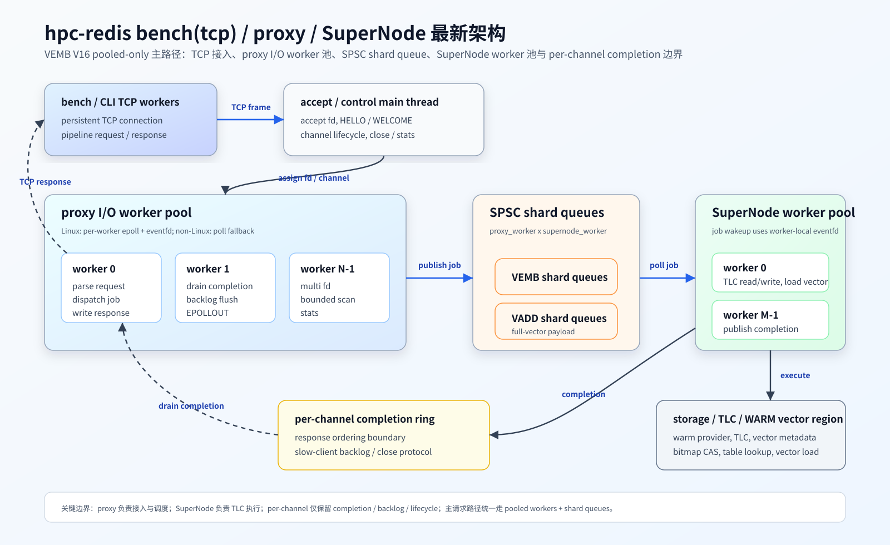

# hpc-redis bench(tcp) / proxy / SuperNode 架构与压测汇报

日期：2026-05-29

## 1. 汇报结论

- 当前 VEMB V16 主路径已经收敛为 `proxy I/O worker pool + SuperNode worker pool` 的 pooled-only 架构。
- TCP 接入侧由 accept/control main thread 负责 `accept`、`HELLO/WELCOME`、channel 生命周期；热路径请求处理交给固定数量的 proxy I/O workers。
- 请求分发已从 per-channel job ring 收敛到 `proxy_worker x supernode_worker` SPSC shard queue。
- per-channel 设计仅保留在 completion ring、TCP response backlog 和 channel lifecycle 边界上，用于保证 response ordering、慢客户端隔离和关闭协议简单。
- TCP `vemb-supernode-read` 最佳记录为 `3,386,415.44 QPS`，参数为 server `--proxy-io-threads 16 --supernode-workers 32`，bench `threads=64`。
- TCP `mixed-80r20w` 在主验证配置下稳定达到 `1,824,299.31 - 1,843,665.09 QPS`，`fail=0`。
- slow client backpressure 已验证生效，稳定正例为 `slow_ops=4096`、`probe_ops=2000`、`stall_ms=5000`，probe `p99=0.078ms`、`max=0.211ms`。

## 2. 当前进度与待实现

已完成：

- 单机架构模型已完成，当前主路径为 `bench(tcp) / CLI -> proxy I/O worker pool -> SuperNode worker pool -> storage / TLC / WARM vector region`。
- `VADD` 已支持，可写入向量数据。
- `VEMB` 已支持，可按 key 读取 embedding / handle / vector 数据路径。

NOTE：当前已支持的命令形式为 `vadd key value`、`vemb key`，与 Redis 侧 `vadd/vemb` 命令形态仍有差异。

```text
当前 standalone / bench 侧：
  vadd <key> <value>
  vemb <key>                         # handle / offset 语义
  vemb <key> RAW                     # 已支持 RAW 兼容语义
    - SHM/UB: --mode vemb-read-vector，由 client mmap vector region 后读取完整 vector
    - TCP:    --mode vemb-inline-vector，由 proxy 在 RESPONSE 后追加 vector_bytes
    - TCP:    --mode vemb-supernode-read 仅表示 SuperNode 内部读取完整 vector 参与压测，
              response 不返回完整 vector payload

Redis 侧目标形态：
  VADD <index_key> ... <vector_key> <vector_value>
  VEMB <index_key> <vector_key> RAW
```

待实现：

- `VSIM` 待支持，用于补齐向量相似度查询链路。
- CLI 中的 consistent hash 一致性分片逻辑待实现，用于多 SuperNode 场景下按 `vector_key` 路由到目标 shard。
- TLC COLD 层与容错故障恢复机制待进一步细化，包括 COLD append、故障恢复、回放边界和一致性策略。

## 3. 最新架构



### 模块职责

| 模块 | 当前职责 |
| --- | --- |
| `bench(tcp)` / CLI | 建立 TCP persistent connection；执行 HELLO/WELCOME；按 pipeline 发送 VEMB/VADD 请求；读取 response；拉取 stats 和 close channel。 |
| `proxy` | 负责接入、channel 生命周期、TCP frame parse、SHM request ring poll、job dispatch、completion drain、response write。 |
| `SuperNode` | 消费 VEMB/VADD shard job；执行 TLC 读写、bitmap 并发控制、向量加载；向 per-channel completion ring 发布 completion。 |
| `storage` | 持有 warm provider、TLC、vector region 及元数据；提供 channel desc、stats、inline vector slice 等公共接口。 |

## 4. TCP 压测参数

### 主验证 server 参数

```bash
./src/vemb_v16_server \
  --transport tcp \
  --tcp-host 127.0.0.1 \
  --tcp-port 6391 \
  --proxy-io-threads 8 \
  --supernode-workers 16 \
  --vector-region /vemb_v16_vectors \
  --warm-backend shm \
  --dim 300 \
  --max-vectors 131072 \
  --loglevel notice
```

### 放大池化 server 参数

```bash
./src/vemb_v16_server \
  --transport tcp \
  --tcp-host 127.0.0.1 \
  --tcp-port 6391 \
  --proxy-io-threads 16 \
  --supernode-workers 32 \
  --vector-region /vemb_v16_vectors \
  --warm-backend shm \
  --dim 300 \
  --max-vectors 131072 \
  --loglevel notice
```

### bench 通用参数

| 参数 | 值 |
| --- | --- |
| `transport` | `tcp` |
| `host` | `127.0.0.1` |
| `port` | `6391` |
| `dim` | `300` |
| `prefill` | `65536` |
| `ops/thread` | `200000` |
| `pipeline` | `16` |
| `timeout-ms` | `30000` |
| `pin` | `--no-pin` |

### 典型 bench 命令

```bash
./benchmark/vemb_v16_bench \
  --transport tcp \
  --host 127.0.0.1 \
  --port 6391 \
  --mode vemb-supernode-read \
  --dim 300 \
  --prefill 65536 \
  --ops 200000 \
  --threads 4,8,16,32,64 \
  --pipeline 16 \
  --timeout-ms 30000 \
  --no-pin
```

```bash
./benchmark/vemb_v16_bench \
  --transport tcp \
  --host 127.0.0.1 \
  --port 6391 \
  --mode mixed-80r20w \
  --dim 300 \
  --prefill 65536 \
  --ops 200000 \
  --threads 4,8,16,32 \
  --pipeline 16 \
  --timeout-ms 30000 \
  --no-pin
```

## 5. 最佳压测数据

### 5.1 TCP `vemb-supernode-read` 最佳结果

| Server 配置 | Bench threads | Requests | QPS | Fail | 说明 |
| --- | ---: | ---: | ---: | ---: | --- |
| `--proxy-io-threads 16 --supernode-workers 32` | 64 | 12,800,000 | **3,386,415.44** | 0 | 最新文档记录的 TCP SuperNode 内部读路径最高值，不返回完整 vector payload |
| `--proxy-io-threads 16 --supernode-workers 32` | 16 | 3,200,000 | 2,446,995.59 | 0 | 放大池化在中并发区间明显领先 |
| `--proxy-io-threads 8 --supernode-workers 16` | 32 | 6,400,000 | 1,918,553.44 | 0 | 主验证配置最高值 |

<span style="color:red">NOTE：该表压测返回的是 handle `(region_id, offset, bytes)`，不是完整 vector payload；返回完整 300 维 float vector 的具体性能数据待下周继续测试，预计应该会略降低。</span>

### 5.2 TCP `mixed-80r20w` 稳定结果

主验证配置：server `--proxy-io-threads 8 --supernode-workers 16`。

| Threads | QPS 区间 | Fail |
| ---: | ---: | ---: |
| 4 | 689,175.98 - 727,205.87 | 0 |
| 8 | 1,081,942.42 - 1,104,866.00 | 0 |
| 16 | 1,418,848.27 - 1,524,972.01 | 0 |
| 32 | **1,824,299.31 - 1,843,665.09** | 0 |

<span style="color:red">NOTE：该表压测返回的是 handle `(region_id, offset, bytes)`，不是完整 vector payload；`mixed-80r20w` 返回完整 300 维 float vector 的具体性能数据待下周继续测试，预计应该会略降低。</span>

关键判断：

- 32 线程下混合读写吞吐稳定在约 `1.82M - 1.84M QPS`。
- 两轮结果接近，说明在 20% 写入占比下性能稳定。
- 所有档位 `fail=0`。

## 6. 一句话汇报

- VEMB V16 当前已经完成从 per-channel 线程模型到 `proxy I/O worker pool + SuperNode worker pool` 的主路径收敛；真实 server 文档数据表明，TCP `vemb-supernode-read` 在放大池化配置下最高达到 `3.39M QPS`，TCP `mixed-80r20w` 在主验证配置下稳定达到 `1.82M - 1.84M QPS`，并保持 `fail=0`、`ring full=0`。
- TCP 模式与 Aeron IPC 模式仍存在性能差距，主要来自 transport 方式差异：TCP 需要经过 socket / kernel network stack / TCP frame 读写，而 Aeron IPC 更接近本机共享内存通信路径。
