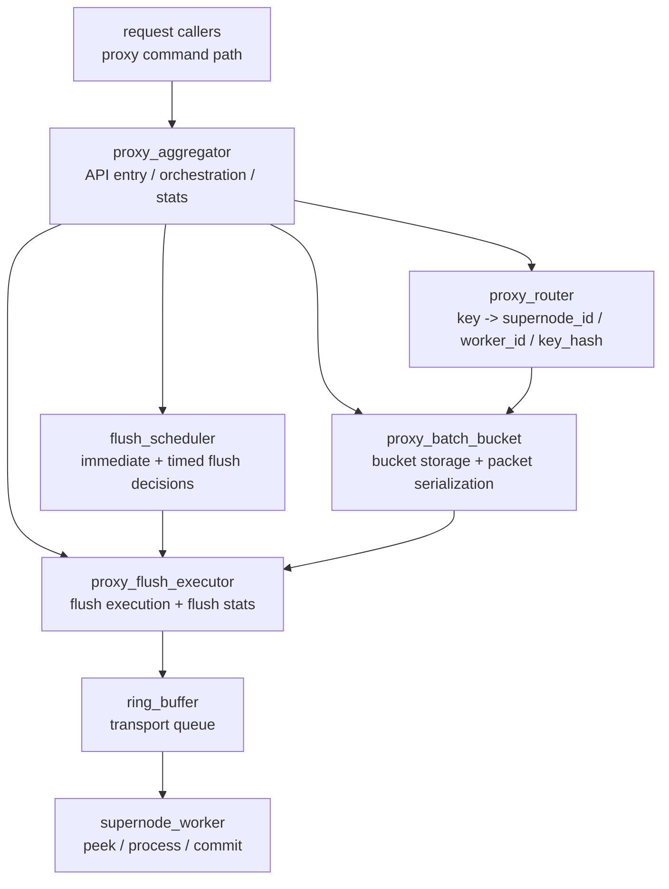

# Proxy Aggregator Architecture

## Overview

`proxy_aggregator` sits between per-request proxy calls and `supernode_worker`.
It batches requests by `(supernode_id, worker_id)`, turns each batch into a
`batch_packet_t`, and sends the packet through a dedicated `ring_buffer`.

The module is an orchestrator, not a transport or compute layer.

Unless explicitly configured, the proxy aggregator uses these defaults:

- `proxy-batch-limit = 3000`
- `proxy-time-limit-us = 200`
- `proxy-max-supernodes = 150`

## Architecture Diagram

```text
                          +----------------------+
                          |   request callers    |
                          |  proxy command path  |
                          +----------+-----------+
                                     |
                                     v
                    +--------------------------------------+
                    |           proxy_aggregator           |
                    |--------------------------------------|
                    | - API entry                          |
                    | - owns bucket topology               |
                    | - drives routing / scheduling        |
                    | - triggers flush execution           |
                    | - owns active-bucket deadline heap   |
                    | - exports stats                      |
                    +----------------+---------------------+
                                     |
          +--------------------------+---------------------------+
          |                          |                           |
          v                          v                           v
+-------------------+     +-------------------+      +----------------------+
|    proxy_router   |     |  flush_scheduler  |      | proxy_flush_executor |
|-------------------|     |-------------------|      |----------------------|
| key -> route      |     | should flush now? |      | reserve/fill/commit  |
| supernode / worker|     | immediate / timed |      | flush-side metrics   |
+---------+---------+     +---------+---------+      +----------+-----------+
          |                         |                           |
          +------------+------------+                           |
                       |                                        |
                       v                                        v
                +--------------------+                 +------------------+
                | proxy_batch_bucket |                 |   ring_buffer    |
                |--------------------|                 |------------------|
                | request storage    |                 | transport queue  |
                | bucket metadata    |                 | publish/consume  |
                | packet serialization                 +--------+---------+
                +--------------------+                          |
                                                                v
                                                     +----------------------+
                                                     |   supernode_worker   |
                                                     |----------------------|
                                                     | peek/process/commit  |
                                                     | SVE compute path     |
                                                     +----------------------+
```



## Module Boundaries

Current decomposition:

- `proxy_aggregator`
  - API entry for enqueue, initialization, shutdown, and stats
  - Owns bucket topology and flush scheduling
- `proxy_router`
  - Converts `key -> {supernode_id, worker_id, key_hash}`
  - Owns the routing policy and wraps consistent-hash lookup
- `proxy_batch_bucket`
  - Owns bucket/request storage and packet serialization helpers
- `proxy_flush_executor`
  - Owns flush execution and flush-side statistics
- `consistent_hash`
  - Hash ring storage and lookup
- `ring_buffer`
  - Transport queue between proxy side and worker side
- `supernode_protocol`
  - Shared `batch_packet_t` wire format
- `supernode_worker`
  - Consumes `batch_packet_t` and performs SVE work

## Thread Diagram

```text
Caller Thread(s)
  -> proxy_enqueue_request()
  -> proxy_router_route()
  -> proxy_batch_bucket_append()
  -> optional immediate flush

Flush Thread (single)
  -> iterate buckets
  -> flush_scheduler_on_poll()
  -> proxy_executor_flush_bucket_locked()

Worker Thread(s)
  -> ring_buffer_peek()
  -> sve_worker_process_batch()
  -> ring_buffer_commit_read()
```

```mermaid
flowchart TD
    A[Caller Thread(s)] --> A1[proxy_enqueue_request()]
    A1 --> A2[proxy_router_route()]
    A2 --> A3[proxy_batch_bucket_append()]
    A3 --> A4[optional immediate flush]

    B[Flush Thread] --> B1[iterate buckets]
    B1 --> B2[flush_scheduler_on_poll()]
    B2 --> B3[proxy_executor_flush_bucket_locked()]

    C[Worker Thread(s)] --> C1[ring_buffer_peek()]
    C1 --> C2[sve_worker_process_batch()]
    C2 --> C3[ring_buffer_commit_read()]
```

## Threads

There are three relevant execution contexts:

1. Caller threads
   - call `proxy_enqueue_request()`
   - route request to a bucket
   - append request into the bucket
   - register bucket into the active deadline heap
   - may trigger an immediate flush on full bucket

2. Aggregator flush thread
   - waits on condition variable when there are no active buckets
   - uses timed wait for the earliest bucket deadline
   - checks the root of the active-bucket min-heap first
   - flushes buckets that are full or timed out

3. Supernode worker threads
   - poll their input ring buffers
   - process `batch_packet_t`
   - commit ring-buffer reads

## Data Flow

```text
request
  -> proxy_enqueue_request()
  -> proxy_router_route()
  -> proxy_batch_bucket append(supernode, worker)
  -> active bucket heap registration
  -> flush_scheduler decision
  -> proxy_executor_flush_bucket_locked()
  -> proxy_batch_bucket_fill_packet()
  -> ring_buffer_commit_write() / publish
  -> supernode_worker ring_buffer_peek()
  -> sve_worker_process_batch()
  -> ring_buffer_commit_read()
```

## Internal Structure

`proxy_aggregator` owns:

- `num_supernodes`
- `num_buckets`
- `buckets[]`
- `ring_buffers[]`
- `router`
- `scheduler`
- `executor`
- active bucket min-heap
- `flush_thread`
- enqueue statistics
- scheduling statistics

Each bucket owns:

- `requests[]`
- `count`
- `capacity`
- target `(supernode_id, worker_id)`
- `last_flush_time_us`
- `mutex`

The producer side is serialized per bucket by `bucket->mutex`.
The consumer side is single-worker per ring buffer.

The flush thread no longer scans every bucket. It maintains an active-bucket
min-heap keyed by:

- `bucket.last_flush_time_us + configured timeout`

This means:

- empty buckets are excluded from scheduling
- the earliest bucket deadline is always at heap root
- the flush thread can block on a timed wait until the next deadline

## Flush Paths

There are two flush paths:

1. Immediate flush
   - used when bucket is already full before append
   - used again after append when bucket reaches the configured batch limit
   - immediate-flush metrics are now recorded inside `proxy_flush_executor`

2. Timed flush
   - handled by the flush thread
   - used when bucket age reaches the configured timeout

If immediate flush fails because the ring buffer is busy, the request remains in
the bucket and the flush thread retries later.

## Statistics

The module currently tracks:

- total requests
- active buckets
- active bucket peak
- active wait wakeups
- timed wait wakeups
- flush retry count
- total batches
- total flushes
- batch-full flushes
- timeout flushes
- immediate flush attempts
- immediate flush successes
- immediate flush deferred
- enqueue rejections on full bucket

Flush-side metrics are owned by `proxy_flush_executor`.

## Statistics Interpretation

The most useful proxy-side signals are:

- `Active buckets`
  - current number of non-empty buckets
  - high sustained value means traffic is spread across many routes

- `Active bucket peak`
  - peak number of non-empty buckets
  - useful for understanding burst fan-out across `(supernode, worker)`

- `Active wait wakeups`
  - number of times the flush thread woke from an empty state
  - high value with low throughput may indicate bursty sparse traffic

- `Timed wait wakeups`
  - number of deadline-based timed wakeups while active buckets existed
  - high value with low flush count means many wakeups are not producing work

- `Flush retry count`
  - number of times a bucket was ready to flush but the flush did not complete
  - usually points to ring-buffer pressure or transient contention

- `Immediate flush attempts`
  - how often caller threads tried to flush immediately
  - high value means batching is often being forced by full buckets

- `Immediate flush successes`
  - immediate flushes that completed successfully
  - compare with attempts to estimate how effective immediate flush is

- `Immediate flush deferred`
  - immediate flushes that had to be left for later retry
  - usually indicates downstream queue pressure

- `Enqueue rejections (full)`
  - caller-side failures when the target bucket was full and could not be drained
  - this is the strongest overload signal in the current proxy layer

### How To Read These Metrics

Typical interpretations:

- high `flush_retry_count`
  - first inspect ring-buffer capacity and downstream worker consumption rate
  - if paired with high `immediate_flush_deferred`, the bottleneck is likely after batching

- high `timed_wait_wakeups` but low `total_flushes`
  - the scheduler is waking often without producing much completed work
  - likely causes:
    - many small active buckets
    - traffic too sparse across routes
    - timeout too short for the current fan-out

- high `active_bucket_peak`
  - request distribution is spreading across many route buckets at once
  - likely causes:
    - too many workers per node
    - too many supernodes for the current traffic
    - a key distribution that defeats batching locality

- high `immediate_flush_attempts`
  - batching is frequently forced by capacity rather than timing
  - usually means either:
    - buckets are too small
    - traffic is hot enough that full-bucket flush dominates timeout flush

- high `enqueue rejections (full)`
  - the system is no longer absorbing input cleanly
  - this should be treated as overload or downstream backpressure

### Suggested Tuning Order

When these metrics look unhealthy, inspect in this order:

1. `Enqueue rejections (full)` and `Flush retry count`
   - determine whether the issue is hard backpressure
2. `Immediate flush deferred` vs `Immediate flush successes`
   - determine whether caller-side immediate flush is still useful
3. `Active bucket peak`
   - determine whether route fan-out is too wide
4. `Timed wait wakeups`
   - determine whether the timeout policy is too aggressive

## Current Tradeoffs

Strengths:

- narrow public API
- ring buffer / protocol / hash ring already separated
- full-bucket immediate flush reduces queueing latency
- flush-thread path provides retry and timeout fallback
- active-bucket heap avoids scanning empty buckets
- condition-variable waiting avoids idle spinning when no buckets are active

Known limitations:

- flush thread is earliest-deadline-first at heap root, but still not a full general timer subsystem
- request objects are allocated one by one
- `proxy_aggregator` still owns bucket topology and ring-buffer lookup
- worker wakeup is still polling-based

## Next Refactor Targets

Recommended next steps:

1. Tighten tests around wakeups, retries, and stats invariants under concurrency.
2. Separate request lifecycle tracking from batch metadata storage.
3. Consider a wakeup mechanism for idle workers if worker-side polling cost becomes visible.
4. Keep transport abstraction in `worker_channel` only if another backend appears.

## Test Coverage

The current standalone tests are split into three layers:

1. `proxy_components_ut`
   - component-level tests
   - covers:
     - `proxy_router`
     - `proxy_flush_scheduler`
     - `proxy_batch_bucket`
     - `ring_buffer_cancel_write()`
     - `proxy_flush_executor`

2. `proxy_scheduler_ut`
   - scheduler-level tests
   - covers:
     - active bucket heap ordering
     - heap removal / reordering
     - condition-variable wakeup on new active bucket

3. `proxy_aggregator_ut`
   - integration-level tests
   - covers:
     - immediate flush success
     - immediate deferred / rejection metrics
     - concurrent enqueue with background flush

## Status

Completed in the current iteration:

- extracted routing into `proxy_router`
- extracted flush decision logic into `flush_scheduler`
- extracted bucket lifecycle and packet fill logic into `proxy_batch_bucket`
- extracted flush execution and flush-side metrics into `proxy_flush_executor`
- extracted `ring_buffer` into its own module
- extracted shared `batch_packet_t` into `supernode_protocol`
- switched from scanning all buckets to active-bucket tracking
- upgraded active-bucket tracking to a deadline min-heap
- added condition-variable wakeup and timed wait to the flush thread
- added `ring_buffer_cancel_write()` to close the reserve/fail correctness gap
- added standalone unit / integration coverage:
  - `proxy_components_ut`
  - `proxy_scheduler_ut`
  - `proxy_aggregator_ut`

Remaining worthwhile work:

- strengthen tests around stats exactness under concurrency
- evaluate worker-side wakeup to reduce polling cost in `supernode_worker`
- consider whether request lifecycle state should be split from batch metadata
- consider a cleaner transport abstraction only if a second backend is introduced
