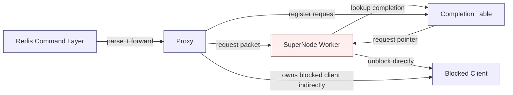
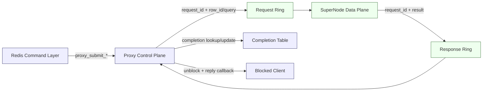

# Proxy/SuperNode Borrowings From Aeron/TLC

This document summarizes what the current `proxy/supernode` path can borrow
from:

- [src/aeron_ipc.h](/Users/szza/codespace/work/hpc-redis/src/aeron_ipc.h:1)
- [src/tlc_aeron_server.c](/Users/szza/codespace/work/hpc-redis/src/tlc_aeron_server.c:1)
- [src/tlc_fc_server.c](/Users/szza/codespace/work/hpc-redis/src/tlc_fc_server.c:1)
- [benchmark/tlc_fc_bench.c](/Users/szza/codespace/work/hpc-redis/benchmark/tlc_fc_bench.c:1)

The goal is not to copy TLC as-is, but to extract transport and execution ideas
that fit the UB `proxy -> supernode` architecture.

## Core Takeaways

### 1. Strong control-plane / data-plane split

`tlc_aeron_server` is very explicit:

- data plane:
  - shared-memory SPSC rings
  - zero-syscall GET/PUT
- control plane:
  - UDS
  - channel allocation
  - fill / stats / batch control

See [src/tlc_aeron_server.c](/Users/szza/codespace/work/hpc-redis/src/tlc_aeron_server.c:4).

For `proxy/supernode`, the equivalent target split should be:

- command layer:
  - syntax parsing only
- proxy control plane:
  - `key + element -> row_id`
  - `key -> candidate rows`
  - blocked client lifecycle
  - completion
  - response formatting
- supernode data plane:
  - `row_id[] -> vectors`
  - `query_vector + row_id[] -> scores`

This is the most important architectural borrowing.

## Borrowable Patterns

### 2. Prefer SPSC channels over shared multi-writer queues

`aeron_ipc.h` is built around:

- one producer
- one consumer
- no locks
- no CAS in the steady-state data path

See [src/aeron_ipc.h](/Users/szza/codespace/work/hpc-redis/src/aeron_ipc.h:46).

Current `proxy` still does:

- shared buckets
- mutex per bucket
- separate flush scheduling

Borrowing idea:

- move toward more single-writer queue ownership
- consider splitting by `(producer thread -> target worker)` instead of forcing
  all requests through one shared aggregation point

That would reduce:

- bucket lock contention
- active-bucket heap pressure
- flush thread coordination overhead

### 3. Keep request packets fixed and compact

TLC request packets are simple:

- `OP_GET [key]`
- `OP_PUT [key + value]`
- `OP_MGET [count + keys...]`

See [src/tlc_aeron_server.c](/Users/szza/codespace/work/hpc-redis/src/tlc_aeron_server.c:33).

For `proxy/supernode`, this translates to:

- `VEMB` request:
  - `op_type`
  - `request_id`
  - `row_id`
- `VSIM` request:
  - `op_type`
  - `request_id`
  - `query_vector`
  - `row_id[]`
  - `count`
  - flags

Do not put into the packet:

- `RedisModuleBlockedClient *`
- `proxy_vector_request_t *`
- `RedisModuleString *`
- RESP formatting concerns

### 4. Separate large-result transport from small-result transport

`aeron_ipc.h` introduces a dedicated large-message ring:

- small messages use the normal ring
- large `MGET` responses use `aeron_large_ring_t`

See [src/aeron_ipc.h](/Users/szza/codespace/work/hpc-redis/src/aeron_ipc.h:34) and
[src/tlc_aeron_server.c](/Users/szza/codespace/work/hpc-redis/src/tlc_aeron_server.c:156).

This maps well to UB commands:

- `VEMB` has small fixed-size responses
- `VSIM` can produce large variable-sized responses

Borrowing idea:

- keep `VEMB` on a fixed small response path
- design a separate large-result path for `VSIM`

This is cleaner than trying to force both onto the same response packet layout.

### 5. Use adaptive spin/yield/sleep loops

`aeron_ipc.h` implements an adaptive poll loop:

- phase 1: pure spin
- phase 2: CPU yield / pause
- phase 3: nanosleep backoff

See [src/aeron_ipc.h](/Users/szza/codespace/work/hpc-redis/src/aeron_ipc.h:152).

Borrowing idea:

- use one consistent adaptive waiting policy for:
  - proxy flush path
  - worker ring polling
  - future response-ring polling

This should improve both:

- low-load latency
- high-load efficiency

### 6. Return compact result identifiers whenever possible

`tlc_fc_bench` highlights the benefit of returning:

- `status + warm_idx`

instead of:

- full 1200-byte value payload

See [benchmark/tlc_fc_bench.c](/Users/szza/codespace/work/hpc-redis/benchmark/tlc_fc_bench.c:4).

For UB:

- `VSIM` should prefer returning:
  - `row_id + score`
- and let proxy / Redis translate:
  - `row_id -> element`
  - optional attribute lookups

This keeps supernode on a compact, execution-only contract.

### 7. Single-request fast path, multi-request batch path

`tlc_fc_server` is adaptive:

- 1 pending request -> direct path
- N pending requests -> batch gather path

See [src/tlc_fc_server.c](/Users/szza/codespace/work/hpc-redis/src/tlc_fc_server.c:14) and
[src/tlc_fc_server.c](/Users/szza/codespace/work/hpc-redis/src/tlc_fc_server.c:161).

Borrowing idea for UB `VSIM`:

- single request:
  - execute directly in worker fast path
- multiple requests:
  - batch gather / batch similarity compute

This is better than requiring every request to wait for a fixed micro-batch
window.

## What Not To Copy Directly

### 8. Do not copy flat combining as the proxy architecture

`tlc_fc_server` uses flat combining because it is solving:

- concurrent cache lookup contention
- shared in-process compute coordination

See [src/tlc_fc_server.c](/Users/szza/codespace/work/hpc-redis/src/tlc_fc_server.c:132).

The UB `proxy/supernode` path has different concerns:

- route to worker
- packetization
- row-id driven UB access
- Redis blocked-client lifecycle

So flat combining is best treated as:

- a possible **worker-internal optimization idea**
- especially for `VSIM`

It should not replace the entire proxy/supernode topology.

## Recommended Borrowing Roadmap

### Near-term

1. Keep driving a stricter control-plane / data-plane split.
2. Keep `VEMB` packet and reply contracts small and fixed.
3. Introduce adaptive polling/waiting in proxy and worker loops.

### Mid-term

1. Add a dedicated response-ring path instead of letting worker touch blocked
   client state directly.
2. Add a separate large-result path for `VSIM`.
3. Prefer returning `row_id + score` from supernode for `VSIM`.

### Longer-term

1. Revisit queue topology toward more SPSC ownership.
2. Add single-request fast path vs multi-request batch path in worker logic.
3. Consider explicit control-plane channel allocation if proxy and supernode
   become truly separate processes.

## Proxy/Supernode Mapping Table

| Current proxy/supernode issue | Borrowing from TLC/Aeron | Suggested direction |
|---|---|---|
| Control logic still leaks toward worker side | Data plane vs control plane separation | Keep metadata, completion, blocked client, reply in proxy side |
| Shared bucket + flush coordination | Per-channel SPSC | Move toward more single-writer queue ownership |
| One packet model may be forced for all ops | Small ring + large ring split | Separate `VEMB` fixed response from `VSIM` large response path |
| Waiting loops are still coarse | Adaptive spin/yield/sleep | Standardize low-latency wait policy |
| `VSIM` may over-batch or under-batch | Flat combining adaptive execution | Add single-request fast path and multi-request batch path |
| Supernode may be tempted to return rich logical objects | Zero-copy index return style | Prefer `row_id + score`, translate to logical names in proxy |

## Summary

The most useful lesson from `aeron_ipc` and the TLC servers is not any single
transport primitive by itself, but the discipline of:

- keeping the data plane small, mechanical, and fixed-format
- keeping the control plane responsible for request lifecycle and client-facing
  semantics
- optimizing transport and execution paths independently

For the UB stack, that means:

- proxy should own lifecycle and semantics
- supernode should own execution only
- packets should carry only execution data
- results should come back as compact structured data, not Redis-facing objects

## Mermaid

### Current Shape

Meaning:

- request transport already looks like a data-plane path
- but worker still knows about completion and blocked-client lifecycle
- so control-plane concerns still leak into the execution side

### Target Shape

Meaning:

- command layer only hands work to proxy
- proxy owns metadata, completion, blocked client, and reply semantics
- supernode only consumes request packets and emits result packets
- no Redis-facing pointers or lifecycle objects cross the data-plane boundary
