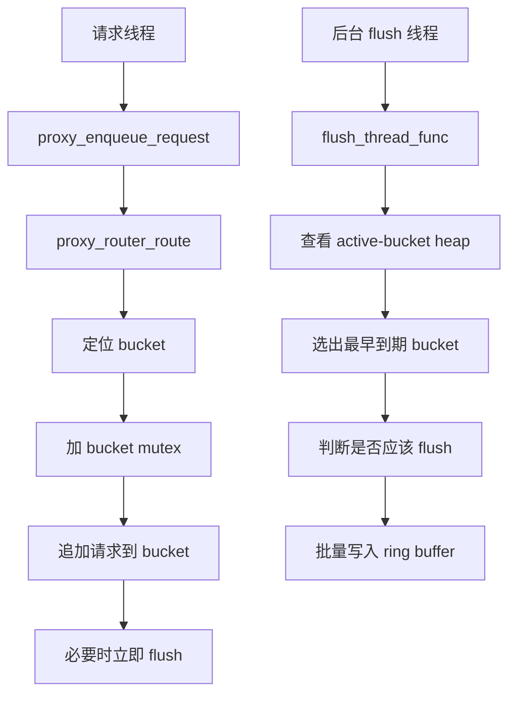
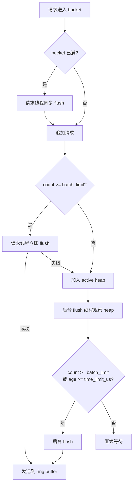
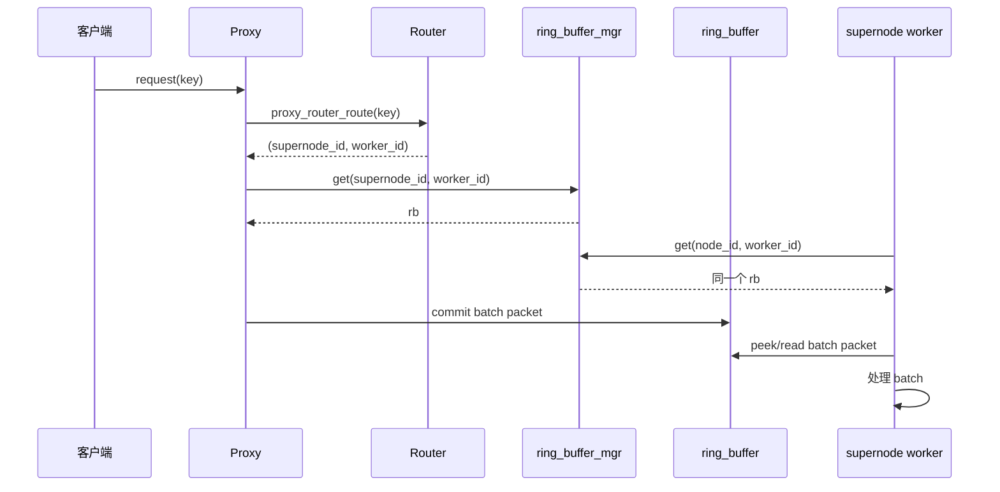

# Ring Buffer Manager 映射关系

## 概述

在将 ring buffer 的查找逻辑从 `proxy_aggregator` 解耦出来之后，`proxy`
侧和 `supernode worker` 侧都通过同一个模块来定位队列：

- `ring_buffer_mgr`

双方共享的查找键是：

- `supernode_id`
- `worker_id`

只要两边查询时使用相同的 `(supernode_id, worker_id)`，就会拿到同一个
`ring_buffer_t *`。

## 映射规则

逻辑上映射关系可以理解为：

```text
(supernode_id, worker_id)
    -> "supernode_%d_worker_%d"
    -> ring_buffer_mgr entry
    -> ring_buffer_t
```

在 `ring_buffer_mgr` 内部，每个 entry 保存：

- `supernode_id`
- `worker_id`
- `rb`

当调用 `ring_buffer_mgr_get(supernode_id, worker_id)` 时，流程是：

1. 先搜索已有 entry
2. 如果找到，直接返回已有的 `rb`
3. 如果没找到，则使用逻辑名 `supernode_%d_worker_%d` 创建一个新的 ring buffer
4. 将新 entry 保存到 manager 中
5. 返回这个 `rb`

## Proxy 路径

在 `proxy` 侧：

1. `proxy_router_route(key, &route)` 计算出：
   - `route.supernode_id`
   - `route.worker_id`
2. `proxy_enqueue_request()` 调用：
   - `ring_buffer_mgr_get(route.supernode_id, route.worker_id)`
3. 后续 batch flush 会写入这个 ring buffer

相关代码：

- [src/proxy_aggregator.c](/Users/szza/codespace/work/hpc-redis/src/proxy_aggregator.c:441)

## SuperNode Worker 路径

在 `supernode` 侧：

1. `supernode_init(node_id, num_workers)` 会遍历所有 worker
2. 对第 `i` 个 worker，调用：
   - `ring_buffer_mgr_get(node_id, i)`
3. 返回的 ring buffer 会赋值给：
   - `ctx->input_rb`

相关代码：

- [src/supernode_worker.c](/Users/szza/codespace/work/hpc-redis/src/supernode_worker.c:204)

## 为什么两边会定位到同一个 Ring Buffer

两边使用的是同一组查找参数：

- proxy 侧：`(route.supernode_id, route.worker_id)`
- supernode 侧：`(node_id, worker_id)`

当满足：

- `node_id == route.supernode_id`
- `worker_id == route.worker_id`

时，双方都会命中 manager 中的同一个 entry，因此返回的是同一个
`ring_buffer_t *`。

manager 构造的逻辑名也是一致的：

```text
supernode_<supernode_id>_worker_<worker_id>
```

这个名字会传给 `ring_buffer_create()`，后者再基于该名字派生出稳定的共享内存名。

相关代码：

- [src/ring_buffer_mgr.c](/Users/szza/codespace/work/hpc-redis/src/ring_buffer_mgr.c:134)
- [src/ring_buffer.c](/Users/szza/codespace/work/hpc-redis/src/ring_buffer.c:29)

## Mermaid 图

```mermaid
flowchart LR
    A[请求 key] --> B[proxy_router_route]
    B --> C[route.supernode_id]
    B --> D[route.worker_id]

    C --> E[ring_buffer_mgr_get(supernode_id, worker_id)]
    D --> E

    E --> F{entry 是否已存在}
    F -- 是 --> G[返回已有 ring_buffer]
    F -- 否 --> H[构造名字: supernode_%d_worker_%d]
    H --> I[ring_buffer_create]
    I --> J[写入 ring_buffer_mgr entry]
    J --> G

    G --> K[proxy 将 batch flush 到 ring_buffer]

    L[supernode_init(node_id)] --> M[遍历每个 worker i]
    M --> N[ring_buffer_mgr_get(node_id, i)]
    N --> O[ctx.input_rb = ring_buffer]

    O --> P[worker 线程 ring_buffer_peek]
    K --> P
    P --> Q[处理 batch]
```

## Bucket 与 Ring Buffer 的 1:1 关系

每个 `proxy_batch_bucket_t` 都会静态绑定一个目标 worker，也静态绑定一个对应的
`ring_buffer_t *`。关系是：

```text
bucket(supernode_id, worker_id)
    -> ring_buffer(supernode_id, worker_id)
    -> supernode worker(supernode_id, worker_id)
```

也就是说：

- 一个 bucket 对应一个 ring buffer
- 一个 ring buffer 对应一个 supernode worker
- 三者之间是固定的 `1:1:1` 绑定关系

```mermaid
flowchart LR
    A[请求 key] --> B[路由到 supernode_id / worker_id]

    B --> C[bucket(sn, worker)]
    C --> C1[target_supernode_id = sn]
    C --> C2[target_worker_id = worker]
    C --> C3[请求先积攒在 bucket 中]
    C --> C4[bucket.rb]

    C4 --> D[ring_buffer(sn, worker)]
    D --> E[supernode worker(sn, worker)]
    E --> F[ctx.input_rb = 同一个 rb]
    F --> G[ring_buffer_peek / 处理 batch]
```

```mermaid
flowchart TD
    subgraph P0[Proxy 侧 Buckets]
        B00[bucket(0,0)]
        B01[bucket(0,1)]
        B10[bucket(1,0)]
        B11[bucket(1,1)]
    end

    subgraph R0[Ring Buffers]
        R00[rb(0,0)]
        R01[rb(0,1)]
        R10[rb(1,0)]
        R11[rb(1,1)]
    end

    subgraph S0[SuperNode 侧 Workers]
        W00[supernode0.worker0]
        W01[supernode0.worker1]
        W10[supernode1.worker0]
        W11[supernode1.worker1]
    end

    B00 --> R00 --> W00
    B01 --> R01 --> W01
    B10 --> R10 --> W10
    B11 --> R11 --> W11
```

## Proxy 线程模型

当前 `proxy` 侧有两类主要执行上下文：

1. 请求线程（caller thread）
2. 后台 flush 线程（单线程）

### 1. 请求线程

请求线程会调用：

- `proxy_enqueue_request()`

它负责：

1. 对请求 key 做路由，得到：
   - `supernode_id`
   - `worker_id`
2. 定位到对应的 bucket
3. 创建 `proxy_request_t`
4. 持有该 bucket 的 mutex，把请求追加到 bucket 中
5. 在需要时触发“立即 flush”

也就是说，请求线程本身既负责“写 bucket”，也可能负责“同步触发一次 flush”。

### 2. 后台 flush 线程

`proxy_aggregator_init()` 会启动一个单独的 flush 线程：

- `flush_thread_func()`

这个线程负责：

1. 观察 active-bucket heap
2. 取出最早到期的 bucket
3. 判断该 bucket 当前是否应该 flush
4. 把一个 bucket 内积攒的请求批量写入对应的 ring buffer

这个线程只负责 bucket -> ringbuffer 的后台批量发送，不负责路由单个请求。

### 线程关系图



## Flush 时机

当前实现里，bucket flush 有三种触发方式：

1. 容量触发的立即 flush
2. append 后命中 batch limit 的立即 flush
3. 后台线程基于时间或容量触发的 flush

### 1. 容量触发的立即 flush

在 `proxy_enqueue_request()` 中，如果当前 bucket 已经满了：

- `proxy_batch_bucket_count(bucket) >= proxy_batch_bucket_capacity(bucket)`

那么请求线程会先尝试同步 flush 一次，再决定是否继续接收当前请求。

这条路径属于：

- 发送前的“腾空间”
- 由请求线程直接触发

如果这次同步 flush 失败，则当前请求会直接返回错误。

### 2. append 后命中 batch limit 的立即 flush

请求追加完成后，会调用：

- `flush_scheduler_on_append()`

当前规则是：

- 如果 `count >= batch_limit`
- 则 `should_flush = 1`

这意味着：

- bucket 一旦达到 batch limit
- 当前请求线程就会立刻尝试 flush

如果立即 flush 成功，bucket 会被从 active heap 中移除。
如果失败，则不会丢请求，而是留给后台 flush 线程后续再处理。

### 3. 后台线程触发 flush

后台 flush 线程会周期性检查 active heap 顶部 bucket，并调用：

- `flush_scheduler_on_poll(count, age_us)`

当前规则是：

- `count >= batch_limit` 时 flush
- 或者 `age_us >= time_limit_us` 时 flush

也就是说，后台线程有两个判断条件：

1. bucket 已经够大
2. bucket 虽然没满，但等待时间已经超过阈值

所以它主要负责：

- 补掉立即 flush 没有完成的情况
- 处理“小批量但等太久”的 bucket

### Flush 时机总结

可以概括成：

```text
请求线程：
  - bucket 满了，先同步 flush 再写
  - append 后达到 batch_limit，立刻尝试 flush

后台 flush 线程：
  - bucket 达到 batch_limit 时 flush
  - bucket 等待时间达到 time_limit_us 时 flush
```

### Flush 时机图



## 时序图


