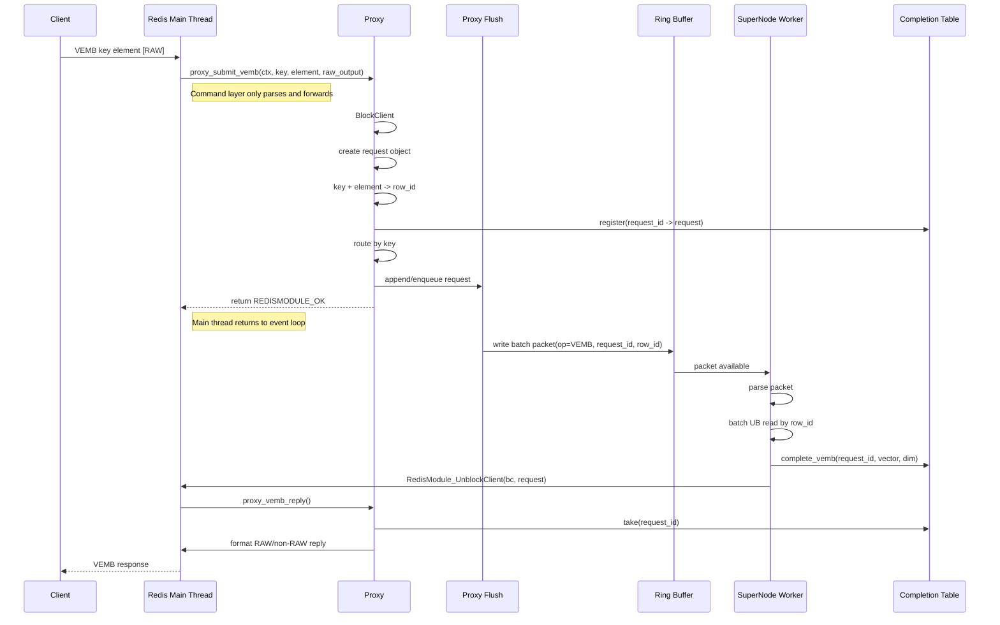

# VEMB Proxy/SuperNode Linux Test

This document gives you a minimal Linux-side startup and test flow for the
current `VEMB -> proxy -> supernode` path.

Important constraints in the current code:

- The vector engine is chosen at startup from `vector-engine` config.
- `VENGINE` currently supports only `GET` and `STATS`.
- There is no runtime switch command for `REDIS <-> UB`.
- `VEMB` in UB mode now goes through:
  `key + element -> row_id -> proxy -> supernode -> completion -> reply`.
- `VSIM` is not part of this verification.

## Execution Design

Target design for `VEMB`:

- `VEMB_RedisCommand()` should only parse arguments and forward the task to a
  proxy entry.
- Proxy should own:
  - blocked client lifecycle
  - request object creation
  - `key + element -> row_id`
  - completion registration
  - routing / batching
  - reply callback
- Supernode worker should only do:
  - parse packet
  - batch UB read by `row_id`
  - completion writeback
  - unblock client



Thread ownership in this design:

- Redis main thread:
  - `VEMB_RedisCommand()`
  - `proxy_submit_vemb()`
  - final reply callback
- Proxy flush thread or request thread:
  - packet flush to ring buffer
- Supernode worker thread:
  - UB batch read
  - completion writeback
  - unblock

## 1. Build

From repo root:

```bash
make -C src redis-server redis-cli USE_UB=yes
```

If your Linux build needs extra flags for your UB/SVE environment, keep them in
your usual build invocation. The key requirement is that `redis-server` and
`redis-cli` are rebuilt after the latest changes.

## 2. Prepare a minimal UB-backed test file

If you do not want to depend on `/dev/obmm_shmdev*` for the first verification,
use a regular file as the mapped backend.

```bash
mkdir -p /tmp/redis-vemb-test
truncate -s 1048576 /tmp/redis-vemb-test/ub.mem
```

This gives a 1 MiB file-backed mapping, which is enough for a 4-dim smoke test.

## 3. Create a minimal config

Create `/tmp/redis-vemb-test/redis-vemb-test.conf` with:

```conf
bind 127.0.0.1
port 6391
protected-mode no
daemonize no
pidfile /tmp/redis-vemb-test/redis.pid
logfile /tmp/redis-vemb-test/redis.log
dir /tmp/redis-vemb-test
save ""
appendonly no

vector-engine ub
vector-dimension 4

ub-table-name myvectors
ub-shm-path /tmp/redis-vemb-test/ub.mem
ub-shm-size 1048576
ub-table-offset 0
ub-table-size 0
ub-vector-stride-bytes 0
ub-element-index-mode suffix-numeric
ub-cacheable no
ub-use-ownership no

supernode-workers 1
proxy-batch-limit 1
proxy-time-limit-us 1
proxy-max-supernodes 1
```

Notes:

- `proxy-time-limit-us` is the actual supported config key.
- `proxy-timeout-us`, `proxy-num-supernodes`, `proxy-ring-buffer-size`, etc.
  are not the keys used by the current code path.
- `daemonize no` is recommended for the first run so you can see startup errors.

## 4. Start Redis

From repo root:

```bash
./src/redis-server /tmp/redis-vemb-test/redis-vemb-test.conf
```

Wait for:

```text
Vector engine initialized: UB
Proxy aggregator initialized ...
Ready to accept connections
```

If startup fails, save the full stdout/stderr and also:

```bash
cat /tmp/redis-vemb-test/redis.log
```

## 5. Verify engine state

In another shell:

```bash
./src/redis-cli -p 6391 VENGINE GET
```

Expected:

```text
engine
UB
```

If it says `REDIS`, stop there and send me:

- `VENGINE GET` output
- startup log

## 6. Run the smoke test

Clean instance:

```bash
./src/redis-cli -p 6391 FLUSHALL
```

Insert one vector:

```bash
./src/redis-cli -p 6391 VADD myvectors VALUES 4 1 2 3 4 item:1
```

Expected:

```text
1
```

Read it back:

```bash
./src/redis-cli -p 6391 VEMB myvectors item:1
```

Also test RAW:

```bash
./src/redis-cli -p 6391 VEMB myvectors item:1 RAW
```

## 7. Capture logs after the test

Run:

```bash
tail -n 200 /tmp/redis-vemb-test/redis.log
```

## 8. Send me these exact outputs

Please send back:

1. Build result
   `make -C src redis-server redis-cli USE_UB=yes`

2. Startup result
   full terminal output of:
   `./src/redis-server /tmp/redis-vemb-test/redis-vemb-test.conf`

3. Engine check
   output of:
   `./src/redis-cli -p 6391 VENGINE GET`

4. Command results
   output of:
   `./src/redis-cli -p 6391 FLUSHALL`
   `./src/redis-cli -p 6391 VADD myvectors VALUES 4 1 2 3 4 item:1`
   `./src/redis-cli -p 6391 VEMB myvectors item:1`
   `./src/redis-cli -p 6391 VEMB myvectors item:1 RAW`

5. Final log tail
   output of:
   `tail -n 200 /tmp/redis-vemb-test/redis.log`

## 9. Known current failure modes

If you hit one of these, send it back exactly:

- `VENGINE GET` returns `REDIS`
- startup logs contain supernode / ring-buffer initialization failure
- `VEMB` hangs
- `VEMB` returns an error such as:
  - `ERR missing VEMB proxy request`
  - `ERR missing VEMB completion`
  - `ERR UB engine vemb failed`
