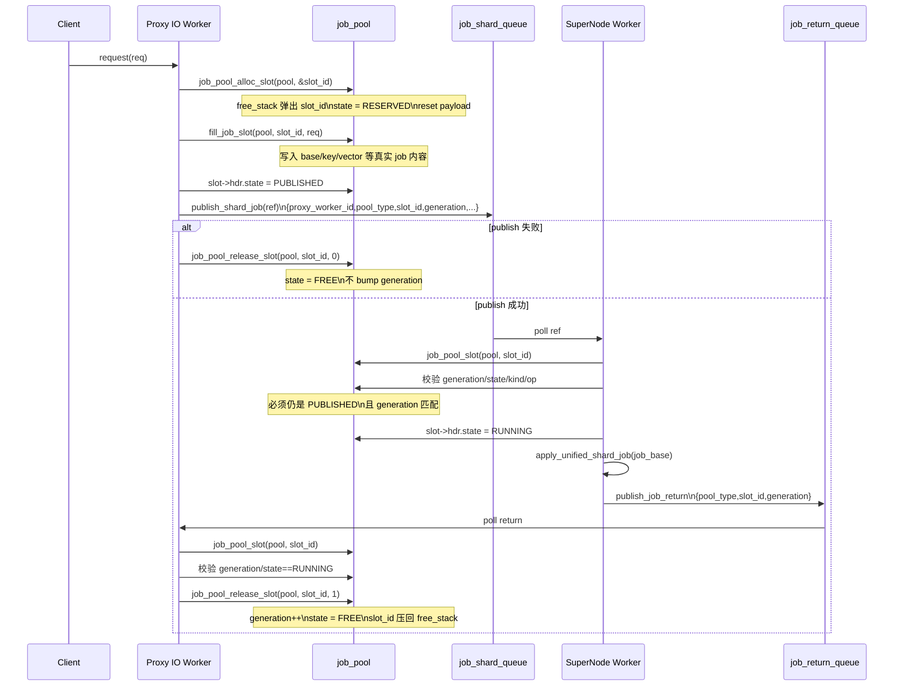

# VEMB v16 Job Pool Runtime Sequence

本文整理 `job_pool_alloc_slot()`、`job_pool_slot()` 以及
`publish_request_job() -> publish_shard_job() -> drain_shard_queues() ->
drain_job_return_queues()` 这一条运行时链路，重点说明：

1. job 数据放在哪里
2. ring 上传递什么
3. slot 什么时候分配、发布、执行、回收
4. `slot_id + generation` 为什么能防止误复用

## 1. 总体思路

proxy 不再把完整 job 大对象直接写入 shard ring。

当前实现改成：

1. proxy IO worker 先从自己的 `job_pool` 中分配一个 slot
2. 把真实 job 内容写入这个 slot
3. shard ring 里只发布轻量 `vemb_v16_job_ref_t`
4. supernode worker 收到 ref 后，回到对应 pool 中定位真实 slot
5. supernode 执行完成后，只发布一个 `vemb_v16_job_return_t`
6. owner proxy IO worker drain return ring 后，真正回收 slot

这样做的核心收益是：

- shard ring 上消息更小
- 避免大对象跨线程搬运
- slot 回收仍然由 owner 线程完成，不需要跨线程 free-list push

## 2. 关键数据结构

相关定义见：

- [src/vemb_v16_dataplane.h](/Users/szza/codespace/work/hpc-redis/src/vemb_v16_dataplane.h:28)
- [src/vemb_v16_proxy.c](/Users/szza/codespace/work/hpc-redis/src/vemb_v16_proxy.c:301)

关键对象：

- `vemb_v16_job_pool_t`
  每个 proxy IO worker 持有多个 pool，按 job 类型拆分
- `vemb_v16_job_slot_t`
  一个 slot = 固定 header + 具体 job payload
- `vemb_v16_job_ref_t`
  发布到 shard ring 的轻量引用
- `vemb_v16_job_return_t`
  supernode 执行完后发回 owner 的回收通知

当前 slot 数策略：

- `READ` pool 按 `supernode_worker_count * (job_shard_ring + job_return_ring + batch)`
  动态计算
- `VSIM_KEY_KEY` 和 `INLINE_VECTOR` pool 仍使用固定容量

slot 状态机：

- `FREE`
- `RESERVED`
- `PUBLISHED`
- `RUNNING`

## 3. `job_pool_slot()` 的作用

实现见 [src/vemb_v16_proxy.c](/Users/szza/codespace/work/hpc-redis/src/vemb_v16_proxy.c:314)。

`job_pool_slot(pool, slot_id)` 不是普通的数组下标访问，而是按字节步长做 arena 寻址：

```c
return (vemb_v16_job_slot_t *)(
    (uint8_t *)pool->slots + (size_t)slot_id * pool->slot_stride);
```

这里的关键是 `pool->slot_stride`。

不同 pool 的 payload 大小不同：

- `READ` pool 使用 `vemb_v16_vemb_job_t`
- `VSIM_KEY_KEY` pool 使用 `vemb_v16_vsim_key_key_job_t`
- `INLINE_VECTOR` pool 使用 `vemb_v16_vadd_job_t`

因此每个 pool 的 slot 大小由 `job_pool_slot_stride()` 决定，而不是统一使用
`sizeof(vemb_v16_job_slot_t)`。

这意味着：

1. `pool->slots` 是一块连续 arena
2. `slot_id` 只是 arena 中的逻辑编号
3. `job_pool_slot()` 负责把逻辑编号映射回真实地址

## 4. `job_pool_alloc_slot()` 的作用

实现见 [src/vemb_v16_proxy.c](/Users/szza/codespace/work/hpc-redis/src/vemb_v16_proxy.c:876)。

它的流程是：

1. 检查 `free_count == 0`
2. 从 `free_stack` 弹出一个 `slot_id`
3. 通过 `job_pool_slot()` 定位 slot 地址
4. 将 `slot->hdr.state` 设为 `RESERVED`
5. 调用 `job_pool_slot_reset()` 清空 payload 区域

对应代码路径：

```c
RETURN_IF(pool->free_count == 0, -1);
*slot_id = pool->free_stack[--pool->free_count];
vemb_v16_job_slot_t *slot = job_pool_slot(pool, *slot_id);
atomic_store_explicit(&slot->hdr.state,
                      VEMB_V16_JOB_SLOT_RESERVED,
                      memory_order_relaxed);
job_pool_slot_reset(pool, *slot_id);
```

这里的含义是：

- `free_stack` 是一个 O(1) 的空闲槽位栈
- 只有 owner proxy IO worker 会对自己的 pool 做 alloc/release
- `state` 是跨线程可见的生命周期标记
- payload reset 只清理数据区，不覆盖 `generation`

## 5. 运行时时序图



## 6. 状态流转说明

### 6.1 `FREE -> RESERVED`

`job_pool_alloc_slot()` 从 `free_stack` 中拿出一个空槽。

此时 slot 已经归当前 proxy IO worker 使用，但还没有对 supernode 发布。

### 6.2 `RESERVED -> PUBLISHED`

`fill_job_slot()` 把真实请求数据写入 slot 后，
`publish_request_job()` 将状态改为 `PUBLISHED`，然后把 `job_ref` 发布到 shard ring。

这表示：

- 真实 job 已经完整落在 pool 中
- supernode 现在可以通过 ref 去消费它

### 6.3 `PUBLISHED -> RUNNING`

supernode drain shard ring 后，先根据 `proxy_worker_id + pool_type + slot_id`
回到 owner pool 中找 slot，再校验：

- `slot->hdr.generation == ref->generation`
- `slot->hdr.state == PUBLISHED`
- `job_base->op == ref->op`

通过后才会把状态推进到 `RUNNING`。

### 6.4 `RUNNING -> FREE`

supernode 执行 job 结束后不会直接回收 slot，而是发布 `job_return`。

最终由 owner proxy IO worker 在 `drain_job_return_queues()` 中：

1. 再次定位 slot
2. 校验 `generation`
3. 校验 `state == RUNNING`
4. 调用 `job_pool_release_slot(pool, slot_id, 1)`

此时才真正回到 `FREE`，并把 `slot_id` 压回 `free_stack`。

## 7. 为什么需要 `generation`

单独使用 `slot_id` 不够，因为 slot 会被复用。

如果旧的 `job_ref` 或 `job_return` 在系统里延迟到达，而这个 `slot_id`
已经被分配给另一个新请求，那么只靠 `slot_id` 会误命中新的 job。

因此设计里把 `generation` 一起作为身份：

- publish 时，ref 带上当前 `slot->hdr.generation`
- supernode 消费时校验 generation
- return 回到 proxy 时再校验 generation
- 最终 release 成功后 `generation++`

这样即使 `slot_id` 被复用，旧引用也不会匹配到新一代 slot。

## 8. 为什么 publish 失败时不 bump generation

见 [src/vemb_v16_proxy.c](/Users/szza/codespace/work/hpc-redis/src/vemb_v16_proxy.c:1048)。

如果 `publish_shard_job()` 失败，当前 slot 还没有成功进入异步执行链路，
理论上没有其他线程拿到这个 slot 的 ref。

因此这里直接：

```c
job_pool_release_slot(pool, slot_id, 0);
```

不 bump generation 是合理的，因为：

- 没有外部可见 ref
- 不存在旧消费者误用该 slot 的窗口
- 这只是一次本地分配失败回退

## 9. 并发约束

这套设计依赖几个前提：

1. `free_stack/free_count` 不是原子的
   因此同一个 `job_pool_t` 不能被多个线程同时 alloc/release
2. pool 的 owner 是 proxy IO worker
   分配和最终回收都回到 owner 线程
3. supernode 不修改 free-list
   supernode 只读 slot、执行 job、发 `job_return`
4. 跨线程同步点在 `slot->hdr.state`
   `PUBLISHED` 和 `FREE` 使用原子状态做可见性边界

## 10. 关键函数索引

- `job_pool_slot_stride()`
  [src/vemb_v16_proxy.c](/Users/szza/codespace/work/hpc-redis/src/vemb_v16_proxy.c:301)
- `job_pool_slot()`
  [src/vemb_v16_proxy.c](/Users/szza/codespace/work/hpc-redis/src/vemb_v16_proxy.c:314)
- `job_pool_slot_reset()`
  [src/vemb_v16_proxy.c](/Users/szza/codespace/work/hpc-redis/src/vemb_v16_proxy.c:322)
- `job_pool_alloc_slot()`
  [src/vemb_v16_proxy.c](/Users/szza/codespace/work/hpc-redis/src/vemb_v16_proxy.c:876)
- `job_pool_release_slot()`
  [src/vemb_v16_proxy.c](/Users/szza/codespace/work/hpc-redis/src/vemb_v16_proxy.c:889)
- `publish_request_job()`
  [src/vemb_v16_proxy.c](/Users/szza/codespace/work/hpc-redis/src/vemb_v16_proxy.c:984)
- `drain_shard_queues()`
  [src/vemb_v16_proxy.c](/Users/szza/codespace/work/hpc-redis/src/vemb_v16_proxy.c:1976)
- `drain_job_return_queues()`
  [src/vemb_v16_proxy.c](/Users/szza/codespace/work/hpc-redis/src/vemb_v16_proxy.c:2071)
