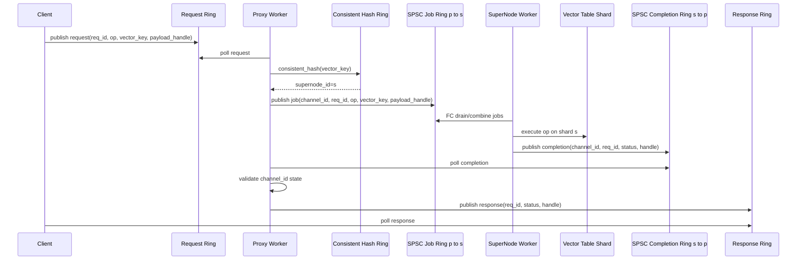
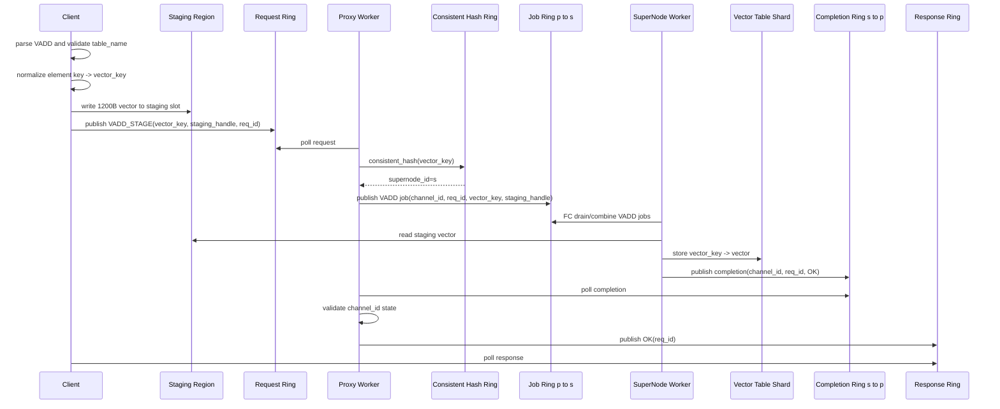
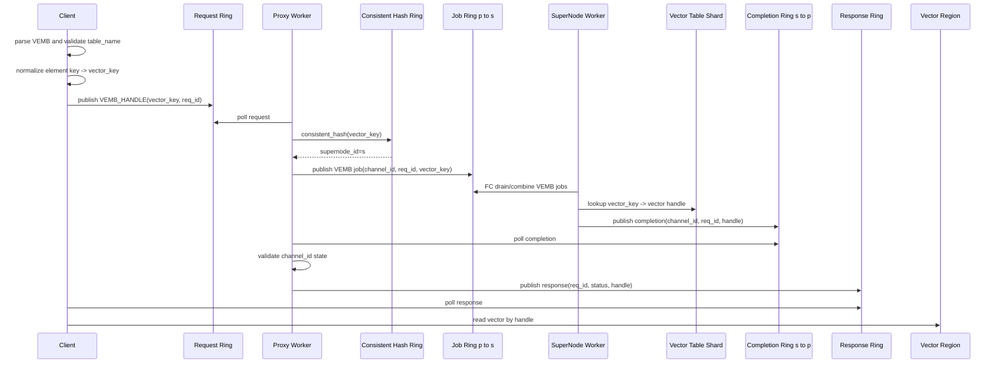
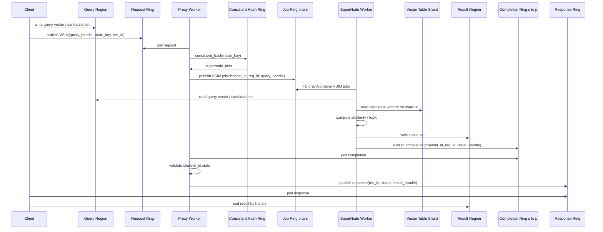
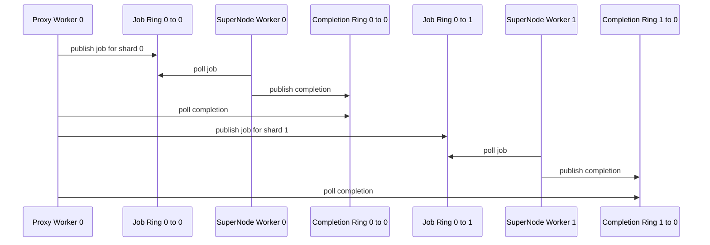

# VEMB V16 多 SuperNode consistent hash ring 设计

日期：2026-05-19

## 核心链路

```text
client -> proxy -> consistent hash ring -> SuperNode -> completion -> proxy -> client
```

这条链路表达的是生产边界：client 只写自己的 channel request ring；proxy/channel worker 负责路由和生命周期；SuperNode 执行 `VADD/VEMB/VSIM`；completion 回到 proxy/channel worker 后再写 client response ring。

## 前提

本设计继承单 SuperNode 版本的生产边界：

```text
proxy 不做计算
SuperNode 执行 VADD / VEMB / VSIM
response ring 生命周期归 proxy/channel worker
SuperNode 只返回 completion
```

区别是这里考虑更真实的部署：

```text
一个 proxy 面对多个 SuperNode
vector_key 通过 consistent hash ring 路由到目标 SuperNode
```

单表模型仍然保持：

```text
server 固定 table_name = myvectors
data-plane request 不携带 table_id
route_key = vector_key
```

## 目标

1. 保持 `VADD/VEMB/VSIM` 全部由 SuperNode 执行。
2. proxy 只做 ingress、channel 生命周期、hash 路由、job 提交、completion 回收、response 写回。
3. 使用 consistent hash ring 决定 `vector_key -> supernode_id`。
4. 当前热路径不使用 mutex/condvar。
5. 尽量保持 SPSC ring，避免全局 MPSC completion queue。
6. 支持多个 SuperNode worker，后续可支持 SuperNode 增删和 consistent hash ring 切换。

## Key / Value 语义

对齐 `tlc_v16`：

```text
vector_key -> 300 dim float32 vector
```

VADD/VEMB 映射：

```text
VADD myvectors ... item:123
  -> vector_key = item:123
  -> value = 300 dim float32

VEMB myvectors item:123 RAW
  -> lookup(vector_key=item:123)
```

`myvectors` 是固定单表名，只在 CLI/control 面校验，不进入 data-plane request。

## 总体时序



说明：

- `channel_id` 只决定 response 回到哪个 client channel。
- `vector_key` 决定路由到哪个 SuperNode。
- SuperNode 不持有 response ring。
- FC 在 SuperNode 内部，负责 drain/combine job ring 后执行 `VADD/VEMB/VSIM`。
- proxy 不访问 vector table。
- `channel_id` 使用 `uint64_t` 单调递增分配，进程生命周期内不复用；旧 completion 不会误写到新的 client channel。

## VADD 时序



文字说明：

- VADD 写入位置由 `consistent_hash(vector_key)` 决定。
- proxy 不复制 1200B vector，只传 `staging_handle`。
- SuperNode 读取 staging slot 并写入自己的 shard。

## VEMB 时序



文字说明：

- VADD 和 VEMB 使用同一个 `consistent_hash(vector_key)`，保证同一个 key 落到同一个 SuperNode。
- VEMB 返回 handle，不通过 response ring 返回 1200B vector。
- `RAW` 语义由 client 拿到 handle 后读取 vector region / shard view 完成。

## VSIM 时序



说明：

- 对单 key VSIM，可以使用 `vector_key` 作为 route key。
- 对 candidate set 或 query-only VSIM，需要定义稳定的 `route_key`，例如 candidate shard id、query target shard 或外部指定 shard。
- 跨 shard VSIM 不在第一版热路径中处理，可作为 fan-out/fan-in 的后续阶段。

## consistent hash ring

consistent hash ring 复用现有实现：

```text
src/consistent_hash.h
src/consistent_hash.c
```

VEMB 不再单独实现一套 `vemb_hash_*` ring 结构，只在 channel worker / proxy 中持有 `consistent_hash_ring_t *` 或复用 `proxy_router_t`。

逻辑路由关系：

```text
vector_key -> murmur3_hash(vector_key) -> consistent_hash ring -> supernode_id
supernode_id = consistent_hash(vector_key)
```

现有接口：

```c
int consistent_hash_init(consistent_hash_ring_t **ring, int num_supernodes);
void consistent_hash_destroy(consistent_hash_ring_t *ring);
int consistent_hash_get_node_by_hash(consistent_hash_ring_t *ring, uint32_t hash);
int consistent_hash_get_node(consistent_hash_ring_t *ring, const char *key);
```

查找：

```text
key_hash = murmur3_hash(vector_key, strlen(vector_key))
supernode_id = consistent_hash_get_node_by_hash(ring, key_hash)
```

也就是：

```text
consistent_hash(vector_key):
  key_hash = murmur3_hash(vector_key)
  return consistent_hash_get_node_by_hash(ring, key_hash)
```

约束：

- 第一版直接复用 `consistent_hash.h/.c` 的 ring 初始化、虚拟节点和查找逻辑。
- 如果要做到完全无锁热路径，后续应把 `consistent_hash_get_node_by_hash()` 的 rwlock 读锁替换为 RCU/只读快照；算法本身仍然使用 `consistent_hash`。
- 第一版不处理在线迁移，只要求启动时固定 ring。

## Ring 拓扑

为了保持无锁，推荐使用 SPSC ring matrix：

```text
job_ring[proxy_worker_id][supernode_worker_id]
completion_ring[supernode_worker_id][proxy_worker_id]
```



文字说明：

- 每条 ring 都保持单 producer、单 consumer。
- channel worker / proxy 需要 poll 多条 completion ring。
- SuperNode worker 需要 poll 来自多个 channel worker / proxy 的 job ring。
- 如果 worker 数很大，后续可以做分组或轮询预算控制。

## Worker Loop

channel worker / proxy loop：

```text
while running:
  poll owned client request rings
    parse req
    s = hash_ring_lookup(vector_key)
    publish job_ring[p][s]
    channel.inflight++

  poll completion_ring[*][p]
    validate channel_id state
    publish response ring
    channel.inflight--
```

SuperNode worker loop：

```text
while running:
  poll job_ring[*][s]
    FC drain/combine jobs
    execute VADD/VEMB/VSIM
    publish completion_ring[s][p]
```

要求：

- 不使用 mutex/condvar。
- request/job/completion descriptor cache-line 对齐。
- channel worker / proxy 和 SuperNode worker pin CPU。
- channel worker / proxy 同一个 loop 同时 poll request 和 completion，避免 result thread。
- FC 只存在于 SuperNode 内部，不放在 CLI 或 proxy 侧；proxy 仍然只负责路由和 completion 回写。

## Channel 生命周期

channel 仍然绑定 client session / client thread：

```text
ALLOC_CHANNEL
-> ACTIVE
-> CLOSE_CHANNEL
-> CLOSING
-> wait inflight == 0
-> CLOSED
```

`channel_id` 分配策略采用方案 A：

```text
channel_id = atomic_fetch_add(&next_channel_id, 1)
CLOSE_CHANNEL 释放 channel 资源，但不回收 channel_id
没有 channel_id free list
没有 channel 代际字段
```

completion 必须携带：

```text
channel_id
req_id
status
handle
```

proxy 收到 completion 后：

```text
if channel_id exists and channel state allows response:
  write response ring
else:
  drop closed-channel completion
```

由于 `channel_id` 不复用，晚到的旧 completion 最多只能命中已关闭 channel，不会命中新建 channel。关闭流程必须等 `inflight == 0` 后再释放 response ring 等资源；如果需要强制关闭，则 response ring 释放前要先把 channel state 标记为不可回写。

## 性能预期

相比单 SuperNode 一对一 SPSC link，多 SuperNode consistent hash ring 版本多了：

```text
murmur3_hash(vector_key)
consistent_hash_get_node_by_hash
job ring matrix 选择
SuperNode worker 扫描多个 proxy job rings
channel worker / proxy 扫描多个 SuperNode completion rings
```

预计：

| 模式 | 单 SuperNode SPSC | 多 SuperNode consistent hash ring | 主要差距 |
|---|---:|---:|---|
| `vemb-handle` | 0.8M - 1.3M QPS | 0.6M - 1.1M QPS | hash lookup + 多 ring poll |
| `vemb-read-vector` | 0.6M - 1.0M QPS | 0.5M - 0.9M QPS | hash lookup + shard handle 读取 |
| `vadd-stage` | 0.8M - 1.3M QPS | 0.6M - 1.1M QPS | hash lookup + staging/table 写 |
| `vsim` | compute 主导 | compute + shard/fanout 策略 | compute 和候选集主导 |

如果 consistent hash ring 足够小、worker 绑定合理，多 SuperNode 的损耗应主要来自 ring 扫描，而不是锁竞争。

## 热点路径

proxy 负责路由和生命周期，不做计算；SuperNode 负责所有 VADD/VEMB/VSIM 执行。

热路径应使用：

```text
SPSC job ring matrix
SPSC completion ring matrix
只读 consistent hash ring
uint64_t channel_id completion 状态校验
```

这样保留生产架构，同时尽量接近 `tlc_v16` 的无锁数据面模型。
