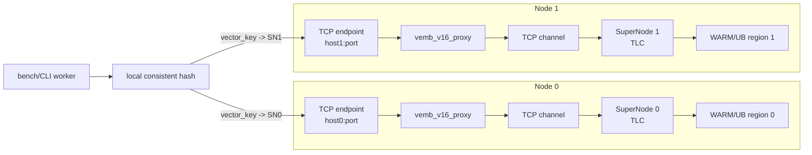
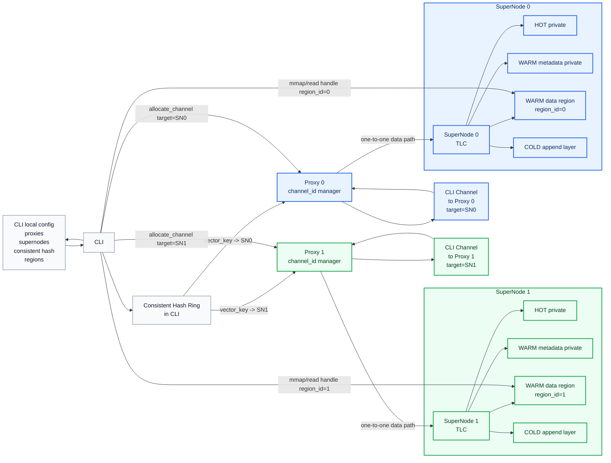
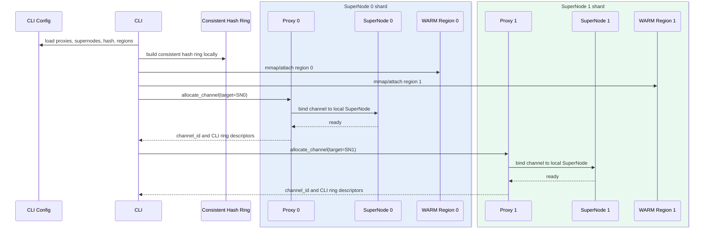
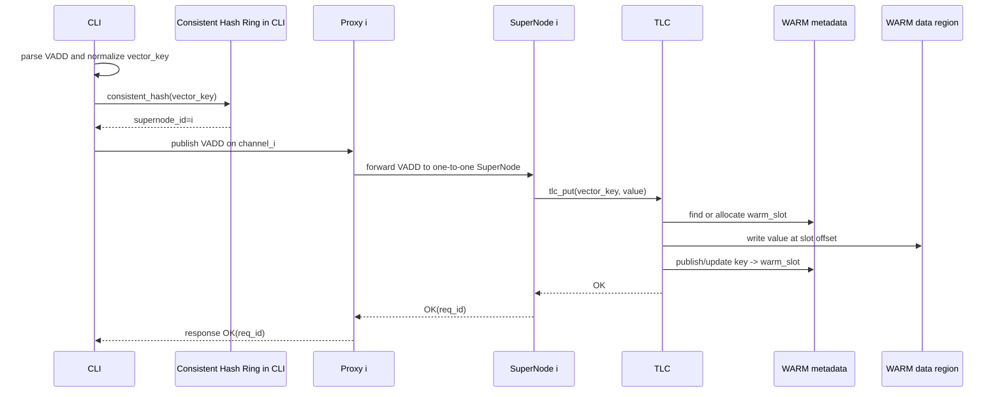
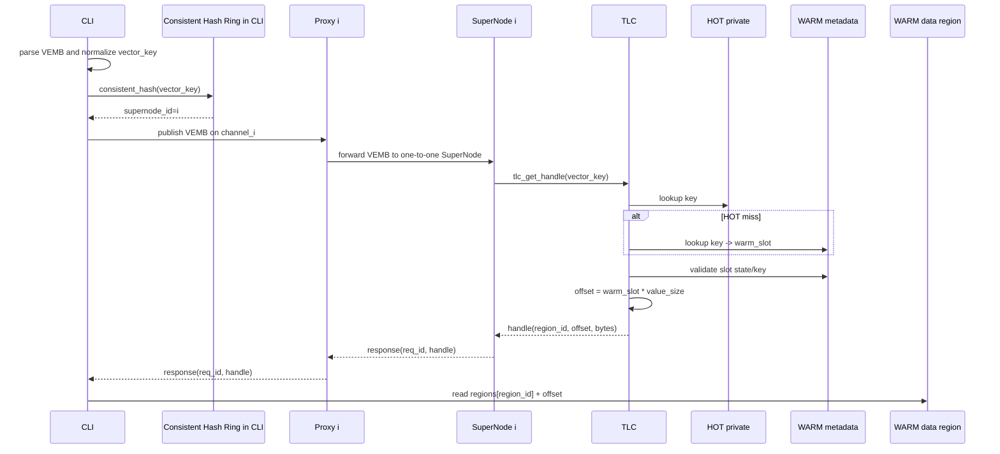

# VEMB V16 多 SuperNode 架构设计

日期：2026-05-22

## 核心结论

多 SuperNode 场景下，`consistent_hash` 在 CLI 中完成。Proxy 不负责 hash、不负责拓扑/region 配置、不做计算。

部署关系采用一一对应模型：

```text
Proxy 0 <-> SuperNode 0
Proxy 1 <-> SuperNode 1
...
Proxy N <-> SuperNode N
```

CLI 根据本地配置执行：

```text
vector_key -> consistent_hash(vector_key) -> supernode_id
supernode_id -> proxy_id
proxy_id == supernode_id
```

然后 CLI 向对应 proxy 申请 channel。Proxy 只负责：

```text
CLI channel 生命周期
channel_id 单调分配和回收
channel_id -> SuperNode 绑定
CLI request/response ring 生命周期
Proxy <-> SuperNode 数据交互
```

SuperNode 负责执行：

```text
VADD
VEMB
VSIM
TLC HOT/WARM/COLD
```

交付版本备注：

```text
交付版本会率先使用 TCP/IP 方式完成 CLI 与 SuperNode 之间的交互。
CLI 仍在本地执行 consistent_hash(vector_key)，选择目标 supernode_id。
选中目标后，CLI 直接通过 TCP/IP 向对应 SuperNode 发送 VADD/VEMB/VSIM 请求。
proxy/channel/shared-memory ring/WARM mmap read-by-handle 作为后续高性能数据面形态继续演进。
```

因此，交付版的功能语义先按“CLI hash route -> TCP/IP -> SuperNode -> TLC”闭环，先保证多 SuperNode 路由、请求语义和 TLC 存储语义正确；后续再把传输层替换为 proxy-managed channel 与共享内存/UB 读路径。

## Network Transport 选型

多 SuperNode 的第一阶段网络路径选择 TCP persistent connection + binary frame，不使用 `aeron_ipc`。

优先级：

```text
1. TCP: first implementation and default cross-node transport
2. DPDK: later high-end transport after TCP profiling identifies kernel stack bottleneck
3. KCP/UDP: experimental transport for lossy or high-jitter networks
```

取舍：

- TCP 最适合先交付：可靠、有序、跨机可用，部署与排障成本低。
- DPDK 只有在可以独占 CPU/NIC 队列、配置 hugepage、绑定 NUMA/core，并且 TCP 已被证明是瓶颈时才值得进入主线。
- KCP 更适合弱网，不适合作为机房内低丢包网络的默认高性能数据面。

第一阶段连接模型：

```text
bench/CLI worker
-> route vector_key by local consistent hash
-> connect target supernode TCP endpoint
-> HELLO/WELCOME creates per-connection channel
-> REQUEST frames carry vemb_v16_req_t
-> RESPONSE frames carry vemb_v16_resp_t
```

跨 SuperNode TCP 路由架构：



每个 TCP 连接在 server 内部仍绑定一个 channel worker 和一个 SuperNode worker；server 内部继续使用进程内 typed SPSC ring，保持现有 `proxy -> SuperNode -> completion -> proxy` 执行边界。

TCP control 也走同一个 TCP endpoint：

```text
STATS
CLOSE_CHANNEL
CLOSE_ALL_CHANNELS
```

因此 `--transport tcp` 的 bench/CLI 可以在跨主机场景下完成 stats 与 channel cleanup，不需要访问目标机器上的 UDS control socket。TCP data connection 断开后，server 负责 reap inactive channel、join worker，并把 counters 合并进 closed stats。

## Multi-SuperNode 架构



说明：

- CLI 从本地配置读取 proxy 列表、SuperNode 列表、consistent hash 参数和 WARM region descriptors。
- CLI 在本地执行 `consistent_hash(vector_key)`，得到目标 `supernode_id`。
- `proxy_id == supernode_id`，CLI 连接对应 proxy。
- Proxy 和 SuperNode 一一对应，不存在一个 proxy 面对多个 SuperNode 的热路径 fan-out。
- Proxy 不做 hash，不持有 consistent hash ring。
- Proxy 不下发 region descriptors。
- 每个 SuperNode 有独立 TLC：HOT 私有、WARM metadata 私有、WARM data region 可被 CLI mmap 读取、COLD 独立 append。
- VEMB response 返回 `{region_id, offset, bytes}`，CLI 根据 `region_id` 读取对应 SuperNode 的 WARM data region。

## 初始化时序



## VADD 时序



## VEMB 时序



## 约束

- `consistent_hash` 只在 CLI 中执行。
- Proxy 和 SuperNode 一一对应。
- Proxy 不参与 hash ring 构建、查找、发布。
- Proxy 不下发 SuperNode 拓扑和 region descriptors。
- Proxy 只管理 channel 生命周期和 `channel_id`。
- Proxy 只把已绑定 channel 的 request 转交给本地对应 SuperNode。
- SuperNode 执行 VADD/VEMB/VSIM 和 TLC。
- CLI 根据 VEMB 返回 handle 读取 WARM data region。

## 性能影响

相对单 SuperNode 场景，多 SuperNode 额外成本主要在 CLI 侧：

```text
murmur3_hash(vector_key)
consistent_hash ring lookup
选择 proxy/channel
```

Proxy 侧不新增 hash lookup，也不需要在多个 SuperNode 之间 fan-out。由于 proxy 与 SuperNode 一一对应，proxy 热路径仍保持固定目标的 channel 转发模型。
