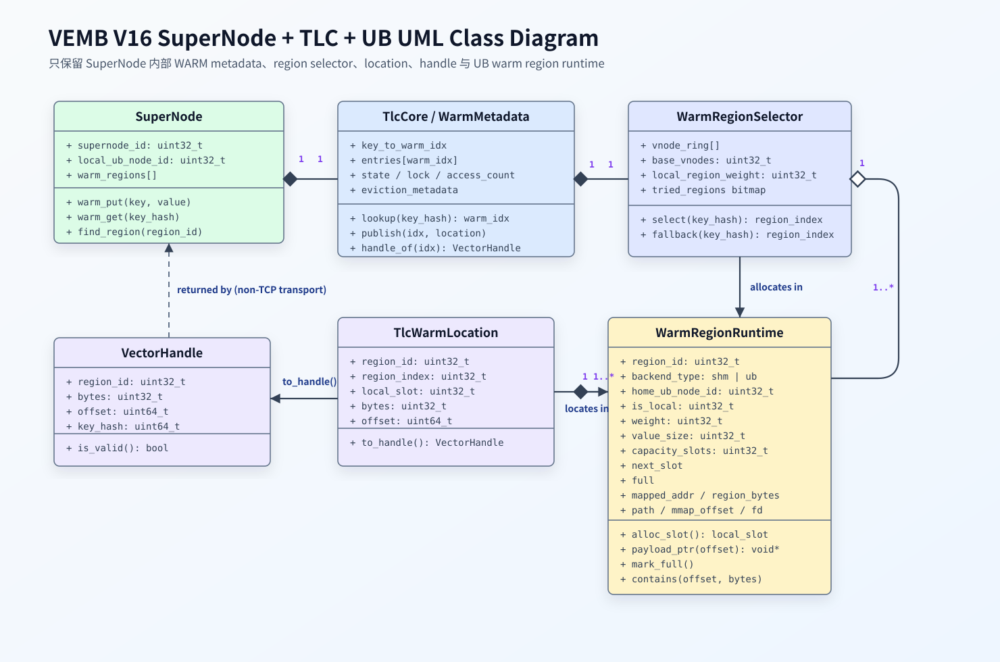

# VEMB V16 单 WARM Layer 多 UB Region 设计

日期：2026-06-03

## 目标

- VEMB V16 的一个 SuperNode 内部，单个 WARM layer 可以映射多个 UB region。
- 支持一个 SuperNode 的 WARM layer 同时挂载多个 UB region。
- 写入新 key 时优先选择本地 UB region。
- 单个 region 满后自动 fallback 到下一个可用 region。
- 保持跨进程 handle ABI 为 `{region_id, offset, bytes}`。
- 保持 HOT/WARM/COLD metadata 私有，不把 hash table、锁、状态位放进 UB data region。
- 兼容当前单 region 模式，便于分阶段落地。
- 新 key 写入时，SuperNode 使用类似 `three_layer_cache_ub` 的 hash + weight 策略选择 WARM UB region。
- OBMM 的 export/import 和 UB path 创建仍由 `obmmctl` 在进程外完成；VEMB 进程只消费已经映射好的 UB path，通过 `open + mmap` 完成本进程映射。
  
  <span style="color:red"> **TODO: 需要 Huawei 方提供生产环境 UB 初始化案例，帮助明确 `obmmctl` 的实际部署、export/import 和 region 暴露方式。** </span>
- <span style="color:red">不做在线 region 迁移、rebalance 或动态扩缩容。</span>

## 架构图



图示说明：

- `SuperNode` 持有单个 `TlcCore / WarmMetadata`，负责 `warm_put`、`warm_get` 和按 `region_id` 查找 region runtime。
- `TlcCore / WarmMetadata` 维护私有元数据：`key -> warm_idx` 与 `warm_idx -> TlcWarmLocation`，不把 hash table、锁和状态位放进 UB region。
- `WarmRegionSelector` 维护带权 virtual-node ring，基于 `key_hash` 优先选择本地 `WarmRegionRuntime`，region 满时执行 fallback。
- `WarmRegionRuntime` 表示一个已 mmap 的 WARM UB region，负责 slot 分配、满位标记和 `offset -> payload` 地址解析。
- `TlcWarmLocation` 描述 payload 在某个 region 内的具体位置：`{region_id, region_index, local_slot, offset, bytes}`。

  ```c
    typedef struct tlc_warm_location {
        uint32_t region_id;
        uint32_t region_index;
        uint32_t local_slot;
        uint32_t bytes;
        uint64_t offset;
    } tlc_warm_location_t;
  ```

  - `region_id`：对外稳定的 region 标识，用于跨进程 handle 和读路径 lookup。
  - `region_index`：当前 SuperNode 进程内 `warm_regions[]` 的数组下标，用于快速定位 runtime descriptor。
  - `local_slot`：该 region 内部分配到的逻辑 slot 编号，通常由 `next_slot` 原子递增得到。
  - `bytes`：该 payload 的有效字节数，用于返回 handle 和读路径边界校验。
  - `offset`：该 payload 在目标 region `mapped_addr` 内的字节偏移，实际读写地址为 `mapped_addr + offset`。

- `VectorHandle` 是适合非 TCP transport 模式的稳定寻址句柄，保持 ABI 为 `{region_id, offset, bytes}`

    跨进程 response 仍返回：

    ```c
    typedef struct vemb_v16_vector_handle {
        uint32_t region_id;
        uint32_t bytes;
        uint64_t offset;
        uint64_t key_hash; // key_hash` 只用于 debug、日志和一致性校验，不参与寻址
    } vemb_v16_vector_handle_t;
    ```

## 数据模型

WARM layer 拆成 metadata 和 payload 两部分：

```text
metadata:
  SuperNode private heap
  key -> warm_idx
  warm_idx -> {region_id, region_index, local_slot, offset, bytes}
  state / access_count / lock / eviction metadata

payload:
  POSIX SHM 或 UB mmap region
  region_id + offset -> vector bytes
```


## Region Runtime

每个 WARM region 在 SuperNode 内部需要一个 runtime descriptor：

```c
typedef struct vemb_v16_warm_region_runtime {
    uint32_t region_id;
    uint32_t backend_type;       /* shm | ub */
    uint32_t home_ub_node_id;
    uint32_t is_local;
    uint32_t weight;
    uint32_t value_size;
    uint32_t capacity_slots;
    atomic_uint_fast32_t next_slot;
    atomic_int full;

    char path[256];
    uint64_t mmap_offset;
    uint64_t region_bytes;
    void *mapping_addr;
    void *mapped_addr;
    size_t mapping_bytes;
    int fd;
} vemb_v16_warm_region_runtime_t;
```

`capacity_slots = region_bytes / value_size`。region 满的判断由 `next_slot` 分配结果决定：

```text
slot = atomic_fetch_add(next_slot, 1)
if slot < capacity_slots:
  allocate success
else:
  mark full and try next region
```

## OBMM Manifest 与 Local 判定

当前仓库里的 OBMM 侧能力只消费现成 shmdev：`open(path, O_RDWR)` + `mmap(MAP_SHARED)`。这只能证明 path 可访问，不能证明 locality。

local 判定必须来自控制面：

```text
region.is_local = region.home_ub_node_id == supernode.local_ub_node_id
```

推荐由 obmmctl 部署流程生成 manifest：

```yaml
supernode_id: 0
local_ub_node_id: 0
warm_regions:
  - region_id: 1
    provider: ub
    path: /dev/obmm_shmdev2
    mmap_offset: 0
    bytes: 1073741824
    value_size: 1200
    home_ub_node_id: 0
    weight: 1
  - region_id: 2
    provider: ub
    path: /dev/obmm_shmdev3
    mmap_offset: 0
    bytes: 1073741824
    value_size: 1200
    home_ub_node_id: 1
    weight: 1
```

短期无法从 obmmctl 输出 `home_ub_node_id` 时，可以显式配置本地 region：

```yaml
supernode_id: 0
local_region_ids: [1]
warm_regions:
  - region_id: 1
    provider: ub
    path: /dev/obmm_shmdev2
    is_local: true
```

不建议用 `/dev/obmm_shmdevX` 的 `X` 推断 locality。该编号是本机 shmdev 资源 id，不是稳定的物理 UB node id。

## 初始化流程

server 启动使用 manifest/config，而不是单个 `--vector-region`：

```bash
./src/vemb_v16_server \
  --socket /tmp/vemb_v16.sock \
  --warm-regions-manifest /etc/vemb/supernode-0-warm-regions.yaml \
  --dim 300 \
  --max-vectors 131072 \
  --loglevel notice
```

初始化时序：

```text
parse manifest
validate unique region_id
validate all value_size == vector_dim * sizeof(float)
for each warm region:
  open path
  mmap region bytes with mmap_offset alignment
  derive capacity_slots
  derive is_local from local_ub_node_id/home_ub_node_id or explicit is_local
build region_id -> runtime region map
build WARM region hash ring
create tlc_core with warm_regions[]
```

UB region mmap 规则：

```c
aligned_offset = page_align_down(mmap_offset)
offset_delta = mmap_offset - aligned_offset
mapping_bytes = region_bytes + offset_delta
mapping_addr = mmap(NULL, mapping_bytes, PROT_READ|PROT_WRITE, MAP_SHARED, fd, aligned_offset)
mapped_addr = mapping_addr + offset_delta
```

## Hash + Weight Region Selector

region selector 使用 virtual nodes：

```python
base_vnodes = 32
effective_weight = region.weight
if region.is_local:
  effective_weight *= local_region_weight
vnodes = base_vnodes * effective_weight
```

hash ring node：

```c
typedef struct warm_region_vnode {
    uint32_t hash_val;
    uint32_t region_index;
} warm_region_vnode_t;
```

查找流程：

```c
h = mix32(key_hash)
pos = lower_bound(vnodes.hash_val, h)
candidate = vnodes[pos].region_index
```

fallback 流程：

```python
start = lower_bound(hash)
for vnode in ring walk from start:
  region = vnode.region
  skip duplicate region already tried
  skip full/offline region
  try allocate local_slot
  if success:
    return location
return WARM_FULL
```

这样本地 region 被选中的概率更高，但不会阻塞全局写入；本地 region 满后，会自然切到远端或其它可用 region。

## 写入语义

新 key：

```text
warm_put(key, value)
  warm hash lookup
  if key exists:
    write existing location
    return existing handle
  location = warm_region_allocator_alloc(key_hash)
  if allocation success:
    write regions[location.region_index].mapped_addr + location.offset
    publish metadata key -> warm_idx -> location
    hot_put(key_hash, warm_idx)
    return handle(location)
  else:
    cold_append(key, value)
    return invalid warm handle or OK-with-cold-spill
```

overwrite 不重新选择 region。这样可以保证同一个 key 的 handle 不因为写入而频繁移动，也避免 reader 拿到旧 region_id/offset 后立即失效。

## 读取语义

VEMB handle：

```text
hot_get(key_hash) -> warm_idx
validate warm_idx key/key_hash/state
location = warm.entries[warm_idx].location
return {location.region_id, location.offset, location.bytes}
```

COLD read-through：

```text
cold_lookup(key)
warm_region_allocator_alloc(key_hash)
copy cold value into selected WARM region
publish warm metadata
return WARM handle
```

CLI/client 读取：

```c
region = find_region(resp.region_id);
if (!region || resp.vector_offset + resp.vector_bytes > region->region_bytes)
    return error;
vector = region->mapped_addr + resp.vector_offset;
```

VSIM key-key 和 server-side read 也必须按 handle 的 `region_id` 找 mapped region，不能再假设单个 `storage->vector_region + offset`。

## 统计与可观测性

需要新增或扩展以下 counters：

```text
warm_region_count
warm_region_full_count
warm_alloc_local
warm_alloc_remote
warm_alloc_fallback
warm_alloc_cold_spill
warm_alloc_fail
warm_region_hash_local_pct
per_region.capacity_slots
per_region.used_slots
per_region.is_local
per_region.full
```

这些统计用于验证 local weight 是否生效，以及 region 满后的 fallback 是否符合预期。

## 需要改造的模块

主要改造点：

```text
vemb_v16_warm_provider
  open_many/close_many
  region_id -> mapped region lookup

vemb_v16_storage
  storage->warm_regions[]
  vector_slice 按 resp.region_id 查 region
  channel desc 或 manifest 支持多 region

vemb_v16_tlc
  create(warm_regions[])
  handle 由 tlc_core 返回 location 生成
  per-region gather/read context

tlc_core
  warm entry 增加 location
  warm allocator 增加 hash ring + full fallback
  warm_data 单指针改为 regions[]

vemb_v16_supernode
  VSIM/read path 按 handle.region_id 查 region

benchmark / CLI
  mmap 多个 region
  find_warm_region(region_id)
  校验 offset + bytes 不越界
```

## 落地顺序

建议分四步：

1. 在单进程 mock/shm 下实现 `regions[]` 和 `warm_idx -> location`。
2. 加入 region hash ring、local weight、full fallback，并补单测。
3. 接入 OBMM manifest，使用多个 `/dev/obmm_shmdevX` 做真实 UB mmap。
4. 扩展 bench/client 多 region mmap，并验证 local hit ratio、fallback 和 COLD spill。

最小单测：

```text
two regions, local weight > remote weight
primary region full -> fallback to second region
all regions full -> cold spill
overwrite keeps original region_id/offset
cold read-through promotes to available WARM region
concurrent distinct key writes do not exceed capacity_slots
```

## 与现有文档关系

本文是单 WARM layer 多 UB region 的专门设计文档。

相关文档：

```text
docs/VEMB_V16_TLC_UB_SHARED_DATA_MODEL.md
docs/VEMB_V16_MULTI_SUPERNODE_HASH_RING_DESIGN.md
docs/VEMB_V16_IMPLEMENTATION_TODO.md
```

其中多 SuperNode 文档描述跨 SuperNode 路由；本文描述目标 SuperNode 内部如何在多个 WARM UB region 之间分配 payload。
