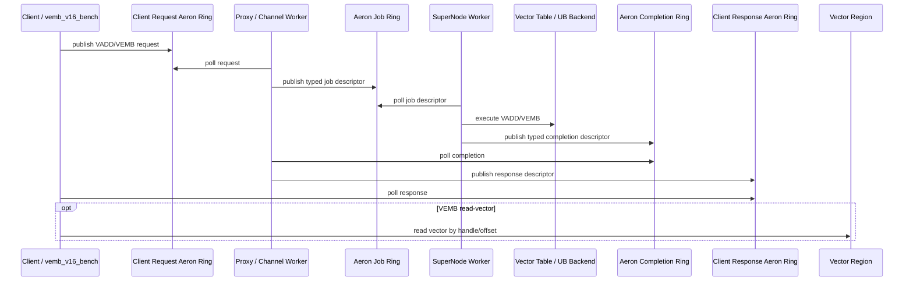

# VEMB V16 Phase 2 Aeron Ring 设计

日期：2026-05-20

## 目标

Phase 2 的目标是把 Phase 1 中 `vemb_v16_proxy.c` 内部临时的 `job_ring` / `completion_ring` 替换为明确的 Aeron fixed-slot SPSC ring，并把 SuperNode 执行从 proxy 文件里拆出来。

本阶段明确不复用 `src/ring_buffer.h/.c`。

原因：

- `ring_buffer.h` 依赖 `server.h`，会把 standalone 数据面重新拖回 Redis runtime。
- `ring_buffer.c` 依赖 `zmalloc/serverLog/RETURN_IF` 等 Redis 内部能力。
- `ring_buffer.h/.c` 是变长 packet 字节流，更适合 Redis 内部 batch packet，不适合 proxy -> SuperNode 的固定 descriptor 热路径。
- Phase 2 需要的是和 `tlc_v16` 一致的 fixed-slot SPSC ring：单 producer、单 consumer、固定槽位、热路径只有 head/tail acquire/release 和一次 descriptor copy。

## 总体链路



## Ring 类型

Phase 2 使用三类 Aeron ring。

### Client Request / Response Ring

保留 Phase 1 已经使用的 `aeron_ring_t` 风格：

```text
client -> proxy: request ring
proxy  -> client: response ring
```

这部分仍然承载 client data-plane request / response。

### Proxy -> SuperNode Job Ring

新增 typed fixed-slot ring：

```text
proxy_worker[p] -> supernode_worker[p]
```

要求：

- SPSC。
- 唯一 producer 是绑定的 proxy/channel worker。
- 唯一 consumer 是绑定的 SuperNode worker。
- slot 中直接放 `vemb_v16_job_t`，不再走变长 `uint32_t len + payload`。
- 不支持多 producer fan-in。
- ring 满时 producer 自旋或计数失败，不引入 mutex/condvar。

### SuperNode -> Proxy Completion Ring

新增 typed fixed-slot ring：

```text
supernode_worker[p] -> proxy_worker[p]
```

要求：

- SPSC。
- 唯一 producer 是绑定的 SuperNode worker。
- 唯一 consumer 是绑定的 proxy/channel worker。
- slot 中直接放 `vemb_v16_completion_t`。
- completion 必须携带 `channel_id` 和 `req_id`，proxy 校验 channel 仍然存活后再写 client response ring。

## 内存布局

Phase 2 引入一个 standalone typed ring 模板，不复用 `ring_buffer.h/.c`。

推荐文件：

```text
src/vemb_v16_aeron_ring.h
```

推荐结构：

```c
typedef struct vemb_v16_aeron_ring {
    _Alignas(64) atomic_uint_fast64_t head;
    _Alignas(64) atomic_uint_fast64_t tail;
    uint32_t slot_size;
    uint32_t slot_count;
    uint32_t slot_mask;
    uint32_t reserved;
    uint8_t  slots[];
} vemb_v16_aeron_ring_t;
```

推荐 API：

```c
int vemb_v16_aeron_ring_init(void *mem,
                             size_t mem_size,
                             uint32_t slot_size,
                             uint32_t slot_count);

int vemb_v16_aeron_publish(vemb_v16_aeron_ring_t *ring,
                           const void *slot);

int vemb_v16_aeron_poll(vemb_v16_aeron_ring_t *ring,
                        void *slot);
```

热路径伪代码：

```c
tail = ring->tail;
head = atomic_load_acquire(&ring->head);
if (tail - head >= slot_count) return FULL;
slots[tail & mask] = descriptor;
atomic_store_release(&ring->tail, tail + 1);
```

```c
head = ring->head;
tail = atomic_load_acquire(&ring->tail);
if (head >= tail) return EMPTY;
descriptor = slots[head & mask];
atomic_store_release(&ring->head, head + 1);
```

## Job Descriptor

Phase 2 的 job descriptor 固定大小。

```c
typedef struct vemb_v16_job {
    uint8_t  op;
    uint8_t  flags;
    uint16_t reserved0;
    uint32_t req_id;
    uint32_t channel_index;
    uint32_t key_len;
    uint64_t channel_id;
    uint64_t key_hash;
    uint32_t dim;
    uint32_t vector_bytes;
    uint64_t vector_offset_or_staging_offset;
    char     key[VEMB_V16_MAX_KEY_LEN];
} vemb_v16_job_t;
```

注意：

- VEMB job 必须只携带 vector_key/key_hash/channel_id/req_id。
- VADD 当前按决策保留 full-vector 传输，走独立 VADD full-vector job ring。
- VADD staged model 延后：等 VEMB 热路径稳定后，再把 client 写 staging region、job 只携带 staging handle/offset 的方案接入。

## Completion Descriptor

```c
typedef struct vemb_v16_completion {
    uint8_t  status;
    uint8_t  op;
    uint16_t flags;
    uint32_t req_id;
    uint32_t channel_index;
    uint32_t dim;
    uint64_t channel_id;
    uint64_t key_hash;
    uint64_t vector_offset;
    uint32_t vector_bytes;
    uint32_t reserved;
} vemb_v16_completion_t;
```

completion 只返回 handle/offset，不返回完整 1200B vector。

`VEMB RAW` 的 RAW 兼容语义由客户端完成：

```text
client poll response -> get vector_offset -> read vector region -> format RAW output
```

## 模块拆分

Phase 2 之后，`vemb_v16_proxy.c` 不再承载 SuperNode 执行和 vector table 实现。

推荐拆分：

```text
src/vemb_v16_aeron_ring.h        Aeron fixed-slot SPSC ring
src/vemb_v16_dataplane.h         job/completion descriptor
src/vemb_v16_proxy.c             UDS control + channel worker + response writeback
src/vemb_v16_supernode.c         SuperNode worker loop
src/vemb_v16_supernode.h         SuperNode lifecycle API
src/vemb_v16_table.c             vector_key -> handle/offset backend
src/vemb_v16_table.h             backend API
```

边界：

```text
proxy:
  parse/poll client request
  route channel
  publish job
  poll completion
  write response

supernode:
  poll job
  execute VADD/VEMB/VSIM
  publish completion

table/backend:
  vadd(vector_key, vector_handle/staging_handle)
  vemb(vector_key) -> vector_offset
  later: UB backend
```

## SuperNode 执行层

Phase 2 先拆出 SuperNode worker loop，不要求一次性接入当前 Redis 版 `supernode_worker.c`。

原因：

- `src/supernode_worker.c` 仍依赖 Redis runtime、`ring_buffer_mgr`、`proxy_vector_request_t *owner` 和 Redis completion 模型。
- 直接链接会破坏 standalone 数据面边界。

正确方式是抽 SuperNode 执行内核：

```text
vemb_v16_supernode.c
  -> standalone worker loop
  -> later reuse/extract SVE/UB load/copy/compute primitives
```

后续接 SVE/UB 时，只复用底层计算和 UB 访问 primitives，不复用 Redis blocked-client completion。

## Phase 2 落地步骤

1. 新增 `src/vemb_v16_aeron_ring.h`。
2. 新增 `src/vemb_v16_dataplane.h`，把 `vemb_v16_job_t` / `vemb_v16_completion_t` 从 `vemb_v16_proxy.c` 移出去。
3. 用 Aeron typed ring 替换 `vemb_v16_proxy.c` 内部临时 `job_ring_push/poll` 和 `completion_ring_push/poll`。
4. 新增 `src/vemb_v16_supernode.c/.h`，把 `supernode_thread_main()` 从 proxy 文件拆出。
5. 新增 `src/vemb_v16_table.c/.h`，把进程内 vector table 从 proxy 文件拆出。
6. 拆分 VEMB 小 descriptor job ring 和 VADD full-vector job ring。
7. 保持 `vadd-inline` 作为当前 VADD 全量传输路径。
8. 增加性能计数：
   - client request publish fail/spin
   - proxy poll count
   - job ring full count
   - SuperNode execute count
   - SuperNode bitmap lock/unlock latency
   - SuperNode vector load latency
   - completion ring full count
   - response publish full count

当前实现状态：

```text
P0: done
  server stats:
    proxy_request_poll
    proxy_completion_poll
    proxy_vemb_publish / proxy_vadd_publish
    proxy_vemb_ring_full / proxy_vadd_ring_full
    proxy_response_publish / proxy_response_ring_full
    supernode_vemb_poll / supernode_vadd_poll
    supernode_completion_publish / supernode_completion_ring_full
    sampled table_lookup_ns
    sampled bitmap_lock_ns / bitmap_unlock_ns
    sampled vector_load_ns
    sampled completion_publish_ns
    bitmap_lock_success / bitmap_lock_failure

  client stats:
    request_publish_spins
    response_empty_polls

P1: done
  benchmark modes:
    ping
    vemb-handle
    vemb-read-vector
    vadd-inline

  benchmark thread list:
    --threads 1,2,4,8,16

  hotspot mode:
    --hot-key-id N
```

## 验收标准

功能：

```text
ping:             ok=100%
vemb-handle:      ok=100%
vemb-read-vector: ok=100%
vadd-inline:      ok=100%
```

结构：

```text
standalone 文件不得 include server.h
standalone 文件不得引用 RedisModule*
standalone 数据面不得 link ring_buffer.h/.c
proxy 文件不得直接执行 VADD/VEMB table 操作
SuperNode worker 必须通过 Aeron job ring 收到请求
completion 必须通过 Aeron completion ring 回到 proxy
```

性能第一目标：

```text
vemb-handle >= Phase 1 当前实现
vemb-read-vector >= Phase 1 当前实现
VEMB 不再复制 full-vector job slot
```

性能第二目标：

```text
vemb-handle 接近 0.8M QPS 起步线
VADD staged 延后到 VEMB 热路径稳定后
```
