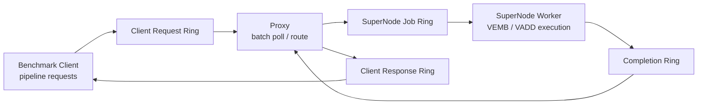
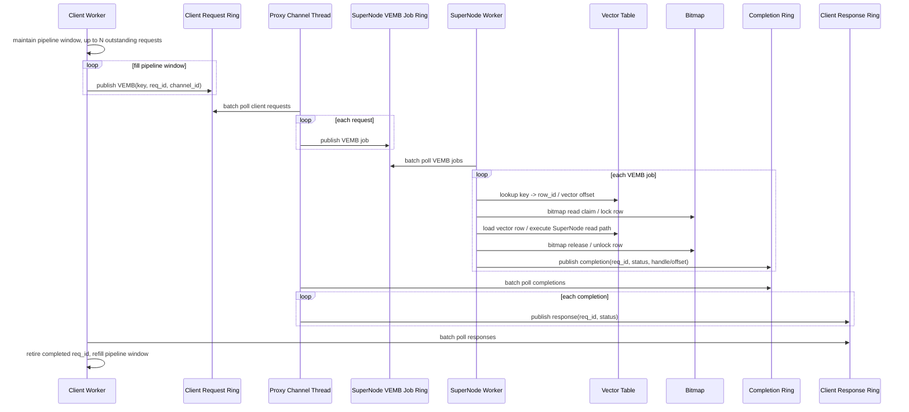

# VEMB v16 Pipeline / Batch / Bitmap 压测结论

本文总结 `vemb_v16_bench --mode vemb-supernode-read` 在当前 `client -> proxy -> SuperNode -> proxy -> client` 路径上的压测结果，并梳理下一阶段优化方向。

## 热点路径

当前压测路径已经绕开 Redis command/module/block-client 路径，核心链路为：

```text
client -> proxy -> SuperNode -> completion -> proxy -> client
```

其中：

- client 通过 per-channel request ring 发送请求。
- proxy channel thread 批量 poll client request，再转发到 SuperNode job ring。
- SuperNode worker 执行 VEMB/VADD，其中 `vemb-supernode-read` 会进入 SuperNode 读向量路径。
- SuperNode 将 completion 写回 completion ring。
- proxy 批量 poll completion，再写回 client response ring。
- client 使用 pipeline window 保持多个 outstanding requests。

## 总体架构图



## VEMB 细化时序图



## 压测数据结论

### pipeline=1 与 pipeline=16

小规模 `prefill=1000, ops=10000, threads=1,2` 下，pipeline 收益非常明显：

| threads | pipeline=1 QPS | pipeline=16 QPS | 提升 |
|---:|---:|---:|---:|
| 1 | 363,517 | 1,526,226 | 4.2x |
| 2 | 768,053 | 3,047,755 | 4.0x |

同时 `response_empty_polls` 从千万级下降到十万级以内，说明 client 不再逐条同步等待 response，proxy/SuperNode batch poll 才能吃到连续请求。

### pipeline=16 真实规模结果

`prefill=65536, ops/thread=200000, pipeline=16`：

| threads | QPS | avg/op | response_empty_polls | bitmap_lock_avg_ns | bitmap_unlock_avg_ns | vector_load_avg_ns |
|---:|---:|---:|---:|---:|---:|---:|
| 1 | 1,813,368 | 548.2ns | 7,183,181 | 45.3 | 34.1 | 48.2 |
| 2 | 3,959,647 | 251.9ns | 6,641,809 | 89.4 | 35.7 | 47.7 |
| 4 | 7,076,081 | 140.6ns | 24,324,647 | 119.6 | 46.5 | 49.7 |
| 8 | 6,659,660 | 149.6ns | 393,046,455 | 238.2 | 109.7 | 50.4 |
| 16 | 7,351,792 | 135.7ns | 3,491,947,591 | 381.4 | 226.2 | 49.8 |
| 32 | 8,477,727 | 117.6ns | 16,926,804,652 | 663.6 | 398.2 | 50.2 |

结论：

- 当前峰值约 `8.5M QPS`。
- `full vemb_ring / response_ring / completion_ring = 0`，ring 容量与 publish full 不是瓶颈。
- `request_publish_spins=0`，client 发请求没有被 request ring 阻塞。
- `vector_load_avg_ns` 稳定在 `48-52ns`，读 300 dim / 1200B 向量本身不是瓶颈。
- 高并发下 `bitmap_lock_avg_ns` 和 `bitmap_unlock_avg_ns` 明显增长，是最清晰的扩展性损耗信号。

### pipeline=32 对比

`pipeline=16 -> pipeline=32` 收益很小：

| threads | pipeline=16 QPS | pipeline=32 QPS | 变化 |
|---:|---:|---:|---:|
| 4 | 7,076,081 | 7,267,629 | +2.7% |
| 8 | 6,659,660 | 6,626,499 | -0.5% |
| 16 | 7,351,792 | 7,435,439 | +1.1% |
| 32 | 8,477,727 | 8,614,195 | +1.6% |

结论：`pipeline=16` 已经基本覆盖 client 等待开销，继续加深 pipeline 不是主要优化方向。默认建议继续使用 `pipeline=16`。

### pin=yes 对比

`--pin yes` 已生效后的结果：

| threads | no pin QPS | pin=yes QPS | 变化 |
|---:|---:|---:|---:|
| 4 | 7,076,081 | 7,139,189 | 基本持平 |
| 8 | 6,659,660 | 6,639,105 | 基本持平 |
| 16 | 7,351,792 | 2,518,011 | 明显下降 |
| 32 | 8,477,727 | 2,459,573 | 明显下降 |

结论：当前 pin 策略是负收益，主压测暂时不要使用 `--pin yes`。

原因判断：

- 目前只 pin client worker，没有同时 pin proxy channel thread 和 SuperNode worker。
- client/server 可能抢同一批 CPU，调度器无法自动避让。
- 16/32 线程时 QPS 大幅下降，但 bitmap lock 并没有同步变坏，说明主要问题是 CPU 绑定布局，而不是 bitmap 本身。

## 当前瓶颈判断

当前链路已经不是 Redis/RESP/TCP 路径瓶颈，也不是 request/response ring full 瓶颈。主要瓶颈集中在 SuperNode 热路径的逐条固定成本：

```text
SuperNode poll VEMB job
  -> key/table lookup
  -> bitmap lock
  -> vector load
  -> bitmap unlock
  -> completion publish
```

从采样数据看：

- table lookup 大约 `65-80ns`。
- vector load 大约 `50ns`。
- completion publish 大约 `80-115ns`。
- bitmap lock/unlock 会随并发明显恶化，32 线程可到 `600ns+ / 400ns+`。

因此下一阶段重点应从 client pipeline 转向 SuperNode 内部 batch 执行与 bitmap 读路径优化。

## 后续优化方向

### P0: 补 batch 真实度量

当前 stats 统计的是 item 数，例如 `supernode_vemb_poll=6400000`，但不知道真实 poll 轮次和 batch size。需要增加：

- `proxy_request_poll_rounds`
- `proxy_request_batch_max`
- `proxy_completion_poll_rounds`
- `proxy_completion_batch_max`
- `supernode_vemb_poll_rounds`
- `supernode_vemb_batch_max`
- `supernode_completion_publish_rounds`

输出时计算：

```text
avg_batch = items / rounds
max_batch = observed max batch size
```

这些指标用于判断 batch poll 是否真的形成批量，而不是 API 上支持 batch、实际仍接近单条。

### P1: SuperNode batch 执行

目标不是只 batch poll，而是 batch execute：

```text
poll N jobs
  -> 批量 lookup row_id / offset
  -> 批量处理 bitmap claim
  -> 批量 vector load / compute
  -> 批量 publish completion
```

预期收益：

- 降低循环分支和函数调用固定成本。
- 降低 ring poll/publish 的 per-item 成本。
- 为后续 bitmap word 分组和 SVE 批处理创造入口。

### P1: bitmap 读路径优化

VEMB 是读，VADD 是写。bitmap 不能直接删除，因为它承担 VADD/VEMB 并发保护。但当前 VEMB 每条都做较重原子 lock/unlock，高并发下 cacheline 抖动明显。

可选方向：

- read-mostly 轻量 claim：VEMB 使用更轻的共享读标记，VADD 使用写保护。
- batch 内按 bitmap word 分组：同一个 bitmap word/cacheline 的 row 集中处理，减少反复抢同一 cacheline。
- batch 内重复 row 去重：同一批内重复 key/row 只做一次 bitmap claim。
- no-lock bench-only 对照：临时跳过 bitmap，只用于量化 bitmap 理论上限，不作为生产语义。

### P2: CPU 亲和性规划

当前 `--pin yes` 只 pin client，16/32 线程明显负收益。后续如果要做 pin，需要同时规划：

- client worker CPU set
- proxy channel thread CPU set
- SuperNode worker CPU set
- NUMA/cluster 分布

在此之前，主压测默认使用 `pin=no`。

## 建议默认压测命令

```bash
./benchmark/vemb_v16_bench \
  --mode vemb-supernode-read \
  --dim 300 \
  --prefill 65536 \
  --ops 200000 \
  --threads 4,8,16,32 \
  --pipeline 16 \
  --timeout-ms 30000
```

如需验证 pin，请使用旧参数格式：

```bash
./benchmark/vemb_v16_bench \
  --mode vemb-supernode-read \
  --dim 300 \
  --prefill 65536 \
  --ops 200000 \
  --threads 4,8,16,32 \
  --pipeline 16 \
  --pin yes \
  --timeout-ms 30000
```

当前推荐结论：主线继续以 `pipeline=16, pin=no` 作为基准，下一轮优先落地 batch 真实度量和 SuperNode 内部 batch/bitmap 优化。
