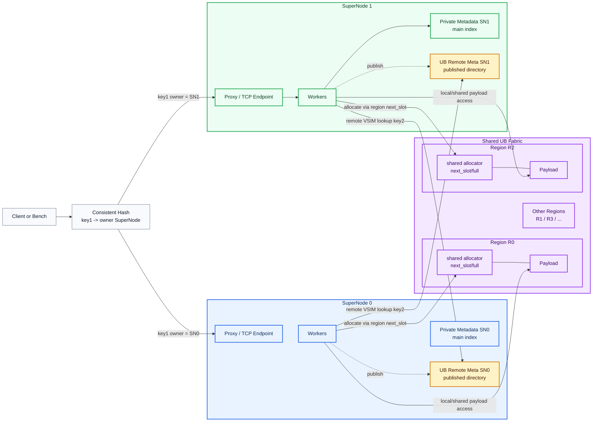
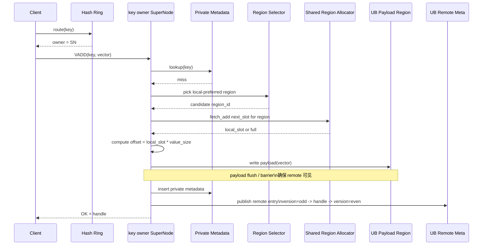
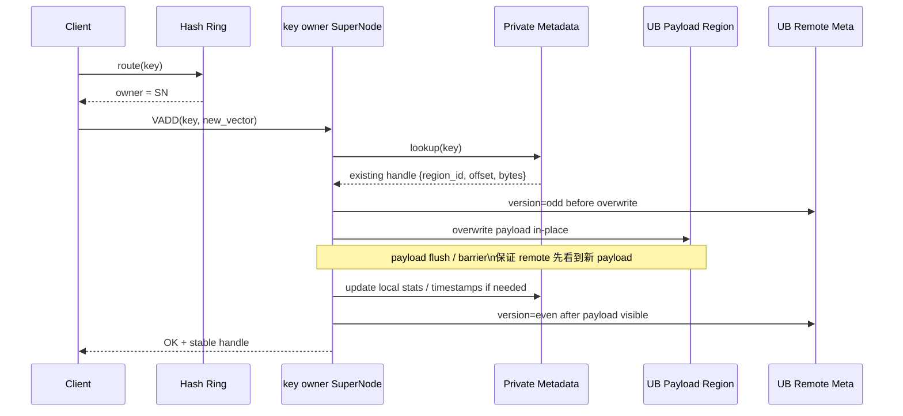
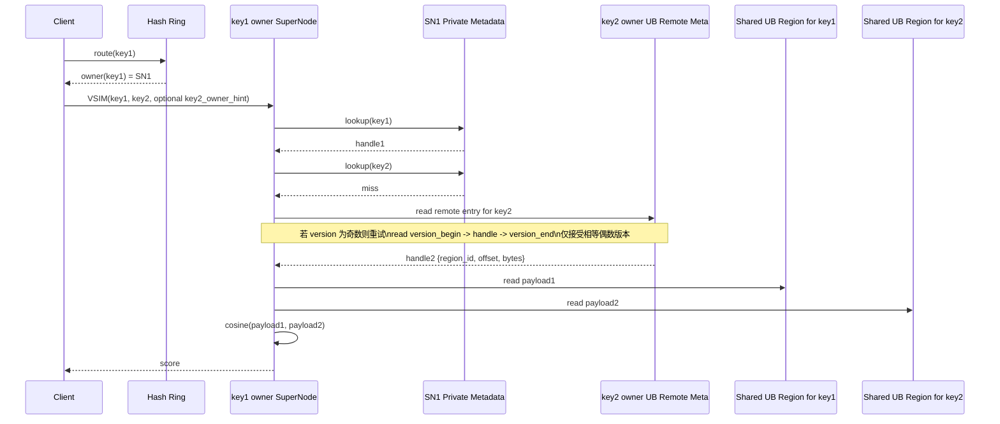

# VEMB V16 Remote-VSIM UB Meta 定稿设计

日期：2026-06-08

## 核心结论

本定稿采用以下边界：

```text
1. 每个 key 的主 metadata 仍由 owner SuperNode 私有管理。
2. UB meta 不是主索引，只是 owner SuperNode 对外发布的只读 remote directory。
3. UB meta 仅在 VSIM key1 key2 跨 SuperNode 查询 key2 handle 时使用。
4. vector handle ABI 只保留 {region_id, offset, bytes}，并将整条 remote entry 控制在 64B cacheline 内。
5. 必须满足：payload visibility happens-before handle publication。
```

## vadd / vemb / vsim 指令格式

本文讨论的 remote VSIM 设计围绕三类向量指令：

```text
VADD:
  VADD key vector

VEMB:
  VEMB key

VSIM:
  VSIM key inline_vector
  VSIM key1 key2
```


## 整体架构图




```text
private metadata:
  owner SuperNode 本地 fast path
  VADD / overwrite / VEMB / 本地 VSIM 均先查这里

UB remote meta:
  owner SuperNode 发布给其他 SuperNode 查询的只读目录
  仅用于 VSIM key1 key2 场景下，key1 owner 去查 key2 handle

  remote meta 不是裸数组。 它至少需要一个 owner-SN 发布的 remote directory：
  key_hash / fingerprint -> remote_meta_entry

  remote_meta_entry 可以保持 64B cacheline。
  directory 的 hash/probe/冲突处理是独立问题，不能省略。

  VSIM 执行位置由 key1 owner 决定：
  key1 owner 在本地取 key1
  若 key2 不在本地，则去 key2 owner 发布的 UB remote meta 取 handle
  然后直接从共享 UB payload region 读 key2 payload

key owner 决定：
  谁维护 private metadata
  谁负责发布对应 UB remote meta

shared region allocator:
  每个 region 一份共享分配状态: 某个 region 的下一个可写 slot 是什么, 该状态必须跨 SuperNode 共享
  至少包含 next_slot / full
  用于避免多个 SuperNode 重复分配同一 slot

shared UB payload regions:
  所有 SuperNode 都 mmap
  handle -> region_id + offset + bytes
```

## Shared Region Allocator

仅共享 payload region 不够，因为新 key 写入时还需要共享“这个 region 已写到哪个 slot”。否则每个 SuperNode 都持有自己的 `next_slot`，会重复分配相同 slot。

第一阶段在以下约束下：

```text
1. overwrite 不迁移 slot
2. 不支持删除后的 slot 复用
3. 新 key 只做 append-style slot 分配
```

最小共享 allocator 结构如下：

```c
typedef struct vemb_v16_shared_region_allocator {
    uint32_t region_id;
    uint32_t capacity_slots;
    _Atomic uint32_t next_slot;
    _Atomic uint32_t full;
    _Atomic uint32_t used_slots;
    uint32_t reserved0;
    uint8_t reserved1[40];
} vemb_v16_shared_region_allocator_t;
```

字段语义：

```text
region_id:
  对应 payload region 标识

capacity_slots:
  region_bytes / value_size

next_slot:
  append-only 分配游标
  writer 用 atomic_fetch_add 获取唯一 local_slot

full:
  提示该 region 已满
  但最终是否成功仍以 slot < capacity_slots 为准

used_slots:
  可选统计字段
  在 append-only 模式下不是必须
```

最小分配规则：

```text
1. 根据 region selector 选择候选 region
2. 先读 allocator.full，若已满则跳过
3. 对 allocator.next_slot 执行 atomic_fetch_add(1)
4. 若返回的 local_slot < capacity_slots：
     分配成功
     offset = local_slot * value_size
5. 若返回的 local_slot >= capacity_slots：
     置 full=1
     fallback 到下一个候选 region
```

## Remote Meta Entry 设计

远端查询 entry 不直接暴露复杂主 metadata，只发布最小可读句柄。

### Handle ABI

```text
vector handle:
  region_id
  offset
  bytes
```

### Published Entry ABI

remote directory entry 固定为单 cacheline，带轻量发布字段：

```c
typedef struct vemb_v16_remote_meta_entry {
    _Atomic uint32_t version; /* odd = writing, even = stable */
    uint32_t region_id;
    uint64_t offset;
    uint32_t bytes;
    uint32_t flags;
    uint64_t key_hash;
    uint64_t key_fingerprint;
    uint8_t reserved0[24];
} vemb_v16_remote_meta_entry_t; /* 64B */
```

约定：

```text
version 为奇数:
  writer 正在更新，reader 必须重试

version 为偶数:
  entry 稳定可读
```

ABI 注意：

```text
1. 共享内存 ABI 不使用 atomic_uint_fast32_t 这类 fast 类型。
   fast 类型大小依赖平台，可能破坏 64B 布局。

2. 共享字段使用固定宽度类型：
   _Atomic uint32_t
   _Atomic uint64_t
   uint32_t
   uint64_t

3. entry 必须 64B 对齐，entries 数组也必须按 64B stride 排布。

4. region_id / offset / bytes 是对外 handle ABI。
   key_hash / key_fingerprint 只用于 remote directory lookup 校验。
```

## Remote Directory Lookup

`UB remote meta` 需要明确如何从 `key2` 找到对应 entry。推荐每个 owner SuperNode 发布一份只读 remote directory：

```text
owner_sn_remote_meta:
  header
  hash_buckets[]
  entries[]
```

最小结构：

```c
typedef struct vemb_v16_remote_meta_header {
    uint32_t magic;
    uint32_t version;
    uint32_t owner_supernode_id;
    uint32_t entry_count;
    uint32_t bucket_count;
    uint32_t bucket_mask;
    uint32_t value_size;
    uint32_t flags;
    uint64_t generation;
} vemb_v16_remote_meta_header_t;

typedef struct vemb_v16_remote_meta_bucket {
    _Atomic uint32_t entry_index;
    uint32_t probe_len;
    uint64_t key_hash;
    uint64_t key_fingerprint;
    uint8_t reserved[40];
} vemb_v16_remote_meta_bucket_t; /* 64B */
```

## Remote Meta View 内存布局

每个 owner SuperNode 发布一块自己的 UB remote meta region。所有 SuperNode 都 mmap 这些 region，并在本地建立只读 view：

```c
typedef struct vemb_v16_remote_meta_view {
    vemb_v16_remote_meta_header_t *header;
    vemb_v16_remote_meta_bucket_t *buckets;
    vemb_v16_remote_meta_entry_t *entries;
} vemb_v16_remote_meta_view_t;
```

固定布局：

```text
remote_meta_base
  + 0
    header

  + align64(sizeof(header))
    buckets[bucket_count]

  + align64(sizeof(header)) + bucket_count * sizeof(bucket)
    entries[entry_count]
```

初始化 view：

```c
uint8_t *base = remote_meta_region[owner_sn].mapped_addr;
size_t header_off = 0;
size_t buckets_off = align64(sizeof(vemb_v16_remote_meta_header_t));
size_t entries_off = buckets_off +
                     (size_t)header->bucket_count *
                     sizeof(vemb_v16_remote_meta_bucket_t);
entries_off = align64(entries_off);

view->header = (void *)(base + header_off);
view->buckets = (void *)(base + buckets_off);
view->entries = (void *)(base + entries_off);
```

布局约束：

```text
1. header 描述整块 remote meta region。
2. bucket 和 entry 都按 64B stride 排布。
3. bucket_count 固定，初始化后不 resize / rehash。
4. entry_count 固定，通常等于该 owner SN 的 max_keys。
5. bucket_count 必须是 2 的幂，bucket_mask = bucket_count - 1。
6. P0 推荐 bucket_count = next_power_of_two(entry_count * 2)，控制 load factor <= 0.5。
```

lookup 规则：

```text
1. 使用 key_hash 定位 bucket。
2. 线性 probe 或 robin-hood probe 查找候选 bucket。
3. bucket 命中后读取 entry_index。
4. 对 entry 执行 version 双读。
5. 校验 entry.key_hash / key_fingerprint。
6. 校验通过后消费 {region_id, offset, bytes}。
```

关于冲突：

```text
当前 vemb_v16_murmur3 是 32-bit hash，不能单独作为跨 SuperNode remote directory 的精确 key 标识。

推荐至少补一个 64-bit fingerprint：
  key_fingerprint = hash64(key bytes)

若要求严格零误判：
  remote directory 还需要 optional key_store 存 key_len + key bytes，
或者 fingerprint 冲突时回退 owner-SN slow path 做 exact lookup。
```

bucket 与 key 数关系：

```text
entry_count ≈ max_keys
bucket_count = next_power_of_two(entry_count / target_load_factor)

P0 推荐：
  target_load_factor <= 0.5
  bucket_count = next_power_of_two(entry_count * 2)
```

原因：

```text
remote lookup 每 probe 一次都可能是一次远端 UB cacheline read。
bucket_count 过小会让 probe 次数急剧增加，拉高 VSIM tail latency。
```

## 一致性与发布顺序

必须满足：

```text
payload visibility happens-before handle publication
```

也就是：

1. 先写 payload。
2. 确保 payload 对 remote 可见。
3. 再发布 remote handle entry。

如果顺序反过来，remote 可能拿到新 handle 后读到旧 payload。

建议的 writer/read protocol：

```text
writer:
  version = odd
  write payload
  payload flush / write barrier
  write region_id + offset + bytes
  release barrier
  version = next even

reader:
  read version_begin
  if odd -> retry
  read region_id + offset + bytes
  acquire barrier
  read version_end
  if version_begin != version_end or odd -> retry
  then read payload
```

overwrite 同样必须走 version 保护：

```text
overwrite writer:
  version = odd
  overwrite payload in-place
  payload flush / write barrier
  release barrier
  version = next even

remote reader:
  version 为奇数时重试
  只在稳定偶数 version 下读取 payload
```

原因：

```text
即使 overwrite 不修改 {region_id, offset, bytes}，
payload 本身仍可能被远端读到半新半旧内容。
因此 overwrite 可以不改 handle，但不能跳过 version odd/even 发布保护。
```

对于 remote VSIM 读路径，`retry` 语义应明确为：

```text
1. 若 version_begin 为奇数，说明 key 正在更新，当前 entry 不可消费。
2. reader 应短暂自旋并重试，而不是直接使用该 handle。
3. 仅当 begin_version == end_version 且两者均为偶数时，才允许读取 payload。
4. 重试必须有上限，不能无限等待 writer。
5. 若达到重试上限仍为奇数或版本持续不稳定，则返回 RETRY/BUSY 或进入慢路径回退。
```

推荐的最小策略：

```text
retry budget:
  自旋重试 N 次，例如 8 / 16 / 32 次

success condition:
  begin_version == end_version
  且 begin_version 为偶数

failure action:
  返回 RETRY / BUSY
  或者回退到 owner-SN slow path
```

## 三条定稿时序

## 1. VADD New Key

适用场景：

```text
key 首次写入
private metadata miss
需要分配新 payload slot
```



关键约束：

```text
1. private metadata 是主索引，先完成本地索引插入。
2. remote meta 是发布目录，不反向驱动 private metadata。
3. remote entry 发布必须晚于 payload 写可见。
4. 新 key slot 由 shared region allocator 分配，不能由各自进程私有计数器决定。
```

## 2. Overwrite Existing Key

适用场景：

```text
key 已存在
继续写回同一 payload slot
不迁移 region_id / offset
```

定稿要求 overwrite 不迁移 slot，这样能显著简化一致性。



关键约束：

```text
1. overwrite 不改 handle，避免远端频繁观察到 handle 切换。
2. overwrite 必须 bump version，用奇数 version 阻止远端读半写 payload。
3. handle 可以保持稳定，但 payload publication 仍由 version odd/even 保护。
4. version 切回偶数必须晚于 payload 对 remote 可见。
```

## 3. VSIM Remote Read

适用场景：

```text
请求为 VSIM key1 key2
执行位置固定在 key1 owner SuperNode
key2 不在本地 private metadata 中
```

如果 client 已知 `key2 owner supernode_id`，可将其作为 hint 直接带给 server；否则 server 也可以按同样 hash 规则自行解析 `key2 owner`。

### 跨节点定位 key2 的完整路径

如果：

```text
key1 owner = SN-1
key2 owner = SN-2
```

则 `remote_lookup_key2` 在 SN-1 的 CPU 上执行。SN-2 只在写入/更新 key2 时发布自己的 UB remote meta，不参与每次 VSIM 查询。

路径：

```text
SN-1:
  key2
  -> key2_owner_sn = SN-2
  -> remote_meta_view[SN-2]
  -> header / buckets / entries
  -> bucket lookup
  -> entry_index
  -> entries[entry_index]
  -> version 双读校验
  -> {region_id, offset, bytes}
  -> warm_region_map[region_id].mapped_addr + offset
  -> key2 payload
```

伪代码：

```c
int remote_lookup_key2(const char *key,
                       uint32_t key_len,
                       uint32_t owner_sn,
                       vemb_v16_vector_handle_t *out) {
    vemb_v16_remote_meta_view_t *view = &remote_meta_views[owner_sn];
    uint64_t key_hash = hash64(key, key_len);
    uint64_t fp = fingerprint64(key, key_len);
    uint32_t pos = (uint32_t)key_hash & view->header->bucket_mask;

    for (uint32_t i = 0; i < REMOTE_META_MAX_PROBES; i++) {
        vemb_v16_remote_meta_bucket_t *bucket = &view->buckets[pos];

        if (bucket->key_hash == key_hash && bucket->key_fingerprint == fp) {
            uint32_t idx = atomic_load_explicit(&bucket->entry_index,
                                                memory_order_acquire);
            vemb_v16_remote_meta_entry_t *entry = &view->entries[idx];

            for (uint32_t r = 0; r < REMOTE_META_RETRY_BUDGET; r++) {
                uint32_t v1 = atomic_load_explicit(&entry->version,
                                                   memory_order_acquire);
                if (v1 & 1u) {
                    cpu_relax();
                    continue;
                }

                uint32_t region_id = entry->region_id;
                uint64_t offset = entry->offset;
                uint32_t bytes = entry->bytes;

                atomic_thread_fence(memory_order_acquire);

                uint32_t v2 = atomic_load_explicit(&entry->version,
                                                   memory_order_acquire);
                if (v1 == v2 && !(v2 & 1u)) {
                    out->region_id = region_id;
                    out->offset = offset;
                    out->bytes = bytes;
                    return 0;
                }
            }
            return VEMB_V16_STATUS_BUSY;
        }

        pos = (pos + 1u) & view->header->bucket_mask;
    }

    return VEMB_V16_STATUS_NOT_FOUND;
}
```

拿到 handle 后：

```text
payload_base = warm_region_map[handle.region_id].mapped_addr
key2_vector = payload_base + handle.offset
key2_bytes = handle.bytes
```



关键约束：

```text
1. SN1 不需要拿 key2 的主 metadata，只需要 key2 owner 发布的 remote handle。
2. remote meta 只解决“key2 在哪”，不承担复杂控制语义。
3. read remote entry 时必须做 version 双读校验，避免读到半写 handle。
4. 用 handle 读 payload 前，entry 已经通过 acquire/retry 语义确认稳定。
5. 若 remote entry 长时间保持奇数 version，则 VSIM 不应无限等待，应按预算重试后失败返回或回退慢路径。
```

## 元数据内存占用估算

以 1TB 级 UB memory、`value_size = 1200B`、P0 remote meta load factor <= 0.5 为例：

```text
payload:
  1200B / key

remote meta bucket:
  bucket_count ≈ 2 * key_count
  bucket = 64B
  bucket cost = 128B / key

remote meta entry:
  entry = 64B
  entry cost = 64B / key

remote meta total:
  192B / key

payload + remote meta:
  1200B + 192B = 1392B / key
```

容量估算：

| 内存口径 | 可存 key-value 数 | payload 占比 | remote meta 占比 |
|---|---:|---:|---:|
| `1 TB = 10^12 B` | `~718.4M` | `86.21%` | `13.79%` |
| `1 TiB = 1024^4 B` | `~789.9M` | `86.21%` | `13.79%` |

如果不计算 remote meta，仅存 payload：

```text
1 TB / 1200B  ≈ 833.3M vectors
1 TiB / 1200B ≈ 916.3M vectors
```

若后续为了严格 exact match 增加 optional key_store，并为每个 key 预留 `128B key bytes`：

```text
meta = 192B + 128B = 320B / key
payload + meta = 1200B + 320B = 1520B / key
meta 占比 = 21.05%

1 TB  ≈ 657.9M key-value
1 TiB ≈ 723.4M key-value
```

P0 推荐先按 `192B/key` 估算 remote meta 成本，也就是约 `13.8%`。

## 设计收益

相比“全局共享主 metadata”，本定稿的收益是：

```text
1. owner SuperNode 本地 fast path 最短。
2. 不需要把主 metadata 做成所有节点共享写热点。
3. UB remote meta 仅承载跨 SN VSIM 所需的最小目录信息。
4. overwrite 原地写回时，远端句柄几乎稳定不变。
5. 协议和一致性边界清晰：主索引私有，发布目录只读。
```

## 与当前代码的最小对接方向

对应现有代码，最小变更点应收敛为：

```text
1. 保留 tlc_core / private metadata 作为主路径。
2. 新增 owner-SN 维护的 UB remote meta publish/read 模块。
3. 在 VADD new / overwrite 成功后发布或刷新 remote entry。
4. 在 VEMB_V16_OP_VSIM_KEY_KEY 路径中加入：
   key2 local miss -> remote meta lookup -> payload read -> compute
5. 协议上可选增加 key2_owner_supernode_id hint，减少 server 侧二次 hash。
```

协议补充建议：

```text
request:
  key2_owner_supernode_id hint
  remote_vsim_retry_budget

response/status:
  OK
  NOT_FOUND
  ERR
  BUSY / RETRY
  REMOTE_META_STALE
  REMOTE_META_COLLISION
```

如果不想立即扩展 status enum，也可以第一阶段把 `BUSY/RETRY` 暂时折叠为 `ERR`，但 stats 中应单独计数，避免和真正错误混在一起。

建议统计项：

```text
remote_meta_lookup
remote_meta_hit
remote_meta_miss
remote_meta_retry
remote_meta_busy
remote_meta_stale
remote_meta_collision
remote_meta_republish
shared_allocator_full
shared_allocator_fallback
```

其中最重要的运行时规则不是“entry 恰好 64B”，而是：

```text
payload first
publish later
reader validates version
then payload read
```

## VSIM key-key 落地计划

### P0：固化同 owner key-key 闭环

当前代码已经具备 `VEMB_V16_OP_VSIM_KEY_KEY` 的同 owner 执行骨架：

```text
proxy carries key2/key2_hash
SuperNode lookup key1 in local TLC
SuperNode lookup key2 in local TLC
SuperNode slices both payloads
SuperNode computes cosine
```

P0 先不引入 remote meta，而是把这条路径作为明确支持项固化：

```text
1. 保留 bench 侧同 endpoint key2 选择策略。
2. 增加 tlc 层 key2 lookup 抽象：
   vemb_v16_tlc_lookup_vsim_key2()
3. 当前 lookup 实现 local-first，仅返回 LOCAL / NOT_FOUND。
4. SuperNode 的 VSIM_KEY_KEY 路径只调用该抽象，不直接写 remote 逻辑。
5. 补齐 key2 lookup miss / slice fail / compute success 日志。
6. 补齐 local key2 lookup UT，确认 P0 闭环稳定。
```

### P1：接入 remote meta lookup

P1 在不改变 SuperNode 主流程的前提下扩展 `vemb_v16_tlc_lookup_vsim_key2()`：

```text
1. 先查 local private TLC metadata。
2. local miss 后，根据 key2 owner hint 或本地 hash ring 得到 key2 owner。
3. 读取 key2 owner 发布的 UB remote meta。
4. 用 version 双读校验拿到稳定 handle。
5. 返回 REMOTE source 和 {region_id, offset, bytes}。
```

SuperNode 仍只负责：

```text
lookup key1
lookup key2 via vemb_v16_tlc_lookup_vsim_key2()
vector_slice(handle1)
vector_slice(handle2)
cosine
```

### P2：VADD publish remote meta

remote lookup 可用后，VADD 成功路径需要发布 key handle：

```text
payload write complete
payload visible to UB readers
remote meta entry version -> odd
publish key_hash/fingerprint/region_id/offset/bytes
remote meta entry version -> even
```

overwrite 不切换 handle，只 bump version 并原地刷新 payload。若未来支持删除或 slot reclaim，需要在 remote meta 中引入 tombstone / generation 语义；P0/P1 不处理 reclaim。

## 当前落地状态

shared allocator 前置已经完成：

```text
multi-region + local-first + shared slot allocator + VADD/VEMB 正确闭环
```

当前进入 VSIM key-key 落地。代码按 P0/P1/P2 分阶段收敛：

### P0：同 owner VSIM key-key

1. SuperNode 仍在 key1 owner 执行 VSIM。
2. key1 走现有 TLC private metadata lookup。
3. key2 通过 `vemb_v16_tlc_lookup_vsim_key2()` 抽象查询。
4. 当前 lookup 只支持 local source：

```text
local TLC hit  -> LOCAL + handle
local TLC miss -> NOT_FOUND
```

5. SuperNode 拿到两个 handle 后统一 `vector_slice`，再计算 cosine。
6. 增加 key2 miss / slice fail / compute success 日志。
7. 增加 TLC UT 覆盖 local key2 lookup source。

### P1：remote meta read 接入点

P1 不改 SuperNode 主流程，只扩展 `vemb_v16_tlc_lookup_vsim_key2()`：

```text
local private metadata lookup
-> local miss
-> key2 owner resolve
-> remote meta directory lookup
-> version 双读校验
-> REMOTE + handle
```

当前代码状态：

```text
已完成 remote meta ABI / publish / lookup 模块
已完成 TLC remote_meta_view 注入点
已完成 VADD success path publish hook
已完成 key2 local miss -> remote meta lookup -> REMOTE source
已完成 storage 生命周期内创建 owner remote meta backing 并注入 TLC
已完成 manifest 配置 remote meta shm/UB mapped backing
已完成 TLC 多 owner remote_meta_view 表和 key2 owner resolver hook
已完成 storage/manifest 多 remote_meta_view 配置加载
已完成生产路径 key2 owner resolve 规则接入
```

生产路径 resolver 由 storage 在 manifest 创建阶段安装到 TLC。规则与 bench / proxy
hash ring 对齐：owner 集合来自 `local_ub_node_id` 和 `remote_meta_views[].owner_id`，
按 owner_id 排序后，每个 owner 生成 10 个 vnode，vnode key 格式为
`supernode_%u_vnode_%u`，再用 `vemb_v16_murmur3()` 构建一致性 hash ring。

manifest 顶层 remote meta 字段：

```yaml
remote_meta_provider: shm       # shm 或 ub
remote_meta_path: /v16_rm_sn0   # shm 名或 UB 文件/设备路径
remote_meta_mmap_offset: 0      # 必须 64B 对齐
remote_meta_entries: 131072     # 默认使用 max_vectors
remote_meta_buckets: 262144     # 默认 next_power_of_two(entries * 2)
```

manifest 额外 owner remote meta views：

```yaml
remote_meta_views:
  - owner_id: 1
    provider: shm               # shm 或 ub
    path: /v16_rm_sn1
    mmap_offset: 0              # 必须 64B 对齐
    entries: 131072
    buckets: 262144
  - owner_id: 2
    provider: ub
    path: /dev/ub_mem_sn2
    mmap_offset: 1048576
    entries: 131072
    buckets: 262144
```

未配置 `remote_meta_path` 时，storage 仍使用进程内 64B 对齐 backing，便于本地 UT 和单进程 smoke。配置后，storage 会打开 mapped backing；如果 header 已有效则 attach，不会清空已有发布目录，否则初始化新的 remote meta header/bucket/entry 布局。

### P2：VADD publish remote meta

VADD 成功路径增加 remote entry 发布：

```text
write payload
payload visible to UB readers
publish remote entry version=odd
publish key_hash/fingerprint/region_id/offset/bytes
publish remote entry version=even
```

overwrite 不迁移 slot，但必须通过 version odd/even 保护 payload 原地刷新。

## 当前手工 Smoke：双 Server Multi-Region

该 smoke 用于验证：

```text
shared payload attach
shared allocator slot 唯一
multi-region local-first fallback
VADD / VEMB 闭环
```

远端 VSIM key-key smoke 已固化为脚本：

```bash
./benchmark/vemb_v16_remote_vsim_smoke.sh
```

脚本会生成两份 manifest，启动两个 TCP server，使用
`vemb_v16_bench --mode vsim-key-key --vsim-key2-owner remote` 预填充并发起跨 owner
key2 查询，最后检查 server log 中出现 `key2_source=2`。

### 1. 准备 Manifest

`dim=8` 时 `value_size = 8 * sizeof(float) = 32B`。每个 region `512B`，即 16 个 vector slot。两个 local regions 共 32 个 slot，写超过 32 个新 key 后才应 fallback 到 remote regions。

```bash
cat > /tmp/vemb_v16_multi_region_smoke.yaml <<'EOF'
local_ub_node_id: 0
local_region_weight: 4
warm_regions:
  - region_id: 0
    provider: shm
    path: /v16_smoke_r0
    mmap_offset: 0
    bytes: 512
    value_size: 32
    is_local: true
    weight: 1
  - region_id: 1
    provider: shm
    path: /v16_smoke_r1
    mmap_offset: 0
    bytes: 512
    value_size: 32
    is_local: true
    weight: 1
  - region_id: 2
    provider: shm
    path: /v16_smoke_r2
    mmap_offset: 0
    bytes: 512
    value_size: 32
    is_local: false
    weight: 1
  - region_id: 3
    provider: shm
    path: /v16_smoke_r3
    mmap_offset: 0
    bytes: 512
    value_size: 32
    is_local: false
    weight: 1
EOF
```

### 2. 编译

```bash
make -C src vemb_v16_server
make -C benchmark vemb_v16_bench
```

### 3. 启动 Server A

Server A 负责 reset。只有第一个初始化 server 带 `--reset-warm-regions`：

```bash
./src/vemb_v16_server \
  --transport tcp \
  --tcp-host 127.0.0.1 \
  --tcp-port 6410 \
  --proxy-io-threads 1 \
  --supernode-workers 1 \
  --warm-regions-manifest /tmp/vemb_v16_multi_region_smoke.yaml \
  --reset-warm-regions \
  --dim 8 \
  --max-vectors 64 \
  --loglevel notice
```

### 4. 启动 Server B

Server B 使用同一份 manifest，但不能带 `--reset-warm-regions`：

```bash
./src/vemb_v16_server \
  --transport tcp \
  --tcp-host 127.0.0.1 \
  --tcp-port 6411 \
  --proxy-io-threads 1 \
  --supernode-workers 1 \
  --warm-regions-manifest /tmp/vemb_v16_multi_region_smoke.yaml \
  --dim 8 \
  --max-vectors 64 \
  --loglevel notice
```

### 5. 跑 VADD 写入

```bash
./benchmark/vemb_v16_bench \
  --transport tcp \
  --endpoints 127.0.0.1:6410,127.0.0.1:6411 \
  --mode vadd \
  --dim 8 \
  --prefill 0 \
  --ops 48 \
  --threads 1 \
  --pipeline 1 \
  --timeout-ms 5000
```

预期：

```text
warm_alloc_local > 0
warm_alloc_remote > 0
warm_fallback > 0
warm_full >= 2
warm_fail = 0
```

### 6. 跑 VEMB 读路径

```bash
./benchmark/vemb_v16_bench \
  --transport tcp \
  --endpoints 127.0.0.1:6410,127.0.0.1:6411 \
  --mode vemb-inline-vector \
  --dim 8 \
  --prefill 16 \
  --ops 64 \
  --threads 1 \
  --pipeline 1 \
  --timeout-ms 5000
```

预期：

```text
ok=64
fail=0
not_found=0
read_bytes=2048
```

### 7. 打满所有 Regions

全部 4 个 regions 共 64 个 slots。写超过 64 个新 key：

```bash
./benchmark/vemb_v16_bench \
  --transport tcp \
  --endpoints 127.0.0.1:6410,127.0.0.1:6411 \
  --mode vadd \
  --dim 8 \
  --prefill 0 \
  --ops 80 \
  --threads 1 \
  --pipeline 1 \
  --timeout-ms 5000
```

预期：

```text
warm_full=4
warm_alloc_fail > 0
cold_spill > 0
```

### 8. 清理

停止两个 server：

```text
Ctrl-C
```

下次重新跑时，仍只让 Server A 带 `--reset-warm-regions`。该参数会清理 local shm payload region 和对应 shared allocator shm。
