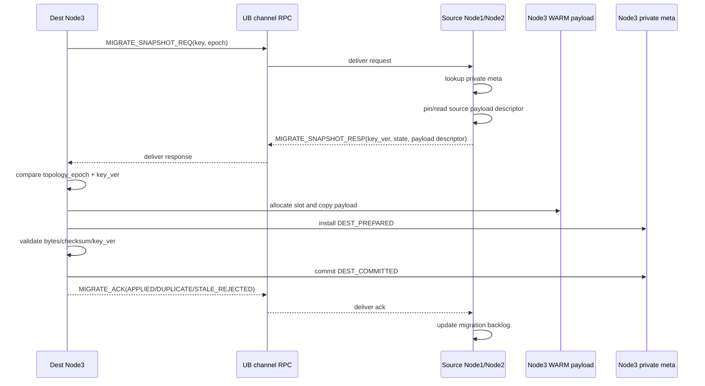
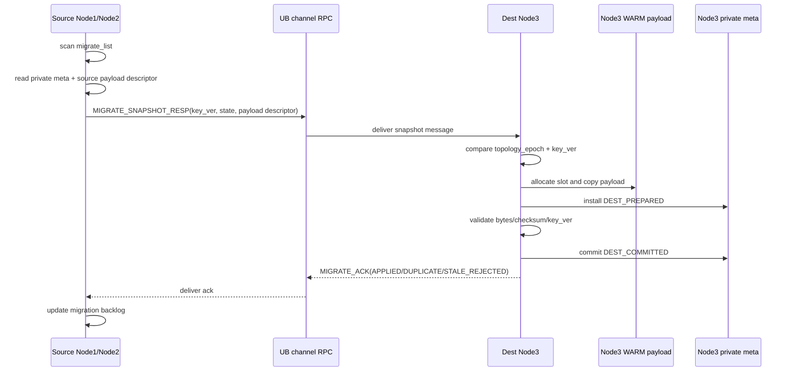
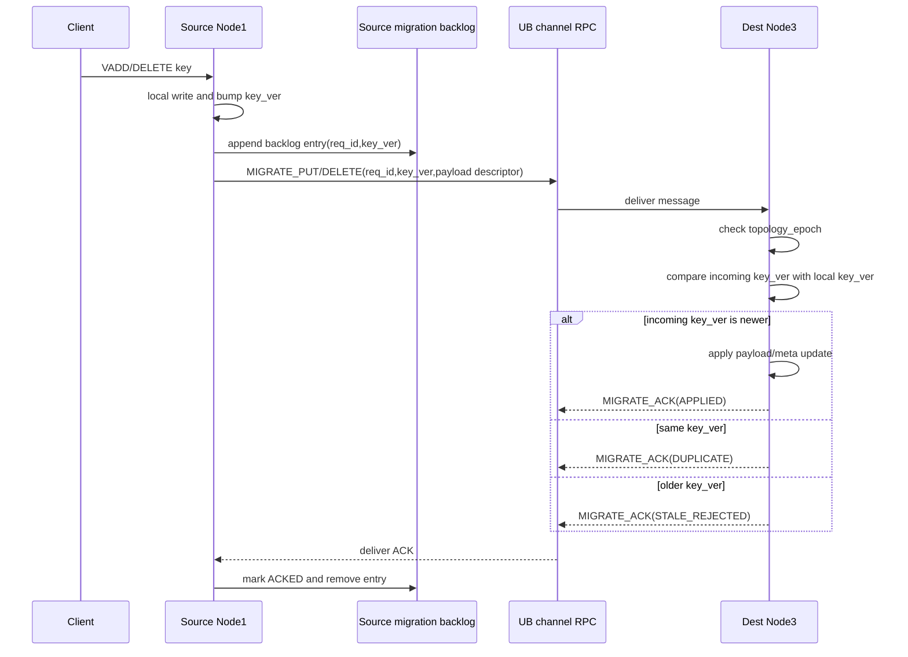

# VEMB V16 扩容节点迁移设计

日期：2026-06-15

## 背景

本文基于仓库根目录 `scale_node.jpg` 中的扩容场景整理，描述从 `Node3` 加入 UBMem 共享内存池，到 `meta + payload` 数据迁移完成、客户端 hash 切换为止的推荐流程。

扩容目标：

```text
扩容前:
  client hash ring -> Node1, Node2

扩容后:
  client hash ring -> Node1, Node2, Node3
```

核心问题不是简单把 `Node3` 加入一致性 hash，而是在迁移期间保证：

```text
1. 不读到未完成迁移的 payload
2. 旧写不会覆盖新写
3. 删除不会被迁移旧值复活
4. 客户端 hash 切换前后请求都有明确处理路径
5. meta 可见性必须晚于 payload 完整写入
```

## 关键约束

扩容流程遵循以下约束：

```text
Node3 加入 UBMem 后，先只对内部控制面可见，不立即对客户端可见。
客户端 hash ring 切换必须晚于 Node3 数据准备完成。
源节点仍然是迁移期间的客户端入口和临时权威写入方。
目标节点 Node3 必须自己更新自己的 meta 和 payload。
源节点不能直接跨节点修改 Node3 的私有 metadata。
```

推荐使用以下控制字段：

```text
topology_epoch:
  拓扑版本。每次扩缩容递增，用于识别过期客户端请求和旧双写消息。

key_version(key_ver):
  key 级别单调版本。用于拒绝旧迁移副本、旧双写消息和乱序更新。

key_migration_state:
  key 或 slot 的迁移状态。用于控制读写路由、双写和垃圾回收。

tombstone:
  删除标记。删除也必须带版本，避免迁移旧值把已删除 key 复活。
```

## 扩容状态机

建议将 `Node3` 的节点状态和 key 的迁移状态分开管理。

节点状态：

```text
JOINING:
  Node3 正在加入 UBMem 池，完成 region mmap、通信通道、健康检查。

PREPARING:
  控制面已用新 hash ring 计算迁移集合，但客户端仍然使用旧 hash ring。

MIGRATING:
  源节点允许后台迁移线程搬迁当前快照。
  迁移窗口内如果发生 VADD/DELETE/覆盖写，源节点才向 Node3 发送双写消息。
  Node3 接收后台迁移 copy 和并发写入，并用 key_version(key_ver) 合并。

CUTOVER_READY:
  Node3 已完成目标 key 的 meta + payload 准备，等待客户端 hash 切换。

ACTIVE:
  客户端 hash ring 已包含 Node3，Node3 正式服务新 owner key。
```

key 迁移状态：

```text
SOURCE_ACTIVE:
  key 仍由旧 owner 正常服务。

MIGRATING:
  key 仍由旧 owner 对客户端服务。
  后台迁移线程直接搬迁当前 meta + payload 快照。
  如果迁移期间发生 VADD/DELETE/覆盖写，旧 owner 本地更新后向 Node3 发送双写消息。

DEST_PREPARED:
  Node3 已分配 payload 位置或正在写 payload，meta 不对外可读。

DEST_COMMITTED:
  Node3 payload 已完整写入，meta 已提交，Node3 可作为新 owner 读取。

CUTOVER:
  客户端 hash 已切到 Node3，旧 owner 对过期请求返回重试或转向错误。

SOURCE_GC:
  旧 owner 清理迁出 key 的本地 ownership 和临时迁移状态。
```

## 扩容流程

### 1. Node3 加入 UBMem 池

`Node3` 首先完成本地初始化：

```text
parse manifest
open/mmap local and remote UB regions
build region_id -> runtime map
start SuperNode worker
start control/data channel
report health to control plane
```

此时 `Node3` 只对 `Node1/Node2` 和控制面可见：

```text
client hash ring:
  Node1, Node2

internal hash ring:
  Node1, Node2, Node3
```

这样可以避免客户端过早把读写请求发到一个还没有迁移完成的新节点。

### 2. 计算迁移 key 集合

控制面加入 `Node3` 后，基于新一致性 hash 重新计算 key 归属。

对每个旧节点扫描私有 metadata：

```text
for key in Node1.meta:
  if old_hash(key) == Node1 and new_hash(key) == Node3:
    add key to Node1 -> Node3 migrate_list

for key in Node2.meta:
  if old_hash(key) == Node2 and new_hash(key) == Node3:
    add key to Node2 -> Node3 migrate_list
```

迁移列表至少需要包含：

```text
key / key_hash
source_node
target_node = Node3
source payload location
value bytes
key_version(key_ver)
delete tombstone state
```

如果 payload 位于 WARM data region，则 source payload location 通常是：

```text
region_id + offset + bytes
```

如果 key 只在 COLD 层，需要记录 COLD locator，并在迁移阶段决定同步迁移或懒迁移。

### 3. 源节点进入 MIGRATING

源节点收到迁移列表后，先将这些 key 标记为 `MIGRATING`：

```text
key.state = MIGRATING
key.target = Node3
key.topology_epoch = new_epoch
```

在客户端 hash 切换前，旧 owner 仍然对客户端提供服务。`MIGRATING` 不表示所有 key 都必须双写，它表示这个 key 进入迁移窗口：

```text
没有并发修改:
  后台迁移线程直接 copy 当前 meta + payload 快照到 Node3。

发生 VADD/DELETE/覆盖写:
  旧 owner 先完成本地更新，再把该次写入作为双写消息发送给 Node3。
```

旧 owner 的读写路径：

```text
read:
  client -> Node1
  Node1 reads local meta + payload

write:
  client -> Node1
  Node1 writes local meta + payload
  if key.state == MIGRATING:
    Node1 sends replicated write message to Node3
```

图中的推荐路径是：

```text
Node1 发消息给 Node3，由 Node3 自己更新 Node3 的 meta 和 payload。
```

不推荐：

```text
Node1 直接操作 Node3 的 meta 和 payload。
```

原因是 Node3 的 metadata 是目标节点私有状态，跨节点直接修改会引入锁边界、并发所有权、恢复和回滚问题。

### 4. 迁移 payload

Node3 根据 migrate list 获取旧值。迁移 payload 可以采用 pull 或 push 两种消息模式：

```text
pull:
  Node3 -> Node1/Node2 request key snapshot
  Node1/Node2 return meta + payload + key_ver
  Node3 writes local payload and commits local meta

push:
  Node1/Node2 scan migrate_list
  Node1/Node2 send meta + payload + key_ver to Node3
  Node3 receives message, writes local payload and commits local meta
```

pull 模式时序：



push 模式时序：



第一版推荐默认使用 pull 模式：

```text
Node3 作为迁移 owner，主动从源节点拉取 meta + payload snapshot。
源节点只提供 snapshot/read API 和迁移期双写消息。
Node3 自己控制迁移并发、节流、目标 region 选择、slot 分配和 meta 提交。
```

pull 的优势：

```text
目标节点拥有目标数据结构的写入所有权。
Node3 可以直接执行 payload-before-meta commit。
Node3 可以本地处理 key_version(key_ver) 冲突。
源节点不需要理解 Node3 的 slot allocator、region full fallback 和 meta 状态机。
背压更清晰，Node3 拉不动时可以自然降低请求并发。
```

push 可以作为后续吞吐优化：

```text
源节点可以按 migrate_list 顺序批量推送 snapshot。
适合后续做 batch push、压缩、pipeline、按 region 聚合发送。
```

source node 和 dest node 之间的消息传输，可以复用现有 UB channel RPC 机制：

```text
复用:
  UB request channel
  UB response channel
  doorbell / polling / backoff
  req_id / status / ack
  descriptor + payload_handle 消息模型

不复用:
  remote_meta
  remote_meta entry
  remote_meta lookup fast path
```

这里的边界是：扩容迁移只复用 UB channel RPC 作为传输机制，不把 `remote_meta` 放进迁移正确性链路。`remote_meta` 仍然是远端 VSIM / lookup 场景的 candidate directory；扩容迁移的权威来源必须是源节点和目标节点自己的 private meta。

迁移 RPC 可以新增独立 op：

```text
MIGRATE_SNAPSHOT_REQ:
  Node3 -> source node，请求某个 key 的当前 snapshot。

MIGRATE_SNAPSHOT_RESP:
  source node -> Node3，返回 key_ver、state、payload descriptor。

MIGRATE_PUT:
  source node -> Node3，迁移窗口内 VADD/overwrite 的双写消息。

MIGRATE_DELETE:
  source node -> Node3，迁移窗口内 delete/tombstone 的双写消息。

MIGRATE_ACK:
  Node3 -> source node，确认 snapshot / double-write 已应用、重复或因旧 key_ver 被拒绝。
```

第一版建议 RPC slot 只承载控制 descriptor：

```text
key / key_hash
topology_epoch
key_version(key_ver)
payload location or staging handle
bytes / checksum
status / error code
```

payload 数据可以通过 source WARM UB handle、migration staging buffer 或后续 batch side buffer 搬运；Node3 根据 descriptor 读取 source payload，再 copy 到自己的 WARM region。

但 push 仍然必须保持同一个所有权边界：

```text
源节点只发送数据消息。
Node3 是唯一提交目标 payload 和目标 meta 的节点。
源节点不能直接写 Node3 的 payload slot 或私有 metadata。
```

因此，无论 pull 还是 push，都推荐以 Node3 为写入 owner：

```text
Node3 allocates destination payload slot
Node3 copies payload into its UB/WARM region
Node3 validates bytes/checksum/version
```

如果迁移期间没有 VADD/DELETE/覆盖写，迁移 copy 就是该 key 的最终目标版本：

```text
T1: Node1 标记 key 为 MIGRATING，当前 key_ver=10
T2: Node3 从 Node1 读取 meta + payload，版本仍是 key_ver=10
T3: Node3 写 payload
T4: Node3 commit meta: key_ver=10, state=DEST_COMMITTED
```

如果迁移期间发生并发 VADD，Node3 可能先收到迁移 copy，也可能先收到双写消息：

```text
迁移 copy: key_ver=10
双写 VADD: key_ver=11
```

最终以更大的 `key_ver` 为准：

```text
迁移 copy 先到，双写后到:
  Node3 先提交 key_ver=10，随后应用 key_ver=11。

双写先到，迁移 copy 后到:
  Node3 先应用 key_ver=11，随后拒绝 key_ver=10 的旧迁移 copy。
```

payload 必须先于 meta 对外可见：

```text
write payload
memory barrier / publish barrier
install meta as DEST_PREPARED
validate payload
commit meta as DEST_COMMITTED
```

读路径只能读取 `DEST_COMMITTED` 的 key。遇到 `DEST_PREPARED` 时应返回重试，或回源读旧 owner。

### 5. 安装 Node3 meta

Node3 写入目标 metadata：

```text
key -> warm_idx
warm_idx -> {
  region_id,
  offset,
  bytes,
  key_version(key_ver),
  migration_epoch,
  state = DEST_PREPARED | DEST_COMMITTED
}
```

meta 提交规则：

```text
只有 payload 完整写入后，meta 才能进入 DEST_COMMITTED。
只有版本不旧于 Node3 当前版本时，迁移 copy 才能提交。
如果 Node3 已经收到更高版本的双写，则迁移 copy 必须丢弃。
如果 Node3 已经收到更高版本 tombstone，则迁移 copy 必须丢弃。
```

### 6. 双写追平

迁移期间，源节点对 `MIGRATING` key 的写入必须复制到 Node3。

双写消息建议包含：

```text
op_type = PUT | DELETE
key / key_hash
value bytes or payload handle
key_version(key_ver)
topology_epoch
source_node
target_node
```

Node3 接收双写消息时执行幂等版本判断：

```text
if msg.epoch < current_epoch:
  reject stale message

if msg.key_ver < local.key_ver:
  reject stale message

if msg.key_ver == local.key_ver:
  treat as duplicate and ack

if msg.key_ver > local.key_ver:
  apply message
```

双写 ack 用于源节点判断 backlog 是否已经追平。

这里的 `backlog` 指源节点在迁移期间已经产生、但还没有被 Node3 确认处理完成的迁移消息队列。它不是业务数据本身，而是 source node -> dest node 的未确认消息账本。

每个源节点建议按目标节点维护独立 backlog：

```text
Node1 -> Node3 migration backlog
Node2 -> Node3 migration backlog
```

backlog entry 至少包含：

```text
msg_id / req_id
op_type = MIGRATE_PUT | MIGRATE_DELETE | MIGRATE_SNAPSHOT_RESP
key / key_hash
topology_epoch
key_version(key_ver)
payload descriptor / staging handle
send_state = PENDING | SENT | ACKED | RETRY | FAILED
retry_count
timestamp
```

Node3 处理迁移消息后返回 `MIGRATE_ACK`：

```text
MIGRATE_ACK {
  req_id
  key_hash
  key_ver
  status = APPLIED | DUPLICATE | STALE_REJECTED | RETRY | ERROR
}
```

源节点收到 ACK 后更新 backlog：

```text
APPLIED:
  Node3 已应用该版本，entry 可以标记 ACKED 并清理。

DUPLICATE:
  Node3 已有同版本数据，entry 可以标记 ACKED 并清理。

STALE_REJECTED:
  Node3 已有更高 key_ver 或更新 epoch，entry 可以标记 ACKED 并清理。

RETRY:
  Node3 临时无法处理，entry 保留并按 backoff 重试。

ERROR:
  进入 FAILED，交给控制面决定重试、降级或中止本轮迁移。
```

backlog 的作用：

```text
1. 记录哪些迁移期双写或 snapshot response 尚未被 Node3 确认。
2. 支持 UB channel RPC full/busy 或 Node3 短暂不可用时重试。
3. 给源节点提供背压依据，避免无限制产生迁移消息。
4. 给切换客户端 hash 提供追平判断。
```

backlog 与双写 ACK 时序：



切流前，控制面需要确认所有 source -> Node3 backlog 已 drain：

```text
backlog_empty(Node1 -> Node3) == true
backlog_empty(Node2 -> Node3) == true
```

但 backlog drain 不是最终一致性来源。即使 backlog 已清空，Node3 仍必须依赖以下字段拒绝旧消息、重复消息和乱序消息：

```text
topology_epoch
key_version(key_ver)
key_migration_state
```

### 7. 切换客户端 hash

当满足以下条件后，进入 `CUTOVER_READY`：

```text
Node3 上所有目标 key 都达到 DEST_COMMITTED，或具备 read-through/retry 能力。
源节点双写 backlog 已 drain。
Node3 health check 正常。
控制面确认 new_epoch 可以发布。
```

之后发布新客户端 hash ring：

```text
client hash ring:
  Node1, Node2, Node3

topology_epoch:
  old_epoch -> new_epoch
```

客户端开始把属于 Node3 的 key 发往 Node3。

旧节点收到过期请求时，不应继续正常写入迁出的 key：

```text
if request.epoch < new_epoch and key.owner == Node3:
  return STALE_TOPOLOGY / MOVED / ASK / RETRY
```

让客户端刷新拓扑并重试，可以解决图中提到的两个 case：

```text
1. 旧 hash 写到 Node1，新 hash 已经让 Node3 可见。
2. 客户端切新 hash 后，同 key 请求已经应该发到 Node3。
```

### 8. 源节点清理

切流稳定后，源节点进入 `SOURCE_GC`：

```text
stop double-write for migrated keys
remove key_migration_state
drop local ownership
optionally keep short-lived forwarding/tombstone metadata
free old payload when no reader references it
```

不要在切流瞬间立即删除所有旧 payload。需要等待读请求、异步复制和客户端旧连接自然收敛，或通过 epoch 明确拒绝旧请求后再回收。

## 冲突和一致性问题

### 旧迁移副本覆盖新写

时序：

```text
T1: Node3 从 Node1 读取 key=v1, version=10
T2: client 写 key=v2 到 Node1, version=11
T3: Node1 双写 v2 到 Node3
T4: Node3 迁移线程提交 v1
```

风险：

```text
Node3 上的新值 v2 被旧迁移副本 v1 覆盖。
```

处理：

```text
Node3 每次提交都比较 key_version(key_ver)。
version=10 的迁移 copy 不能覆盖 version=11 的本地值。
```

### meta 先可见，payload 尚未完成

时序：

```text
T1: Node3 meta 指向 offset=100
T2: payload offset=100 尚未写完
T3: read request 命中 Node3
```

风险：

```text
读到未初始化、半写入或旧 payload。
```

处理：

```text
payload-before-meta commit
meta 使用 DEST_PREPARED / DEST_COMMITTED 两阶段状态
读路径只允许读取 DEST_COMMITTED
```

### 客户端切 hash 后旧双写晚到

时序：

```text
T1: 客户端切到 new_epoch，写 Node3: key=v3, version=12
T2: Node1 上旧双写消息晚到 Node3: key=v2, version=11
```

风险：

```text
旧双写覆盖新 owner 上的新值。
```

处理：

```text
Node3 基于 epoch + key_version(key_ver) 拒绝旧消息。
源节点切流前尽量 drain backlog，但 Node3 仍必须有版本兜底。
```

### 新节点读到未迁移 key

时序：

```text
T1: 客户端切新 hash
T2: client -> Node3 read key
T3: key 在 Node3 仍是 DEST_PREPARED 或不存在
```

风险：

```text
误返回 nil 或读失败。
```

处理选项：

```text
返回 RETRY/ASK，让客户端稍后重试。
Node3 回源 Node1/Node2 读取，并补写本地。
等待单 key 迁移完成，但必须有超时。
```

短期推荐：

```text
未 DEST_COMMITTED 的 key 不从 Node3 本地 payload 读取。
如果实现 read-through，则必须携带版本并提交本地 meta。
```

### 删除和迁移并发

时序：

```text
T1: 迁移线程读取 key=v1, version=10
T2: client 删除 key, version=11
T3: 迁移线程把 v1 安装到 Node3
```

风险：

```text
已经删除的 key 在 Node3 复活。
```

处理：

```text
DELETE 也是一个带版本的写操作。
Node3 记录 tombstone version=11。
迁移 copy version=10 不能覆盖 tombstone。
```

### 源节点清理过早

时序：

```text
T1: 控制面发布新 hash
T2: Node1 立即释放旧 payload
T3: 旧 epoch 读请求或 Node3 read-through 仍访问 Node1
```

风险：

```text
读失败、读到已复用内存或无法完成补迁移。
```

处理：

```text
源节点进入 SOURCE_GC 后延迟释放 payload。
通过 epoch 拒绝旧客户端请求。
Node3 完成 read-through 能力前，不允许依赖已释放的源 payload。
```

## COLD 层迁移

图中将 COLD 层迁移标为 TODO。推荐分阶段处理。

第一阶段可以采用懒迁移：

```text
WARM/HOT meta + payload 优先迁移。
COLD locator 先记录 source_node。
Node3 miss 时回源读取 COLD，并异步补写本地 COLD/WARM。
```

优点：

```text
切流更快。
避免扩容窗口被全量冷数据搬迁拖长。
```

风险：

```text
Node3 对 COLD miss 依赖源节点存活。
SOURCE_GC 不能过早清理 COLD 数据。
```

后续可演进为同步 COLD 搬迁：

```text
迁移窗口更长。
切流后 Node3 独立性更好。
对一致性和失败恢复要求更高。
```

## 推荐最小实现

扩容第一版可以先实现以下最小闭环：

```text
1. Node3 JOINING/PREPARING/MIGRATING/ACTIVE 状态。
2. 控制面生成 Node1/Node2 -> Node3 migrate_list。
3. 源节点 key 标记 MIGRATING。
4. 源节点仅对 MIGRATING key 的迁移期 VADD/DELETE/覆盖写执行双写。
5. Node3 使用 key_version(key_ver) 拒绝旧迁移 copy 和旧双写。
6. Node3 payload-before-meta commit。
7. 客户端 hash 切换后，旧节点对迁出 key 返回 STALE_TOPOLOGY/RETRY。
8. 源节点延迟 GC。
```

暂缓项：

```text
COLD 全量同步迁移。
复杂跨节点锁。
源节点直接写 Node3 私有 meta。
无版本号的盲目覆盖。
```

## 结论

扩容过程中，`Node3` 从加入到正式服务可以拆成：

```text
加入 UBMem -> 计算迁移集合 -> 源节点 MIGRATING -> payload 迁移
-> Node3 meta commit -> 双写追平 -> 客户端 hash 切换 -> 源节点 GC
```

一致性的关键是：

```text
topology_epoch 控制拓扑新旧。
key_version(key_ver) 控制写入新旧。
key_migration_state 控制读写路径。
payload-before-meta commit 控制可见性。
tombstone 控制删除不会复活。
```

只要这几条边界明确，扩容期间即使发生并发写、读、删除、旧请求晚到，也可以通过重试、拒绝旧版本和延迟 GC 保持 `meta + payload` 的一致性。
