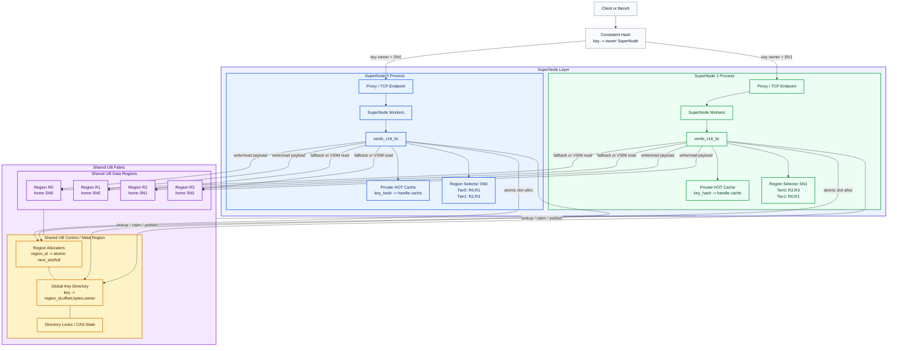

# VEMB V16 Shared Multi-UB-Regions TLC 设计

日期：2026-06-08

## 核心结论

新的 TLC multi-UB-regions 目标态是：

```text
n 个 SuperNode 共享 m 个 UB data regions
每个 SuperNode 都 mmap 全部 m 个 UB data regions
每个 SuperNode 写 key 时按自己的 NUMA/locality 优先选择 local UB region
所有 key 的可见位置由 shared key directory 提供
VSIM key1 key2 在 key1 所属 SuperNode 内直接完成计算
```

这和当前 `单 SuperNode / 单进程私有 metadata + 多 data region` 设计的最大区别是：只共享 payload data region 不够，必须额外共享 allocator 和 key directory。否则多个 SuperNode 会因为私有 `next_slot` 重复分配同一个 slot，也无法让 key1 所属 SuperNode 找到 key2 的 `{region_id, offset, bytes}`。

推荐保留以下边界：

```text
HOT:
  每个 SuperNode 私有，作为 shared key directory 的 cache。

WARM data:
  所有 SuperNode 共享的 UB payload regions，只存 packed vector bytes。

WARM metadata:
  分成两层。
  1. shared control/meta region：allocator + global key directory。
  2. SuperNode private cache/index：HOT、短期 lookup cache、统计、worker-local selector。

COLD:
  第一阶段仍按现有 cold spill 语义保留，后续再统一到共享 cold index。
```

## 设计目标

- 支持 `n` 个 SuperNode 共享同一组 `m` 个 UB regions。
- 每个 SuperNode 写入新 key 时仍使用 `key_hash -> region selector`，但 selector 对当前 worker/NUMA local region 加权。
- 同一个 SuperNode 可以有多个 local regions，例如 `numa-0-region` 和 `numa-1-region`。
- 每个 worker/NUMA 建独立 WARM region hash ring，使 NUMA-0 worker 更偏向 NUMA-0 region，NUMA-1 worker 更偏向 NUMA-1 region。
- region 满后沿 worker-local hash ring fallback 到下一个可用 region。
- overwrite 不迁移，继续写回 shared directory 中已有 `{region_id, offset}`。
- `VSIM key1 key2` 路由到 key1 所属 SuperNode；该 SuperNode 通过 shared key directory 查询 key2 位置，并直接读 UB payload 计算。
- handle ABI 继续保持 `{region_id, offset, bytes}`。

## SuperNode With Multi-Regions 架构图

P0 先不做 NUMA-local 细分，只做 SuperNode-local 优先。每个 SuperNode 都 mmap 全部 UB data regions 和同一个 shared meta region；区别在于每个 SuperNode 构建自己的 two-tier region selector：

```text
Tier 0: home_supernode_id == local_supernode_id
Tier 1: remote regions
```



写入时，owner SuperNode 的 TLC 先查 shared key directory；新 key 使用本 SuperNode 的 selector 优先从 Tier 0 local regions 分配 slot。local regions 全满后，再 fallback 到 Tier 1 remote regions。

`VSIM key1 key2` 时，请求路由到 key1 owner SuperNode。该 SuperNode 从 shared key directory 同时查 key1/key2 的 handle，然后按 `region_id + offset` 直接读 shared UB data regions 计算。

## 当前代码基线

当前已经具备的基础能力：

- `tlc_core` 已经有 multi-region runtime、weighted vnode selector 和 fallback 逻辑。
- `vemb_v16_storage` 已经支持 manifest 打开多个 warm regions。
- `vemb_v16_tlc_vector_slice()` 已经按 `region_id` 查 mapped region。
- `VEMB_V16_OP_VSIM_KEY_KEY` 已经在 SuperNode 内读取两个 vector 并计算 cosine。

当前必须修改的部分：

- `tlc_core` 的 per-region `next_slot/full` 仍在进程私有内存中，不能支持多 SuperNode 共享写。
- `tlc_core` 的 `warm->entries/hash_table/count/locks` 仍是进程私有 key index，key1 SuperNode 无法查到 key2 所属 SuperNode 写入的 metadata。
- 当前 region selector 只有一份 `is_local`/weight 视角，不能表达 worker NUMA 级别的多个 local regions。
- 当前 `publish_shard_job()` 主要按 channel index 选 SuperNode worker；应改为按 key hash 或 precomputed route 选 key owner/worker。

## 数据模型

共享 UB data region 仍只存 vector payload：

```text
region_id = 100
offset = local_slot * value_size
payload = float vector bytes
```

新增 shared control/meta region：

```text
shared_meta_region
  header
  region_allocators[m]
  key_directory[hash_capacity]
  directory_locks[lock_count]
  stats
```

建议结构：

```c
typedef struct vemb_v16_shared_meta_header {
    uint32_t magic;
    uint32_t version;
    uint32_t value_size;
    uint32_t region_count;
    uint32_t directory_capacity;
    uint32_t lock_count;
    uint64_t generation;
} vemb_v16_shared_meta_header_t;

typedef struct vemb_v16_shared_region_allocator {
    uint32_t region_id;
    uint32_t capacity_slots;
    atomic_uint_fast32_t next_slot;
    atomic_uint_fast32_t full;
} vemb_v16_shared_region_allocator_t;

typedef struct vemb_v16_shared_key_entry {
    atomic_uint_fast32_t state;
    uint32_t key_len;
    uint64_t key_hash;
    uint32_t region_id;
    uint32_t bytes;
    uint64_t offset;
    uint32_t owner_supernode_id;
    atomic_uint_fast64_t version;
    char key[VEMB_V16_MAX_KEY_LEN];
} vemb_v16_shared_key_entry_t;
```

`state` 建议：

```text
EMPTY = 0
CLAIMED = 1
VALID = 2
DELETED = 3
```

## Locality 与多个 local regions

不要再把 locality 建模为单个布尔值 `is_local`。推荐使用分层 locality：

```text
same SuperNode + same NUMA     最高权重
same SuperNode + other NUMA    次高权重
remote SuperNode/UB            低权重
```

manifest 示例：

```yaml
supernode_id: 0
local_numa_count: 2
same_numa_weight: 16
same_supernode_weight: 8
remote_weight: 1

shared_meta_region:
  provider: ub
  path: /dev/obmm_meta0
  mmap_offset: 0
  bytes: 268435456

warm_regions:
  - region_id: 100
    provider: ub
    path: /dev/obmm_sn0_numa0
    mmap_offset: 0
    bytes: 1073741824
    value_size: 1200
    home_supernode_id: 0
    home_numa_id: 0
    weight: 1

  - region_id: 101
    provider: ub
    path: /dev/obmm_sn0_numa1
    mmap_offset: 0
    bytes: 1073741824
    value_size: 1200
    home_supernode_id: 0
    home_numa_id: 1
    weight: 1

  - region_id: 200
    provider: ub
    path: /dev/obmm_sn1_numa0
    mmap_offset: 0
    bytes: 1073741824
    value_size: 1200
    home_supernode_id: 1
    home_numa_id: 0
    weight: 1
```

每个 SuperNode worker 需要知道自己的 `worker_numa_id`。初始化时为每个 worker/NUMA 建一份 selector：

```text
worker 0 on NUMA 0:
  region100 effective_weight = 16
  region101 effective_weight = 8
  region200 effective_weight = 1

worker 8 on NUMA 1:
  region100 effective_weight = 8
  region101 effective_weight = 16
  region200 effective_weight = 1
```

权重计算：

```c
if (region.home_supernode_id == local_supernode_id &&
    region.home_numa_id == worker_numa_id) {
    locality_weight = same_numa_weight;
} else if (region.home_supernode_id == local_supernode_id) {
    locality_weight = same_supernode_weight;
} else {
    locality_weight = remote_weight;
}

effective_weight = region.weight * locality_weight;
vnodes = base_vnodes * effective_weight;
```

这样 `key_hash` 仍然决定 region ring 的起点，但不同 worker 的 ring 权重不同，因此会自然优先当前 NUMA 的 local region。local region 满后沿该 worker 的 ring fallback 到同 SuperNode 其他 NUMA region，再 fallback 到 remote region。

## 写入流程

新 key 写入：

```text
1. 请求按 key_hash 路由到 key owner SuperNode。
2. owner SuperNode 选择当前 worker 的 NUMA-aware region selector。
3. 查 shared key directory。
4. 如果 key 已存在，读取旧 handle，overwrite 原位置。
5. 如果 key 不存在，按 key_hash 在 worker-local selector 上选择 primary region。
6. 对 shared region allocator 做 atomic_fetch_add(next_slot)。
7. 如果 slot 未超过 capacity，得到 {region_id, offset, bytes}。
8. 如果 region full，标记 full，并沿 selector fallback。
9. 写 vector payload 到 mapped_addr + offset。
10. release store 发布 shared key directory entry 为 VALID。
11. 更新私有 HOT cache。
```

伪代码：

```c
int shared_tlc_put(ctx, key, key_hash, vector) {
    entry = shared_dir_lookup_or_claim(ctx->shared_meta, key, key_hash);
    if (!entry) return C_ERR;

    if (entry->state == VALID) {
        handle = entry->handle;
    } else {
        handle = alloc_from_worker_selector(ctx, key_hash);
        if (!handle.valid) return cold_spill_or_error();
    }

    sve_streaming_store(vector, region_addr(handle.region_id) + handle.offset, value_size);

    shared_dir_publish_valid(entry, key, key_hash, handle, ctx->supernode_id);
    hot_put(ctx->private_hot, key_hash, handle);
    return C_OK;
}
```

发布顺序必须保证：

```text
payload write 完成
directory fields 写入
version/state 用 release store 发布 VALID
```

读取时用 acquire load 读取 `state/version`，避免读到半写入 payload。

## Lookup 与 VSIM key-key

`VSIM key1 key2` 不需要第三方计算节点，但 key1 SuperNode 必须能查到 key2 的位置。实现依赖 shared key directory：

```text
VSIM key1 key2
-> route by key1 to SuperNode owner(key1)
-> lookup key1 in shared directory
-> lookup key2 in shared directory
-> read region_id/offset for both vectors
-> local SVE cosine
-> return score
```

流程：

```text
key1_handle = shared_dir_lookup(key1)
key2_handle = shared_dir_lookup(key2)
v1 = map[region_id(key1)] + offset(key1)
v2 = map[region_id(key2)] + offset(key2)
score = sve_cosine_similarity_f32(v1, v2, dim)
```

因此 key2 可以由任何 SuperNode 写入，也可以存储在任何 UB region。只要 key2 已经发布到 shared directory，key1 SuperNode 就能通过 `{region_id, offset, bytes}` 定位并读取。

一致性读取建议：

```text
1. acquire load entry.version/state
2. 校验 state == VALID
3. 校验 key_hash/key_len/key bytes
4. 读取 handle
5. 再读一次 version
6. 如果 version 未变化，handle 稳定；否则重试
```

## 路由语义

建议保留 key owner 概念：

```text
owner_supernode_id = consistent_hash(key)
```

写入和 `VEMB key` 请求路由到 `owner_supernode_id`。这样每个 key 的主要更新路径稳定，减少多 writer overwrite 冲突。

`VSIM key1 key2` 固定按 key1 路由：

```text
target_supernode_id = owner(key1)
```

原因：

- key1 SuperNode 可以本地完成计算，不需要第三方 coordinator。
- key2 位置通过 shared directory 查询，不要求 key2 与 key1 同 owner。
- 如果 key2 所在 payload region 是 remote UB region，只影响一次 read locality，不改变计算节点。

## 需要改的模块

### 新增 shared meta 模块

建议新增：

```text
src/vemb_v16_shared_meta.h
src/vemb_v16_shared_meta.c
```

职责：

```text
open/create shared meta region
validate header
initialize region allocators
directory lookup / claim / publish
directory lock 或 CAS claim
region allocator atomic slot allocation
stats
```

### 修改 manifest/storage

修改：

```text
src/vemb_v16_storage.h
src/vemb_v16_storage.c
src/vemb_v16_warm_provider.h
src/vemb_v16_warm_provider.c
```

新增字段：

```text
shared_meta_region
supernode_id
worker_numa mapping
same_numa_weight
same_supernode_weight
remote_weight
home_supernode_id
home_numa_id
```

`vemb_v16_storage_ctx_create_from_manifest()` 需要：

```text
1. mmap shared meta region
2. mmap all warm data regions
3. initialize shared allocators if creator
4. create worker/NUMA selectors
5. pass shared_meta + selectors into tlc_core
```

### 修改 tlc_core

修改：

```text
src/tlc_core.h
src/tlc_core.c
```

关键替换：

```text
private warm->regions[i].next_slot
  -> shared_meta->region_allocators[i].next_slot

private warm->hash_table / entries as source of truth
  -> shared key directory as source of truth

single warm->vnodes selector
  -> selector per worker/NUMA
```

私有 `warm->entries/hash_table` 可以先保留为 cache，但不能再作为全局 truth。miss 后必须查 shared directory。

### 修改 supernode worker

修改：

```text
src/vemb_v16_supernode.h
src/vemb_v16_supernode.c
```

`vemb_v16_supernode_ctx_t` 增加：

```text
supernode_id
worker_numa_id
selector_id 或 worker_id -> selector
```

`VADD` 写入时使用当前 worker selector。`VSIM_KEY_KEY` lookup key2 时走 shared directory，而不是只依赖私有 warm metadata。

### 修改 proxy/bench 路由

修改：

```text
src/vemb_v16_proxy.c
benchmark/vemb_v16_bench.c
src/proxy_router.c
```

`publish_shard_job()` 不应只用 `channel_index % worker_count`。建议：

```text
worker_id = key_hash % supernode_worker_count
```

或使用更明确的 route：

```text
owner_supernode_id = consistent_hash(key)
worker_id = route_worker(owner_supernode_id, key_hash)
```

`VSIM key1 key2`：

```text
route key1 only
request carries key2/key2_hash
```

## 分阶段落地

### P0：共享 allocator + shared directory，无 eviction

目标：

```text
n 个 SuperNode 共享 m 个 UB data regions
append-only slot allocation
shared key directory lookup
VSIM key1 key2 跨 owner 可查 key2
```

不做：

```text
slot reuse
eviction
online rebalance
directory resize
crash recovery
```

### P1：NUMA-aware selector

目标：

```text
per worker/NUMA selector
same NUMA > same SuperNode > remote
per-region/per-NUMA stats
```

### P2：一致性与恢复

目标：

```text
generation/version
startup scan/repair directory
dirty entry recovery
writer failover
```

### P3：eviction/slot reuse

目标：

```text
high watermark / low watermark
clock or sampled LRU
dirty flush
free slot bitmap
generation guarded handle
```

## 测试计划

单测：

```text
shared allocator: 多 writer 不重复分配 slot
shared directory: claim/publish/lookup/version retry
overwrite: handle 不迁移
fallback: same NUMA full -> same SuperNode other NUMA -> remote
all full: cold spill 或 ERR
```

集成测试：

```text
2 SuperNode x 2 NUMA regions
SN0 写 keyA，SN1 写 keyB
VSIM keyA keyB 路由到 owner(keyA)
keyA SuperNode lookup keyB handle 并完成 cosine
```

压测指标：

```text
warm_alloc_same_numa
warm_alloc_same_supernode
warm_alloc_remote
warm_alloc_fallback
warm_region_full_count
shared_dir_lookup_hit
shared_dir_lookup_miss
shared_dir_claim_conflict
vsim_key2_remote_region_reads
```

## 风险点

- shared directory 是新的竞争热点，需要足够大的 hash capacity 和 lock striping。
- 所有 SuperNode mmap 同一组 UB regions 后，部署 manifest 必须保证 `region_id/path/mmap_offset/bytes/value_size` 完全一致。
- `region_id` 必须全局唯一，不能只在单个 SuperNode 内唯一。
- 如果允许多 SuperNode 同时 overwrite 同一个 key，需要增加 CAS version 或 owner writer 约束。P0 建议只允许 owner SuperNode 写该 key。
- shared meta region 初始化需要 creator/participant 角色，避免多个进程同时初始化 header 和 allocator。

## 方案 1 的最难点

这里的“方案 1”指：

```text
shared global key directory
+ key1 SuperNode 直接查 key2 handle
+ key1 SuperNode 本地完成 VSIM
```

它是长期最理想的形态，但实现难点明显高于“client 先拿 key2 handle 再发给 key1”的过渡方案。最难的部分不在 cosine 计算，而在 shared metadata 的正确性、一致性和生命周期管理。

### 1. 全局 key directory 一致性

最核心的难点是把下面这份 metadata 做成所有 SuperNode 都可信的全局 truth source：

```text
key -> {region_id, offset, bytes, owner_supernode_id, version, state}
```

难点：

- 多个 SuperNode 可以并发插入不同 key。
- 同一个 key 可能并发 overwrite。
- lookup 不能读到半写入 entry。
- directory 中的 handle 必须与实际 payload 保持一致。

本质上这里不是简单共享内存，而是在实现一个共享 hash index。

### 2. payload 与 directory 的发布顺序

对 `VSIM key1 key2` 来说，key1 SuperNode 会直接根据 directory 中的 handle 去读 key2 payload。因此写入时必须严格保证发布顺序：

```text
1. 先写 payload bytes
2. 再写 directory fields
3. 最后 release store 发布 entry 为 VALID
4. 读侧 acquire load 读取 state/version
```

如果顺序或内存序不对，会出现：

- directory 已可见，但 payload 尚未写完
- 读到旧 handle / 半更新 handle
- key 匹配，但 `{offset, bytes}` 还不稳定

这部分是方案 1 正确性最硬的一块。

### 3. overwrite、eviction 与 slot reuse

如果 overwrite 永远不迁移，复杂度会明显下降：

```text
overwrite -> 继续写原 {region_id, offset}
```

但只要未来引入：

- eviction
- slot reuse
- compaction
- rebalance

directory 就必须扩展：

```text
version / generation
state
tombstone or reclaim state
```

否则 key1 SuperNode 从 directory 查到的 key2 handle 可能已经指向被复用的旧 slot。也就是说，方案 1 的难点不是“查到 handle”，而是“查到的 handle 是否长期可信”。

### 4. shared allocator 不是最难，shared directory 才是最难

shared allocator 自身相对直接：

```text
atomic_fetch_add(next_slot)
capacity check
full flag
```

真正复杂的是：

```text
这个 slot 现在属于哪个 key
谁发布
谁覆盖
谁删除
别人什么时候可以安全读取
```

allocator 解决“写到哪”，directory 解决“这个位置现在是谁的”。后者才是方案 1 的主体复杂度。

### 5. owner 边界与全局可见性

即便约束为：

```text
只有 owner SuperNode 能写该 key
```

方案 1 仍然要解决：

- 其他 SuperNode lookup 时，是否总能读到 owner 发布的最新 handle。
- owner 异常退出时，directory 是否可能停留在 `CLAIMED` 或中间态。
- 恢复后谁来清理残留 entry、修复状态、继续发布。

换句话说，方案 1 会逼着系统明确定义 shared metadata 的生命周期，而不是只处理 happy path。

### 6. 启动、恢复与共享 region 初始化

只要 shared directory 放进 UB/shared meta region，就会面临：

- 多个 SuperNode 同时启动时，谁初始化 header。
- 上次崩溃后留下的 entry 怎么处理。
- allocator 中的 `next_slot/full` 是否需要恢复或重建。
- directory 是否需要启动扫描校验。

这部分在原型阶段往往容易被低估，但工程上经常是最难收尾的一段。

### 7. 热点与可扩展性

方案 1 在请求链路上最优雅，但 shared directory 很容易成为热点：

- 高频 key 更新冲突。
- hash bucket lock 冲突。
- lookup probe 链增长。
- 所有 SuperNode 高频读写同一个 shared meta region。

因此它不只是要“做对”，还要“做得不太慢”。这也是为什么它适合作为长期目标，而不一定适合作为第一阶段最小落地方案。

### 小结

方案 1 最难的点可以概括为：

```text
把 key -> handle 做成一个所有 SuperNode 共享、并发安全、发布有序、可恢复、可扩展的全局元数据系统
```

真正难的是 shared metadata，而不是 shared data region 本身，也不是 `VSIM` 的计算本身。

### 为什么 P0 倾向选择过渡方案

这也是为什么 P0 更适合使用过渡方案：

```text
client 先向 key2 owner 获取 handle
再把 handle 带到 key1 owner 执行 VSIM
```

这样可以绕开：

- shared global key directory
- server 侧跨 owner metadata lookup
- shared metadata 生命周期的一大批复杂性

同时仍然保留：

- 共享 UB data regions
- key1 SuperNode 本地执行 VSIM
- 后续平滑演进到方案 1 的空间
