# VEMB V16 独立数据面重构设计

日期：2026-05-19

## 前提

`VADD/VEMB -> proxy -> supernode` 路径可以完全摒弃对 Redis 的依赖。唯一要求是指令层兼容现有 `VADD` / `VEMB` 语法。

这意味着新的目标不再是优化 Redis module 内部 proxy，而是实现一个类似 `tlc_v16_server/bench` 的独立 VEMB 数据面：

```text
兼容 VADD/VEMB 指令
-> 自定义解析层
-> shared-memory ring 数据面
-> proxy/channel worker
-> supernode/UB vector table
-> shared-memory response ring
```

不再保留：

- Redis command dispatch
- RedisModule API
- Redis blocked client / unblock
- Redis reply callback
- RESP 编码
- TCP socket 传输完整 vector
- 当前 Redis proxy 历史路径中的 completion dict / active bucket / flush scheduler 等包袱

## 设计目标

1. 兼容 `VADD` / `VEMB` 指令语法。
2. 热路径采用 shared-memory request/response ring。
3. `VEMB RAW` 服务端优先返回 handle，客户端从共享 vector region 读取完整 vector。
4. `VADD` 支持 shared staging buffer，避免大 payload 通过 socket。
5. proxy/channel worker 不做计算，不访问 vector table，只负责 ingress、channel 生命周期、路由和 response ring 写回。
6. `VADD`、`VEMB`、`VSIM` 都必须在 SuperNode 中执行。
7. 当前只考虑一个 SuperNode，proxy worker 与 SuperNode worker 一对一绑定，通过 SPSC job/completion ring 通信。
8. `VEMB exact lookup` 不进入 Redis，不 block/unblock，不走 response callback，但仍由 SuperNode 产出结果。
9. benchmark 口径区分 handle-only、read-vector、print-vector。

## Key / Value 语义

以 `tlc_v16_bench` 为基准，数据模型应理解为：

```text
key -> value
value = 300 dim float32 vector = 1200B
```

映射到 VADD/VEMB：

```text
myvectors       -> 单表名称，仅用于 CLI/control 校验
item:123        -> vector_key / element key
300 float32     -> vector value
```

因此：

```text
VADD myvectors ... item:123
表示 store(vector_key=item:123, value=300dim float32)

VEMB myvectors item:123 RAW
表示 lookup(vector_key=item:123) -> vector handle/value
```

`vector_key` 不是物理 `row_id`。`row_id`、slot、offset、handle 都是服务端内部索引或返回结果，不能作为 CLI 与 proxy 之间的核心语义。

第一版采用单表模型，对齐 `tlc_v16`：

```text
server 固定 table_name = myvectors
data-plane request 不携带 table_id
route_key = vector_key
```

## 总体架构

### Client -> Proxy Channel

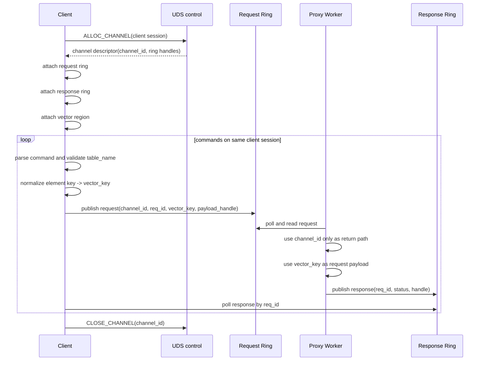

说明：当前 VADD/VEMB 热路径只要求 attach request ring、response ring、vector region。`staging` 是 staged VADD 的后续扩展，`query/result` 是 VSIM 的后续扩展，不是当前已落地路径的必要 region。

映射关系：

```text
client session / client thread -> channel_id
vector_key -> request payload
channel_id -> response ring lifecycle + completion return target
channel_id -> uint64_t monotonic id, never reused in process lifetime
```

### VADD / PUT

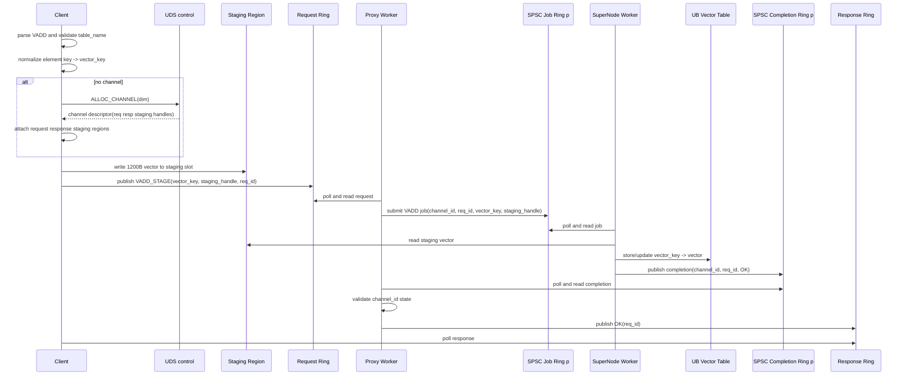

### VEMB

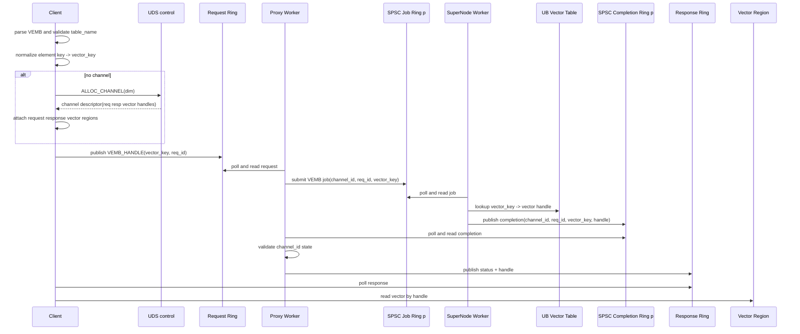

### VEMB 完整往返

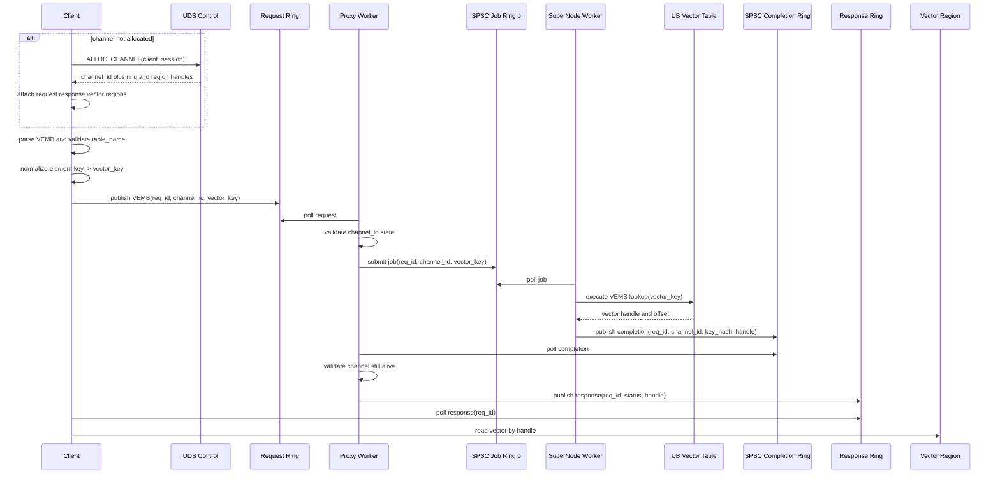

### VSIM

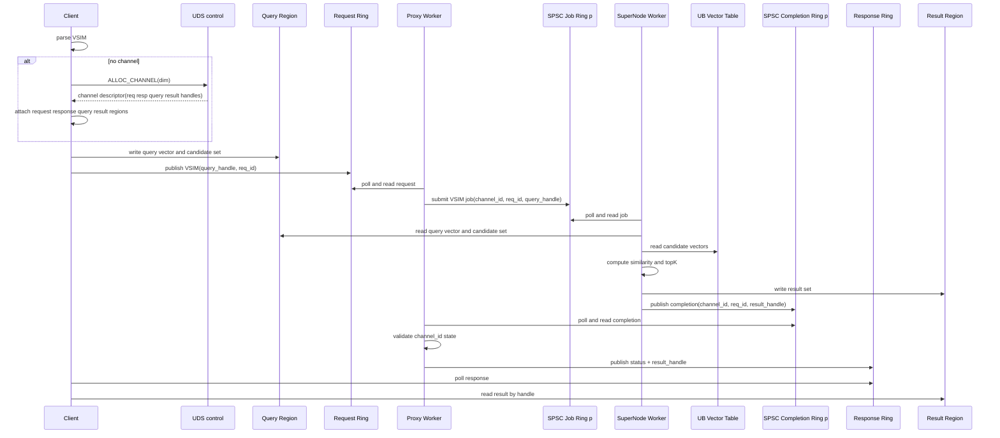

## 组件划分

### vemb_v16_server

独立服务进程，负责：

- UDS 控制面监听。
- channel 分配。
- request/response ring 创建。
- vector table / staging region 创建。
- channel worker 生命周期管理。
- VADD/VEMB 二进制协议 ingress。
- channel worker 提交 `VADD/VEMB/VSIM` job 并回写 response ring。
- SuperNode 执行 `VADD` / `VEMB` / `VSIM`。

### vemb_cli

高性能客户端，不依赖 Redis 或 `redis-cli`。

职责：

- 接收兼容语法：`VADD` / `VEMB`。
- 将文本命令解析为二进制 data-plane request。
- attach server 返回的 shared-memory regions。
- 写 request ring。
- poll response ring。
- 对 `VEMB RAW`，按 handle 从 vector region 读取向量。
- benchmark 模式下只校验状态和 handle，不打印完整 vector。

### vemb_v16_bench

专用 benchmark，避免终端输出和文本格式化干扰。

建议直接提供：

```bash
./benchmark/vemb_v16_bench \
  --server /tmp/vemb_v16.sock \
  --dim 300 \
  --prefill 65536 \
  --ops 1000000 \
  --threads 8 \
  --mode vemb-handle
```

## 控制面

控制面只负责低频 channel 管理，使用 UDS 即可。

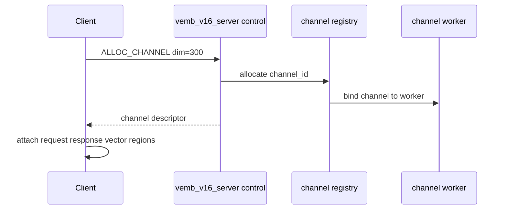

`channel_id` 使用 `uint64_t` 单调递增分配：

```text
channel_id = atomic_fetch_add(&next_channel_id, 1)
CLOSE_CHANNEL 释放 channel 资源，但不回收 channel_id
没有 channel_id free list
没有 channel 代际字段
```

这样旧 completion 即使晚到，也不会误写到新的 client channel。proxy 只需要校验 `channel_id` 当前是否仍处于可回写状态；如果 channel 已关闭，直接丢弃该 completion。

channel descriptor 只返回逻辑 handle，不暴露底层设备配置：

```c
typedef struct vemb_channel_desc {
    uint32_t protocol_version;
    uint64_t channel_id;
    uint32_t vector_dim;
    uint32_t vector_stride;
    uint64_t request_ring_handle;
    uint64_t response_ring_handle;
    uint64_t staging_region_handle;
    uint64_t vector_region_handle;
    uint32_t capabilities;
} vemb_channel_desc_t;
```

## 数据面协议

所有热路径请求使用固定头：

```c
typedef struct vemb_msg_hdr {
    uint8_t  op;
    uint8_t  flags;
    uint16_t header_len;
    uint32_t req_id;
    uint32_t payload_len;
    uint32_t reserved;
} vemb_msg_hdr_t;
```

op 类型：

```c
enum {
    VEMB_OP_PING        = 0x01,
    VEMB_OP_VADD_INLINE = 0x10,
    VEMB_OP_VADD_STAGE  = 0x11,
    VEMB_OP_VEMB_HANDLE = 0x20,
    VEMB_OP_VEMB_RAW    = 0x21,
    VEMB_OP_VSIM        = 0x30
};
```

## VEMB 路径

### 指令兼容

外部语法保持：

```text
VEMB myvectors item:123 RAW
```

客户端解析后生成：

```c
typedef struct vemb_get_req {
    vemb_msg_hdr_t hdr;
    uint32_t key_len;
    uint64_t key_hash;
    uint32_t output_mode;  /* handle/raw */
    uint32_t reserved;
    char     key[];
} vemb_get_req_t;
```

这里的 `key` 对齐 `tlc_v16_bench` 的语义：

```text
vector_key -> 300dim float32 value
```

也就是：

```text
VADD/VEMB 中的 element key
对应 tlc_v16 的 key
不是物理 row_id
```

`item:N` 可以被客户端解析成规范化 `vector_key`，但不应该在 CLI 中直接等同为物理 `row_id`。物理 `row_id`、slot、offset、handle 是服务端 lookup/store 后的内部结果。

### 服务端执行

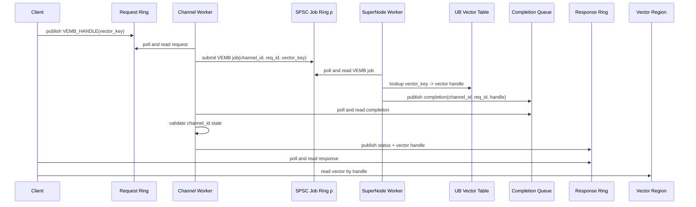

VEMB response：

```c
typedef struct vemb_handle_resp {
    uint32_t req_id;
    uint16_t status;
    uint16_t flags;
    uint64_t key_hash;
    uint64_t vector_offset;
    uint32_t vector_len;
    uint32_t reserved;
} vemb_handle_resp_t;
```

`VEMB RAW` 的兼容语义由客户端完成：客户端拿到 handle 后本地读取 vector，再按需要输出 RAW 格式。server 热路径不返回 1200B。

## VADD 路径

外部语法保持：

```text
VADD myvectors VALUES 300 0.1 0.2 ... item:123
```

建议提供两种 data-plane 编码。

### Inline VADD

适合简单实现和小规模测试：

```c
typedef struct vemb_vadd_inline_req {
    vemb_msg_hdr_t hdr;
    uint32_t key_len;
    uint64_t key_hash;
    uint32_t dim;
    uint32_t vector_bytes;
} vemb_vadd_inline_req_t;
```

payload 布局：

```text
[vemb_vadd_inline_req][key bytes][vector bytes]
```

缺点是 request ring 承载 1200B payload，会降低 ring 吞吐。

### Staged VADD

推荐高性能路径：

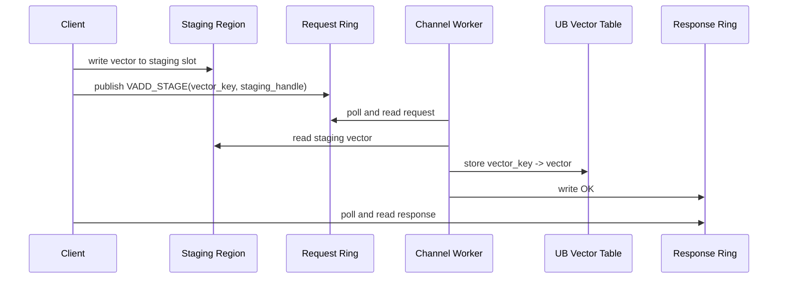

请求：

```c
typedef struct vemb_vadd_stage_req {
    vemb_msg_hdr_t hdr;
    uint32_t key_len;
    uint64_t key_hash;
    uint64_t staging_offset;
    uint32_t dim;
    uint32_t vector_bytes;
    char     key[];
} vemb_vadd_stage_req_t;
```

响应：

```c
typedef struct vemb_status_resp {
    uint32_t req_id;
    uint16_t status;
    uint16_t flags;
} vemb_status_resp_t;
```

## Proxy 与 SuperNode 新关系

当前 Redis proxy 的历史结构可以删除：

- active bucket
- bucket mutex
- flush scheduler
- flush executor
- completion dict
- result thread
- blocked client 关联逻辑

生产边界要求 proxy 不做计算。因此新模型要求 `VADD`、`VEMB`、`VSIM` 都在 SuperNode 中执行。当前只考虑一个 SuperNode，proxy worker 与 SuperNode worker 一对一绑定。

proxy/channel worker 的职责：

- 从 request ring 取请求。
- 做轻量协议校验和 `vector_key` / payload handle 搬运。
- 将所有 `VADD/VEMB/VSIM` 请求提交到绑定的 SPSC job ring。
- 轮询绑定的 SPSC completion ring。
- 校验 `channel_id` 仍处于可回写状态后写 response ring。
- 不访问 vector table，不执行 lookup/store/compute。

SuperNode 的职责：

- 执行 `VADD/VEMB/VSIM`。
- 访问 vector table、staging/query/result regions。
- 产出 completion。
- 不持有 response ring，不缓存 channel pointer。

执行边界：

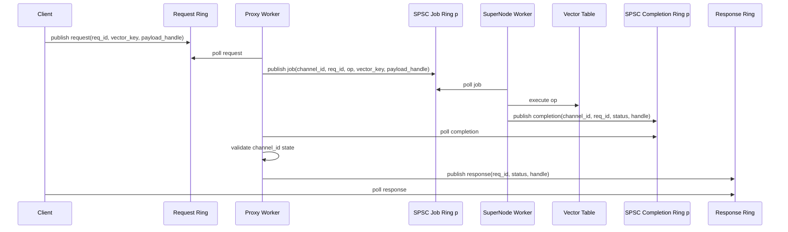

这个边界保留 `proxy -> SuperNode -> proxy` 的生产架构，同时把当前单 SuperNode 场景简化到最少两条 SPSC ring：`job_ring[p]` 和 `completion_ring[p]`。未来多 SuperNode 时再扩展为 consistent hash ring + SPSC ring matrix。

Phase 2 明确采用 Aeron fixed-slot SPSC ring 实现 `job_ring[p]` 和 `completion_ring[p]`，不复用 `src/ring_buffer.h/.c`。原因是 `ring_buffer.h/.c` 依赖 Redis runtime，且是变长 packet 字节流；这里需要的是固定 descriptor 热路径。

详细设计见：

```text
docs/VEMB_V16_PHASE2_AERON_RING_DESIGN.md
```

## 单 SuperNode SPSC Link

当前实现目标是一个 proxy 面对一个 SuperNode，不引入 consistent hash ring：

```text
proxy_worker[p] -> supernode_worker[p]
job_ring[p]: proxy_worker[p] -> supernode_worker[p]
completion_ring[p]: supernode_worker[p] -> proxy_worker[p]
```

建议第一版约束：

```text
proxy_workers == supernode_workers
```

如果数量不同，可以先使用：

```text
supernode_worker = proxy_worker_id % supernode_workers
```

但这会让多个 proxy worker 共享同一个 SuperNode worker，SPSC 会退化或需要额外 fan-in。为了压测和第一版实现，优先保持一对一。

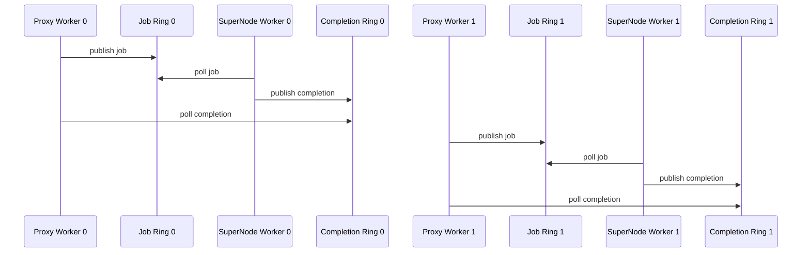

文字说明：

- `job_ring[p]` 是 SPSC，唯一 producer 是 `proxy_worker[p]`，唯一 consumer 是 `supernode_worker[p]`。
- `completion_ring[p]` 是 SPSC，唯一 producer 是 `supernode_worker[p]`，唯一 consumer 是 `proxy_worker[p]`。
- proxy worker 不需要 consistent hash ring lookup，也不需要 MPSC CAS。
- SuperNode 不需要扫描多个 proxy queue。
- response ring 仍然只由 proxy/channel worker 写，保持 channel 生命周期安全。

## 内存布局

建议 server 创建以下共享区域：

```text
request rings:
  每 channel 一个 SPSC/MPSC ring

response rings:
  每 channel 一个 SPSC ring

completion queues:
  completion_ring[p]，SuperNode worker p -> proxy worker p 的 SPSC ring

staging region:
  客户端写 VADD vector payload

vector region:
  internal vector slot/offset -> vector bytes
```

`vector_key` 到物理地址需要先查内部索引：

```text
vector_key -> internal slot/offset -> vector_ptr
vector_ptr = vector_region_base + table_offset + internal_slot * vector_stride
```

对于 `dim=300`：

```text
vector_stride = 1200 bytes
```

## 线程模型

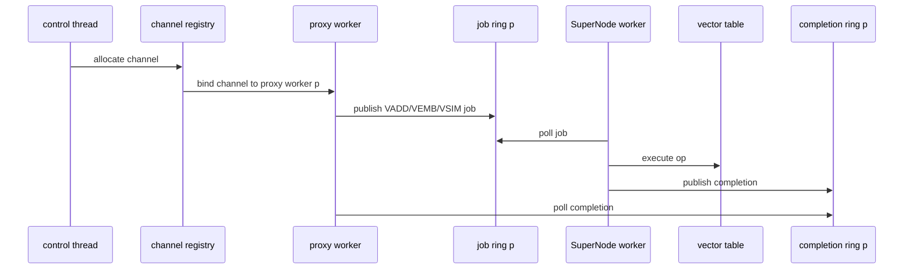

建议优先实现：

- 每个 channel 绑定一个 proxy worker，proxy worker 负责 poll request ring 和 completion ring。
- proxy worker 不访问 vector table，不执行 `VADD/VEMB/VSIM`。
- 每个 proxy worker `p` 固定绑定 SuperNode worker `p`。
- `job_ring[p]` 和 `completion_ring[p]` 都是 SPSC。
- SuperNode worker 是 `VADD` / `VEMB` / `VSIM` 的唯一执行线程组。
- response ring 由 channel worker 唯一写入，SuperNode 只写 completion queue。
- ingress worker 与 SuperNode worker 都采用 spin + pause/yield 分层等待。
- bench 默认 pin CPU，避免调度噪声。

## 指令兼容层

兼容层只在客户端或入口层处理文本：

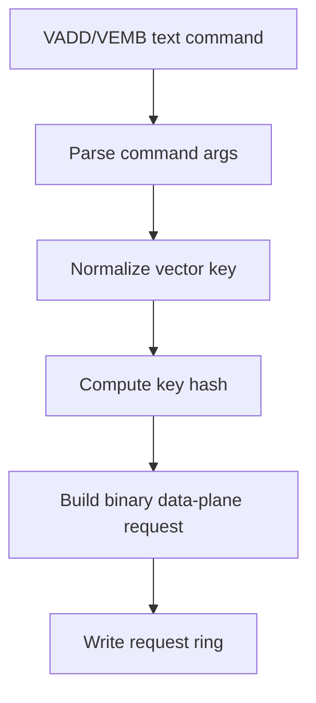

不建议在服务端热路径解析文本命令。benchmark 应直接使用二进制 request，但 request 语义仍然是 `vector_key -> vector`，不是 CLI 生成物理 `row_id`。

## Benchmark 口径

必须拆分三类指标：

1. **handle-only**
   - 测 request ring + channel worker submit + SuperNode VEMB + completion queue + response ring。
   - 不读 1200B vector。
   - 对标 TLC V16 GET 5B response，但会多 `channel worker -> SuperNode` 和 `SuperNode -> channel worker completion` 两次 hop。

2. **read-vector**
   - 收到 handle 后从 vector region 读 1200B。
   - 不打印。
   - 衡量真实客户端读取 vector 的成本。

3. **print-vector**
   - 读取并输出 vector。
   - 受 stdout/格式化影响，不作为 server 性能指标。

示例：

```bash
./benchmark/vemb_v16_bench \
  --mode vemb-handle \
  --dim 300 \
  --rows 65536 \
  --ops 1000000 \
  --threads 8

./benchmark/vemb_v16_bench \
  --mode vemb-read-vector \
  --dim 300 \
  --rows 65536 \
  --ops 1000000 \
  --threads 8
```

## 预期性能模型

`VEMB_HANDLE` 热路径：

```text
request:  vector_key/key_hash
response: status + handle，约 24-32B
transport: shared-memory ring
server work: channel worker SPSC job ring -> SuperNode key lookup -> handle -> SPSC completion ring -> channel worker response ring
payload: client 本地读 vector region
```

这个模型仍然有机会达到较高 QPS，但由于 `VEMB` 必须进入 SuperNode，且 response ring 生命周期归 channel worker，相比 `tlc_v16_server` 的单层 worker GET 会多 job queue 和 completion queue 两次 handoff。

`VADD_STAGE` 热路径：

```text
payload: client 写 staging region
request: vector_key + staging handle
server work: channel worker submit -> SuperNode copy/store vector to table -> completion queue -> channel worker response ring
response: OK
```

VADD 仍然需要写 vector table；在生产边界下它也由 SuperNode 执行，proxy 只提交 job 和回写 response。

## 与 TLC V16 的性能预期

约束条件：`VADD`、`VEMB`、`VSIM` 都必须在 SuperNode 中执行；当前单 SuperNode 场景采用 proxy worker 与 SuperNode worker 一对一 SPSC link。因此不能按 `tlc_v16_server` 的单层 worker 直接估算。

`tlc_v16_server` 已测基线：

```text
V16 Aeron 100% GET: 约 2.19M QPS，平均 456ns
V16 Aeron 100% PUT: 约 2.15M QPS，平均 465ns
```

新 `VEMB/VSIM` 路径多出来的固定开销：

```text
client request ring
-> channel worker poll
-> SPSC job ring publish
-> SuperNode worker poll
-> SuperNode 执行 VEMB/VSIM
-> SPSC completion ring publish
-> channel worker poll completion
-> response ring
-> client poll response
```

新 `VADD_STAGE` 路径：

```text
client 写 staging region
-> channel worker poll request
-> SPSC job ring publish
-> SuperNode worker copy/store vector
-> SPSC completion ring publish
-> channel worker poll completion
-> response ring
-> client poll response
```

性能预测：

| 模式 | 对标 TLC V16 | 预测 QPS | 预测平均延迟 | 主要差距来源 |
|---|---:|---:|---:|---|
| `ping` | 2.19M GET | 1.8M - 2.5M | 400ns - 650ns | ring/worker 基础成本 |
| `vemb-handle` | 2.19M GET | 0.8M - 1.3M | 0.8us - 1.4us | SPSC job + SPSC completion |
| `vemb-read-vector` | 2.19M GET | 0.6M - 1.0M | 1.0us - 1.8us | completion 回跳 + client 读 1200B |
| `vadd-stage` | 2.15M PUT | 0.8M - 1.3M | 0.8us - 1.5us | SPSC job/completion + staging 读 + table 写 |
| `vsim` | 无直接等价 | 取决于候选数/compute | 取决于 compute | SuperNode compute 成本主导 |

第一阶段合理验收线：

```text
ping:             >= 1.8M QPS
vemb-handle:      >= 800k QPS
vemb-read-vector: >= 600k QPS
vadd-stage:       >= 800k QPS
```

如果 `vemb-handle` 低于 `800k QPS`，优先检查：

- proxy worker 到 SuperNode worker 是否确实是一对一 SPSC。
- SuperNode 是否批量 poll，还是每条请求触发线程唤醒。
- completion queue 是否无锁，channel worker 是否在同一 loop 中同时 poll request 和 completion。
- request/response/job descriptor 是否 cache-line 对齐。
- SuperNode worker 是否固定 CPU，避免跨 NUMA 抖动。

## 分阶段落地计划

### 阶段 1：vemb_v16_server skeleton

- UDS 控制 socket。
- channel 分配。
- request/response ring 创建。
- `OP_PING`。
- `vemb_v16_bench --mode ping`。

验收目标：

```text
ping ring round-trip 达到 TLC V16 同量级
```

### 阶段 2：Aeron Ring 化与模块拆分

- 采用 Aeron fixed-slot SPSC ring。
- 不复用 `src/ring_buffer.h/.c`。
- 新增 typed job ring 和 typed completion ring。
- VEMB 使用小 descriptor job ring，不复制 1200B vector payload。
- VADD 先保留 full-vector job ring，全量传输 vector。
- 将 `vemb_v16_job_t` / `vemb_v16_completion_t` 移到 data-plane 头文件。
- 将 SuperNode worker loop 从 `vemb_v16_proxy.c` 拆到独立模块。
- 将 vector table/backend 从 `vemb_v16_proxy.c` 拆到独立模块。
- 保持 `VEMB_HANDLE`、`vemb-read-vector`、`vadd-inline` 功能不回退。

验收目标：

```text
standalone 数据面不 include server.h
standalone 数据面不引用 RedisModule*
standalone 数据面不 link ring_buffer.h/.c
proxy 文件不直接执行 table lookup/store
SuperNode worker 通过 Aeron job ring 执行 VADD/VEMB
completion 通过 Aeron completion ring 回 proxy
```

### 阶段 3：VEMB_HANDLE 性能优化

- vector table 初始化。
- `vector_key -> internal slot/offset` 索引。
- channel worker 通过 `job_ring[p]` 提交 `VEMB_HANDLE(vector_key)` 到绑定 SuperNode worker。
- SuperNode 计算 vector handle 并写 completion queue。
- channel worker 消费 completion，校验 channel 仍处于可回写状态后写 response ring。

验收目标：

```text
handle-only VEMB 达到 800k+ QPS，并量化 SPSC job ring 和 completion ring 开销
```

### 阶段 4：客户端 read-vector

- 客户端按 handle 读取 vector region。
- benchmark 增加 `vemb-read-vector`。
- 对比 handle-only 与 read-vector 差距。

### 阶段 5：VADD_STAGE

- 该阶段延后到 VEMB 热路径稳定之后。
- staging region。
- client 写 staging slot。
- channel worker 通过 `job_ring[p]` 提交 VADD job。
- SuperNode worker 读取 staging slot 并写 vector table。
- SuperNode worker 写 completion ring，channel worker 回写 response OK。

### 阶段 6：指令兼容 CLI

- `vemb-cli VADD ...`
- `vemb-cli VEMB ... RAW`
- 保持命令语法兼容，但执行环境不依赖 Redis。

### 阶段 7：VSIM compute

- 在已有 SuperNode 执行框架上实现 VSIM/compute。
- 复用 `VEMB` 已验证的 request ring -> channel worker -> SuperNode -> completion queue -> channel worker -> response ring 路径。

## 与当前 Redis FC Proxy 的取舍

| 项 | 当前 Redis FC Proxy | 新 VEMB V16 数据面 |
|---|---|---|
| 命令入口 | Redis RESP command | CLI 兼容解析 + binary request |
| 请求传输 | TCP RESP | shared-memory ring |
| VEMB 回复 | RESP array + 1200B bulk | status + handle |
| payload 读取 | Redis socket 返回 | client 读 vector region |
| 阻塞模型 | RedisModule_BlockClient | spin/poll ring |
| completion | Redis unblock + reply callback | completion queue + channel worker 写 response ring |
| SuperNode 路由 | 旧 proxy hash/bucket 机制 | 单 SuperNode 固定 worker 绑定 |
| exact lookup | 走 proxy/SuperNode | 固定 SPSC link 到 SuperNode，SuperNode 返回 handle |
| VADD/PUT | Redis command/module 路径 | 固定 SPSC link 到 SuperNode，SuperNode 写 vector table |
| 适用目标 | Redis 兼容 | TLC V16 风格高性能数据面 |

## 结论

在“只要求兼容 VADD/VEMB 指令，不要求依赖 Redis 执行环境”的前提下，最优方案是全新实现 `vemb_v16_server/bench/cli`。

核心路径应该是：

```text
VEMB item:N RAW
-> client 规范化 vector_key
-> request ring 发送 vector_key
-> channel worker 通过 SPSC job ring 提交 SuperNode job
-> SuperNode 生成 completion
-> SPSC completion ring 回到 channel worker
-> channel worker 写 response ring 返回 handle
-> client 从 vector region 读 1200B
```

这条路径绕开了 Redis、RESP、blocked-client、reply callback、socket write 和当前 proxy 历史结构，才具备接近 `tlc_v16_server` 的性能基础。
