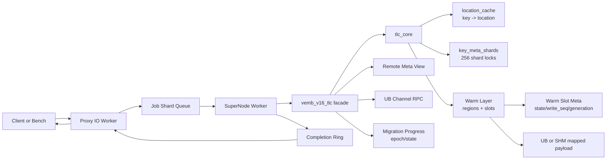
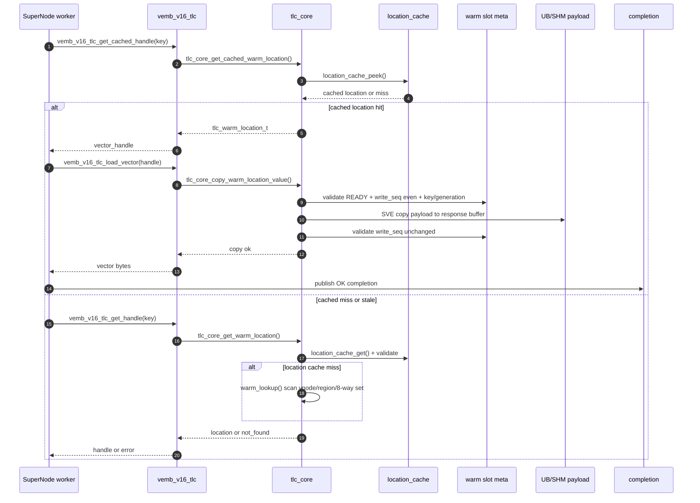
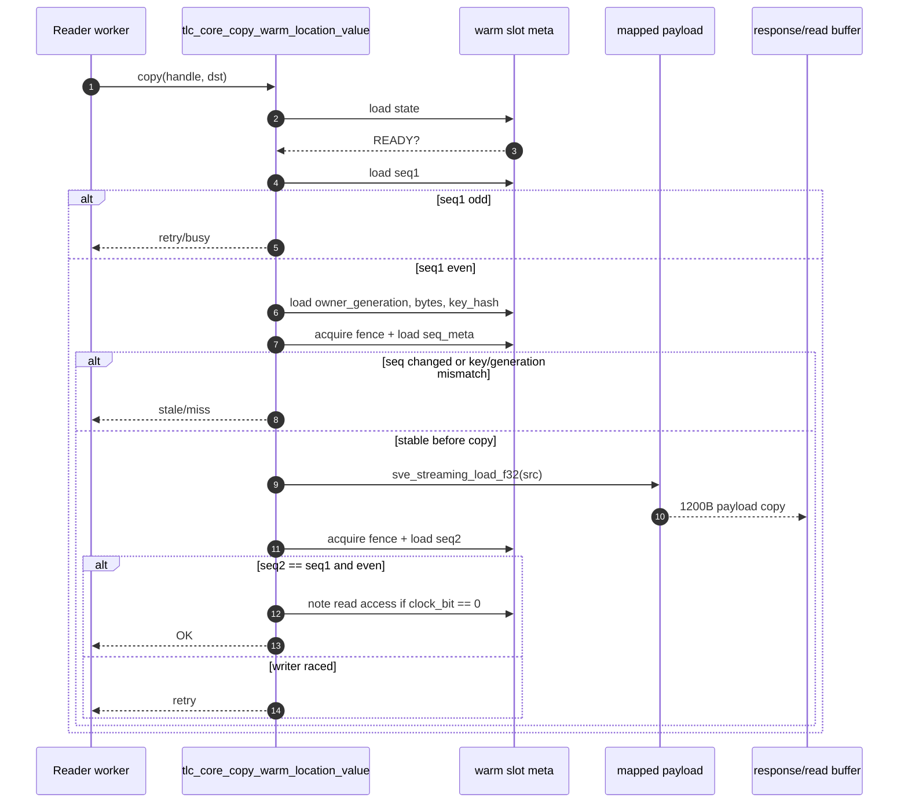
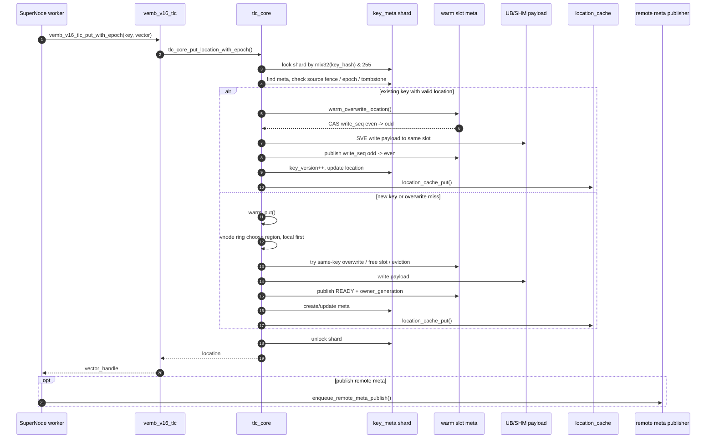
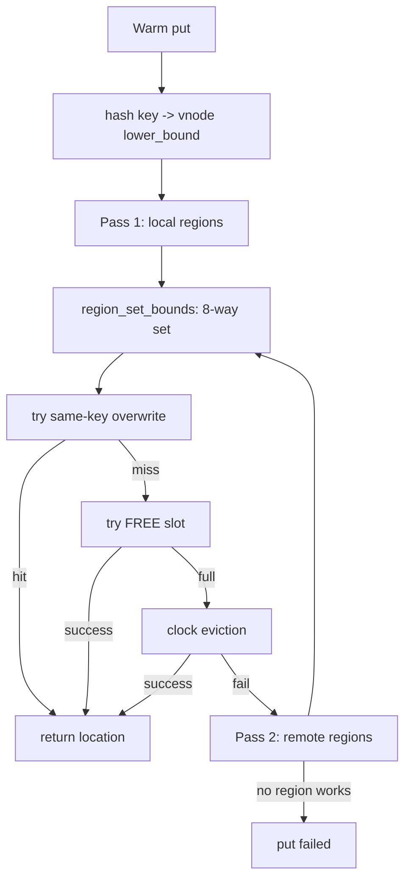
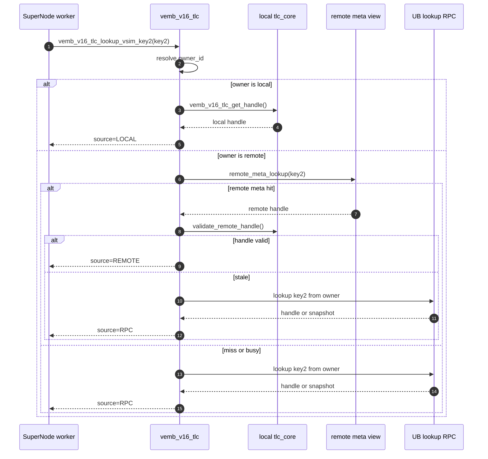
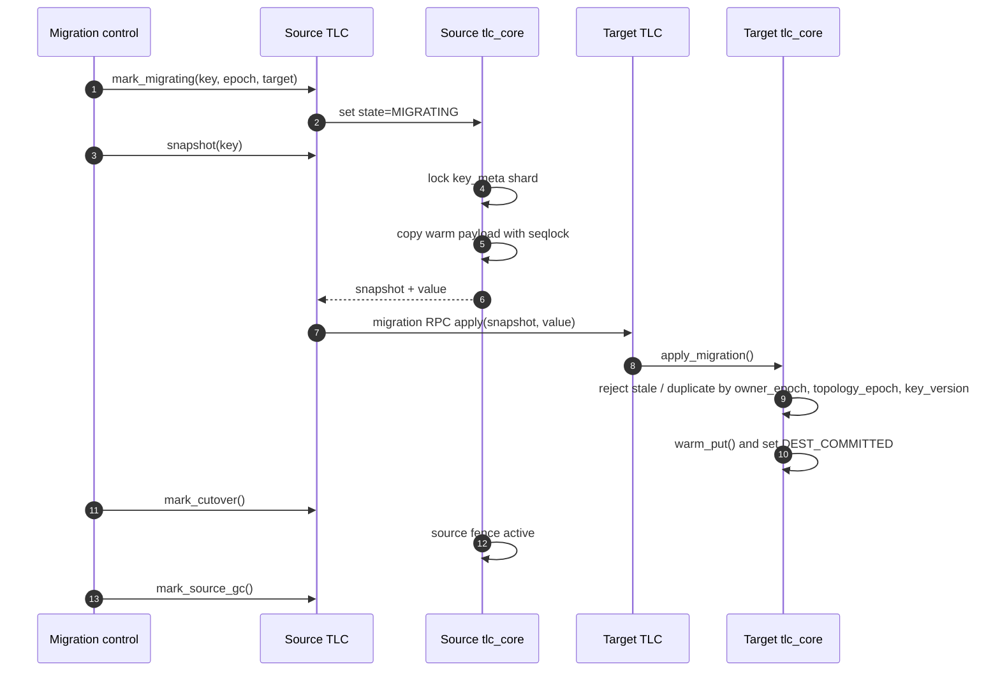

# VEMB V16 TLC 架构、时序与并发模型

日期：2026-06-24

本文按当前代码重新梳理 TLC 的整体设计、架构边界、读写时序和并发模型。文中的图使用 Mermaid，可在支持 Mermaid 的 Markdown 预览器中直接渲染。

主要代码位置：

- `src/vemb_v16_supernode.c`：SuperNode worker 执行 VEMB/VADD/VSIM job。
- `src/vemb_v16_tlc.c` / `src/vemb_v16_tlc.h`：TLC facade，负责 vector handle、remote meta、UB RPC、migration API。
- `src/tlc_core.c` / `src/tlc_core.h`：本地核心存储层，负责 warm region、location cache、key meta、slot 并发一致性。

## 1. 总体定位

TLC 当前不是单纯的三层缓存，而是 SuperNode 的向量存储访问层：

```text
SuperNode job handler
  -> vemb_v16_tlc facade
    -> tlc_core local storage
      -> location_cache / warm regions / key_meta_shards / cold
    -> remote meta / UB lookup RPC / migration control
```

整体架构：



分层职责：

| 层 | 主要职责 | 关键数据 |
| --- | --- | --- |
| SuperNode worker | 执行请求、组织 completion、统计耗时 | `vemb_v16_job_base_t`、`vemb_v16_completion_t` |
| `vemb_v16_tlc_t` | 把 core location 转成 vector handle，管理 remote meta、UB RPC、migration | `warm_regions`、`remote_meta_views`、`migration_progress` |
| `tlc_core_t` | 本地存储与并发一致性 | `location_cache`、`warm`、`key_meta_shards` |
| warm region | 真正的 payload 存储 | `mapped_addr + offset` |
| slot meta | payload 的并发状态和版本 | `state`、`write_seq`、`owner_generation` |

## 2. 核心数据结构

### `vemb_v16_tlc_t`

`vemb_v16_tlc_t` 是对外 facade，字段包括：

- `vector_dim/value_size/max_vectors`：向量维度、单条 payload 大小和容量。
- `warm_regions`：region 配置和 mmap/UB 映射。
- `core`：指向 `tlc_core_t`。
- `remote_meta_views`：按 owner 组织的 remote meta view。
- `lookup_rpc`：远端 owner 查询 fallback。
- `migration_progress`：迁移进度和 barrier。
- `remote_meta_publisher`：异步 remote meta publish ring 和后台线程。
- 一组 atomic runtime stats。

### `tlc_core_t`

`tlc_core_t` 是本地核心：

- `location_cache`：读热路径缓存，保存 `key -> tlc_warm_location_t`。
- `warm`：warm region runtime、vnode ring、slot meta、payload 映射。
- `key_meta_shards`：256 个 key meta shard，控制写串行化、迁移状态、epoch/version、tombstone、当前 location。
- `cold`：编译开关控制，默认 `TLC_CORE_ENABLE_COLD_LAYER=0`，当前主路径基本不走 cold。
- `hold/hot` 和 `warm.entries/hash_table`：结构仍存在，但当前主路径没有看到写入维护，实际核心命中依赖 `location_cache + warm slot meta`。

`tlc_warm_location_t` 是 core 内部 location：

```text
region_id
region_index
local_slot
bytes
offset
owner_generation
```

facade 会把它转换为 `vemb_v16_vector_handle_t` 返回给 supernode。

## 3. VEMB Read 时序

VEMB read 在 SuperNode 中先尝试 cached handle，再退回 full lookup。payload 需要返回时，会复制快照到 inline buffer 或 read result buffer。



关键点：

- cached read 不进入 key meta shard lock，除非 source fence/tombstone active。
- location cache hit 后仍会校验 warm slot，避免 stale handle。
- payload copy 前后都检查 `write_seq`，避免读到半写数据。
- `owner_generation` 用于识别 slot 被覆盖/复用后的旧 handle。

## 4. Payload Copy 时序

payload copy 是当前读路径的核心一致性机制。



这个模型允许读路径无锁，同时保证 copy 的 payload 与 slot meta 是同一个稳定版本。

## 5. VADD Write 时序

写路径以 key meta shard lock 串行化控制面，再通过 slot CAS/seqlock 保护 payload。



写并发规则：

- 同一个 key meta shard 内写串行；不同 shard 可并行。
- slot 写入不依赖 pthread mutex，而是 `state CAS + write_seq`。
- same-slot overwrite 避免重新扫描 warm bucket，是 mixed 读写的重要优化。

## 6. Warm Region 放置与驱逐

Warm region 放置逻辑：



Warm region 选择：

- 每个 region 生成 `32 * effective_weight` 个 vnode。
- local region 默认权重乘 `local_region_weight`，默认 4。
- lookup/put 都先 local 后 remote。
- region 内使用 8-way set，减少全局扫描。

驱逐策略：

- 只驱逐 `READY + COLD_COMMITTED + write_seq even` 的 slot。
- 优先选择 `clock_bit == 0` 的 slot。
- 如果都为 1，则清零 clock bit，并选择 `last_access_ns` 最老的 slot。

## 7. VSIM Remote Meta 与 UB RPC 时序

VSIM 的 key2 可以本地查，也可以通过 remote meta 或 UB RPC 找到远端 handle。



remote meta 的作用是把跨 supernode key2 查询从 RPC 降级为本地 metadata lookup；但命中后仍要校验 handle，防止远端 meta stale。

## 8. 迁移时序

迁移控制面依赖 key meta：



迁移期间：

- source fence active 后，读写会检查 key 是否 cutover/source_gc。
- 写入带 topology epoch，过期写会被拒绝。
- snapshot/apply 用 `owner_epoch/topology_epoch/key_version` 做 stale/duplicate 判定。

## 9. 并发模型总结

| 对象 | 并发策略 | 说明 |
| --- | --- | --- |
| location cache | entry `seq` seqlock | 读无锁，写 CAS 抢 seq，写完 release 发布 |
| key meta | 256 shard bitmap lock | 写路径和迁移控制面串行化，不同 shard 并行 |
| warm slot payload | `state CAS + write_seq + owner_generation` | payload copy 前后校验，避免半写和 stale handle |
| warm placement | region vnode + 8-way set | local 优先，set 内 free/overwrite/evict |
| remote meta publish | MPSC-ish ring + background thread | VADD 后异步发布，避免阻塞主写路径 |
| migration progress | pthread mutex | 迁移进度管理低频路径 |
| cold layer | bitmap lock | 默认关闭，不在当前主路径 |

读路径核心目标：

```text
不拿全局锁，不拿 key_meta shard lock；
用 location_cache + slot seqlock/generation 保证一致性。
```

写路径核心目标：

```text
key 控制面按 shard 串行；
payload 写入按 slot CAS/seqlock 发布；
已有 key 尽量 same-slot overwrite。
```

## 10. 当前设计对性能的影响

正向收益点：

- location cache 将多数读命中缩短为 cache lookup + slot validate。
- 读 copy 无锁，依赖 `write_seq` 保证一致性。
- key meta 从全局锁拆成 256 shard bitmap lock，降低 mixed 写冲突。
- same-slot overwrite 减少 warm bucket scan 和 slot 重分配。
- SVE copy 用于 warm payload 读写，适合 300 dim / 1200B 固定 payload。
- remote meta 让跨 owner VSIM 查询尽量避免 UB RPC。

主要剩余成本：

- payload copy 仍需 1200B 数据搬运和两次 `write_seq` 校验。
- location cache 仍要 key words 比对和 slot validate。
- mixed 写在同 shard/key 高冲突时仍会被 shard lock 和 slot seq 限制。
- remote meta stale 时会 fallback UB RPC，尾延迟会变大。

## 11. 当前代码注意事项

- `TLC_CORE_ENABLE_COLD_LAYER` 默认是 0，当前主路径不要把 cold 当成实际承载层。
- `hold/hot` 和 `warm.entries/hash_table` 结构仍存在，但当前代码中未看到 warm put 维护这些结构，性能分析应优先看 `location_cache` 和 slot meta。
- remote meta handle 命中不是最终可信结果，必须通过 `tlc_core_validate_warm_location()`。
- `owner_generation` 是 handle 正确性的关键字段，slot overwrite/evict 后可识别旧 handle。

