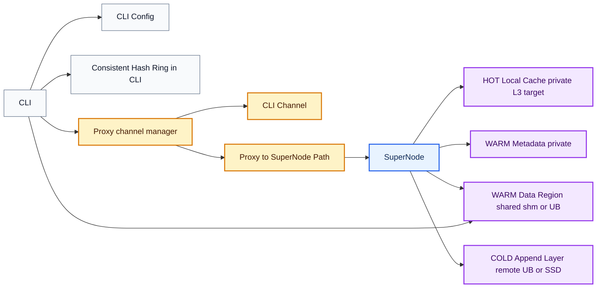
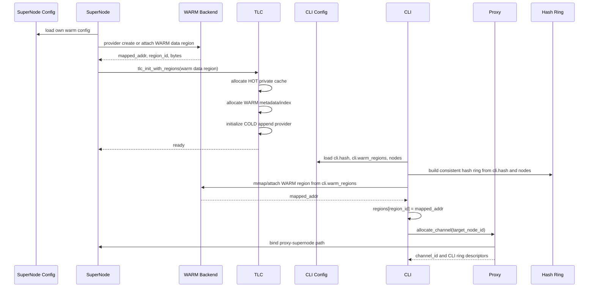
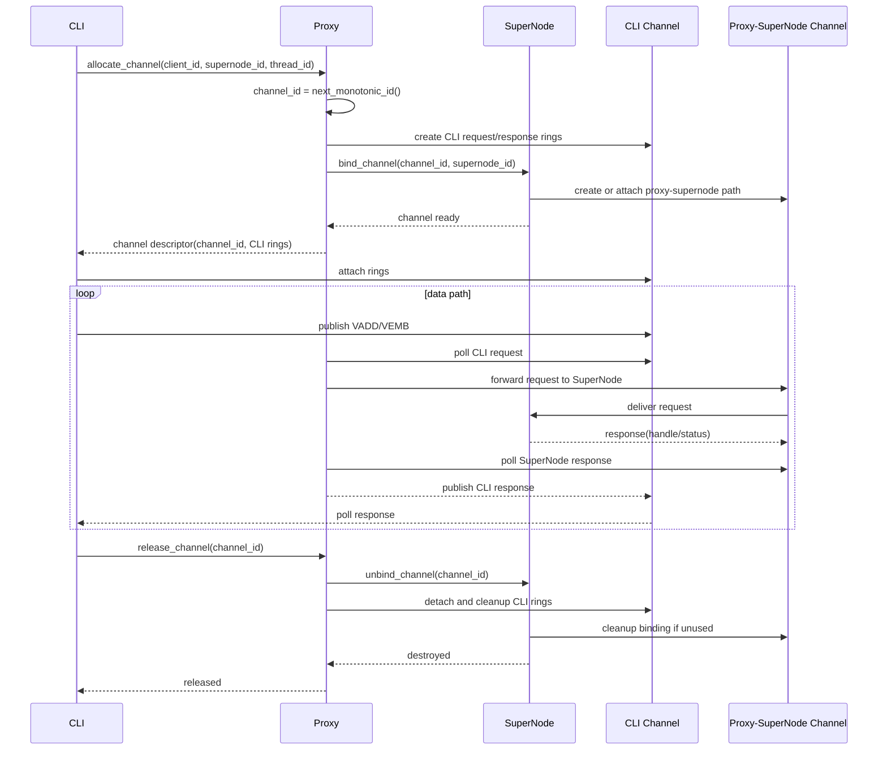
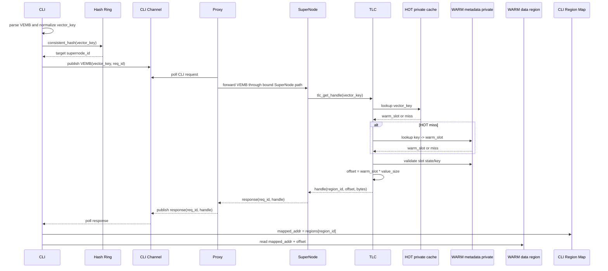
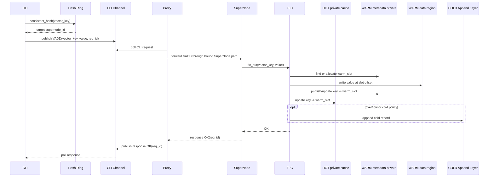
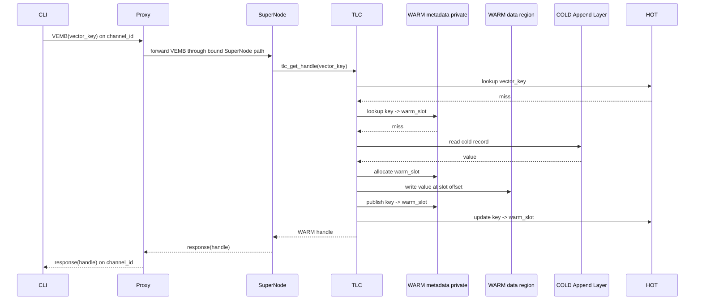

# VEMB V16 TLC WARM 共享数据模型

日期：2026-05-22

## 核心结论

VEMB V16 中，TLC 是 SuperNode 内部的分层内存管理器。`VADD/VEMB/VSIM` 由 SuperNode 执行，CLI 通过 proxy-managed channel 与目标 SuperNode 交互，VEMB response 返回 WARM handle，CLI 再从对应 WARM data region 读取向量。

```text
CLI local config -> consistent_hash(vector_key) -> target supernode_id
CLI -> Proxy channel -> SuperNode -> TLC
VEMB response -> {region_id, offset, bytes}
CLI read -> regions[region_id].mapped_addr + offset
```

关键约束：

```text
consistent_hash 在 CLI 中完成
Proxy 不负责 hash/region 配置/计算
Proxy 负责 channel 生命周期、channel_id 管理、Proxy <-> SuperNode 数据交互
SuperNode 负责 VADD/VEMB/VSIM 和 TLC HOT/WARM/COLD
WARM handle 永远指向 WARM data region，不直接指向 COLD
```

## 总体架构



说明：

- CLI 从本地配置读取 proxy、SuperNode、hash ring 和 WARM region。
- CLI 本地执行 `consistent_hash(vector_key)`，选择目标 SuperNode。
- CLI 向 proxy 申请绑定到目标 SuperNode 的 channel。
- Proxy 管理 `channel_id`、CLI request/response ring 生命周期，以及 Proxy 与 SuperNode 的数据交互。
- Proxy 不下发拓扑/hash/region，不做 VEMB/VSIM 计算，不读写 WARM/COLD。
- SuperNode 内部调用 TLC；TLC 管理 HOT、WARM metadata、WARM data region、COLD。

多 SuperNode 拓扑单独维护在：

```text
docs/VEMB_V16_MULTI_SUPERNODE_HASH_RING_DESIGN.md
```

该拓扑使用两个关键约束：

```text
consistent_hash 在 CLI 中完成
proxy 与 SuperNode 一一对应
```

## TLC 数据模型

```text
HOT:
  SuperNode 私有 cache/index
  目标是 L3 cache resident
  key -> warm_slot
  不暴露给 CLI

WARM:
  SuperNode 私有 metadata/index:
    key -> warm_slot
    slot state / bitmap lock / access_count / eviction metadata
  共享 data region:
    slot_id -> vector bytes
    provider 可以是 shm，也可以是 UB
    CLI 根据 {region_id, offset, bytes} 直接读取

COLD:
  append-only 冷/溢出层
  可以是 remote UB，也可以是本地 SSD/mmap file
  不存全量数据
```

关键澄清：

```text
WARM 不是 data region + HOT Layer。
WARM = shared data region + SuperNode private metadata/index。
HOT = 独立上一层 cache，只缓存 key -> warm_slot。
```

WARM data region 使用 packed vector arena：

```text
slot_id * value_size -> vector bytes
vector_slot[N][1200B]
```

P0 如果不做 slot 复用，可以先不加 `generation`。后续如果 WARM 支持淘汰/复用，需要在私有 metadata 中增加：

```text
generation
key_hash
state
```

COLD read-through 不直接把 COLD handle 返回给 CLI：

```text
read COLD
promote/write WARM
return WARM handle
```

这样 CLI 永远只读 WARM region，协议保持简单。

## 配置与 ABI

CLI 启动配置中，`cli` 描述 CLI 自己要使用的 hash 算法和可 mmap 的 WARM region map；`nodes[]` 描述每组一一对应的 Proxy 和 SuperNode 初始化资源。CLI 根据 `cli.hash` 对 `vector_key` 做 `consistent_hash` 得到 `node_id`，再连接对应 node 的 `proxy.endpoint` 申请 channel。

```yaml
cli:
  id: cli-0
  hash:
    algorithm: consistent_hash
  warm_regions:
    - region_id: 0
      node_id: 0
      provider: shm
      path: /vemb_warm_0
      mmap_offset: 0
      bytes: 1073741824
      value_size: 1200
    - region_id: 1
      node_id: 1
      provider: ub
      path: /dev/obmm_shmdev2
      mmap_offset: 0
      bytes: 1073741824
      value_size: 1200

nodes:
  - id: 0
    proxy:
      endpoint: /tmp/vemb_proxy_0.sock
    supernode:
      tlc:
        warm:
          region_id: 0
          provider: shm
          path: /vemb_warm_0
          mmap_offset: 0
          bytes: 1073741824
          value_size: 1200
  - id: 1
    proxy:
      endpoint: /tmp/vemb_proxy_1.sock
    supernode:
      tlc:
        warm:
          region_id: 1
          provider: ub
          path: /dev/obmm_shmdev2
          mmap_offset: 0
          bytes: 1073741824
          value_size: 1200
```

说明：

- `cli.hash` 只给 CLI 本地路由使用，Proxy 不持有 hash ring。
- `cli.warm_regions[]` 是 CLI 需要 mmap 的所有 SuperNode WARM data region；VEMB response 的 `region_id` 必须能在这里查到。
- `node.id` 同时标识 Proxy 和 SuperNode 这一对实例。
- `node.proxy.endpoint` 是 CLI 连接 Proxy、申请 channel 的地址。
- `node.supernode.tlc.warm` 是该 SuperNode 初始化 TLC 时使用的 WARM data region descriptor，应与 `cli.warm_regions[]` 中同 `region_id` 的条目一致。
- 当前 P0 中，每个 SuperNode 的 `warm_layer` 只映射一个 WARM data region；也就是一个 `node.supernode.tlc.warm` 对应一个 `region_id`。
- 后续如果一个 `warm_layer` 需要映射多个 region，应把配置扩展为 `node.supernode.tlc.warm.regions[]`，并在 TLC metadata 中增加 `warm_slot -> region_id + offset` 映射。
- SuperNode 不再单独暴露给 CLI 一个 endpoint；Proxy 和 SuperNode 一起初始化，Proxy 负责与本地对应 SuperNode 的数据交互。
- P0 暂时不需要在 CLI 配置里暴露 `hot/cold`：HOT 是 SuperNode 私有 cache，COLD 是 SuperNode 私有 append 层；二者不被 CLI mmap 读取。

关键结构：

```c
typedef enum {
    VEMB_REGION_LOCAL_SHM = 1,
    VEMB_REGION_UB = 2,
} vemb_region_backend_t;

typedef struct vemb_region_desc {
    uint32_t region_id;
    uint32_t supernode_id;
    uint32_t storage_class;
    uint32_t backend_type;
    uint32_t dim;
    uint32_t value_size;
    uint64_t mmap_offset;
    uint64_t region_bytes;
    char path[256];
} vemb_region_desc_t;

typedef struct vemb_cli_region {
    uint32_t region_id;
    uint32_t supernode_id;
    uint32_t backend_type;
    uint32_t value_size;
    uint64_t region_bytes;
    void *mapping_addr;
    void *mapped_addr;
} vemb_cli_region_t;

typedef struct vemb_vector_handle {
    uint32_t region_id;
    uint32_t bytes;
    uint64_t offset;
    uint64_t key_hash;           /* Optional debug/check field; not used for address lookup. */
} vemb_vector_handle_t;

typedef struct tlc_warm_region {
    uint32_t region_id;
    uint32_t backend_type;
    void *mapped_addr;
    uint64_t region_bytes;
    uint32_t value_size;
} tlc_warm_region_t;
```

`warm_slot/warm_idx` 可以作为 debug 字段保留，但不应该成为跨进程协议的唯一定位信息。

`vemb_vector_handle_t` 中真正用于定位 vector 的字段是：

```text
region_id + offset + bytes
```

`key_hash` 不参与寻址。它只用于日志、调试、请求/handle 一致性校验，以及后续 slot 复用或 stale handle 排查。

## 初始化时序



## Channel 生命周期



`channel_id` 由 proxy 单调分配。Proxy 负责 CLI channel 创建、回收和异常清理，维护 `channel_id -> SuperNode` 绑定，并把 CLI channel 上的 request 转交给目标 SuperNode。

## VEMB 时序



热路径读取逻辑：

```c
const vemb_vector_handle_t *h = &resp->handle;
const vemb_cli_region_t *r = &cli->regions[h->region_id];

if (!r->mapped_addr)
    return VEMB_ERR;
if ((uint64_t)h->offset + h->bytes > r->region_bytes)
    return VEMB_ERR;

const void *vector = (const uint8_t *)r->mapped_addr + h->offset;
```

P0 校验：

```text
region_id 存在
mapped_addr 非空
offset + bytes 不越界
bytes == 1200
```

## VADD 时序



P0 可以先让 VADD 全量经过 CLI channel 和 proxy 转发到 SuperNode。后续再引入 client-side staging buffer，避免 VADD 大 payload 经过 channel slot。

## COLD Read-Through 时序



## 当前代码差距

当前代码与目标模型的主要差距：

1. `ub_mem_manager_t` 仍会自己创建模拟 UB region。
   目标是 SuperNode/provider 创建或 attach 真实 WARM region，再把 `mapped_addr/region_id/bytes` 传给 TLC。

2. 当前 WARM 仍接近 `warm_entry_t { key, value, state, ... }` 结构。
   目标是 WARM data region 只放 packed vector bytes，metadata/index 放 SuperNode 私有内存。

3. `tlc_get()` 是 copy API，会返回完整 1200B。
   VEMB 热路径应使用 `tlc_get_handle()` 返回 `{region_id, offset, bytes}`。

4. COLD 只做 append-only 冷/溢出层。
   COLD 命中后需要 promote/write WARM，再返回 WARM handle。

## 落地计划

### Phase 1：ABI 与配置骨架

```text
vemb_vector_handle_t
vemb_region_desc_t
vemb_cli_region_t
tlc_warm_region_t
CLI/SuperNode 配置字段
```

### Phase 2：TLC 消费 SuperNode WARM region

```text
tlc_init_with_regions()
warm.data_region = warm_region.mapped_addr
WARM metadata/index 私有分配
旧 tlc_init() 保留给现有 benchmark
```

### Phase 3：TLC WARM handle API

```text
tlc_get_handle()
warm_slot -> offset
response 不复制 1200B
COLD read-through 后 promote 到 WARM 再返回 WARM handle
```

### Phase 4：SuperNode 融合 TLC

```text
SuperNode 初始化 WARM backend
VADD -> tlc_put()
VEMB -> tlc_get_handle()
```

### Phase 5：CLI region map 与 read-by-handle

```text
CLI attach regions
region_id -> mapped_addr
read mapped_addr + offset
VEMB read-by-handle bench
read_bytes 统计
```

### Phase 6：CLI consistent hash + proxy channel

```text
CLI 根据 vector_key 选 SuperNode
Proxy 管理 channel 生命周期和 channel_id
Proxy 负责 channel 绑定后的 SuperNode 数据交互
Proxy 不负责 hash/region 配置，也不做计算
单 SuperNode / 多 SuperNode 配置拓扑验证
```
