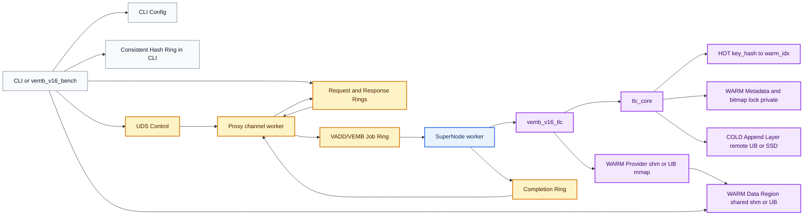
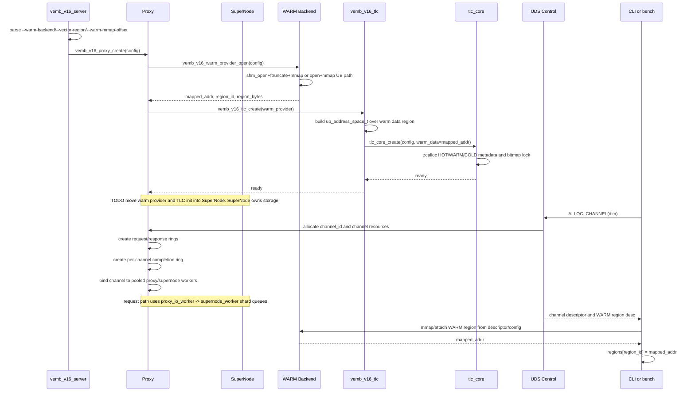
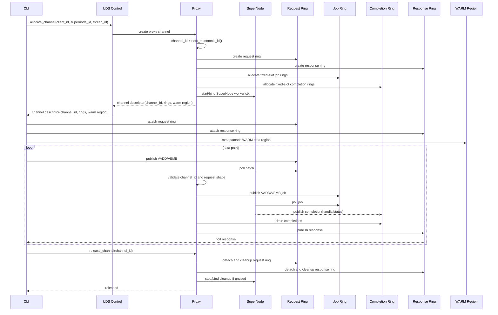
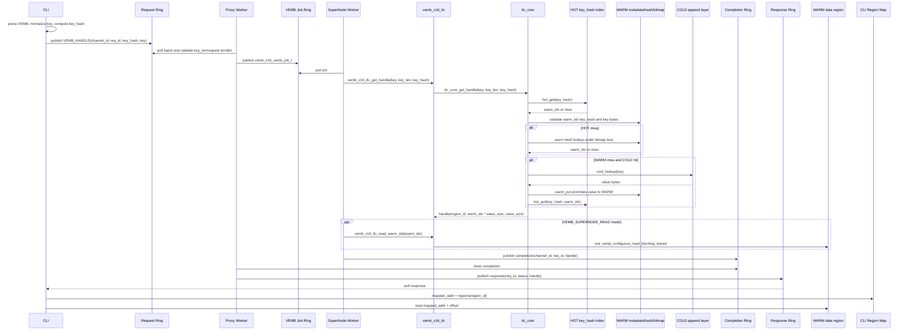
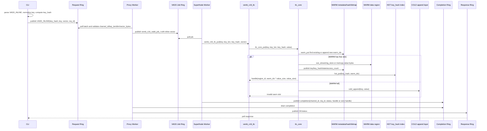
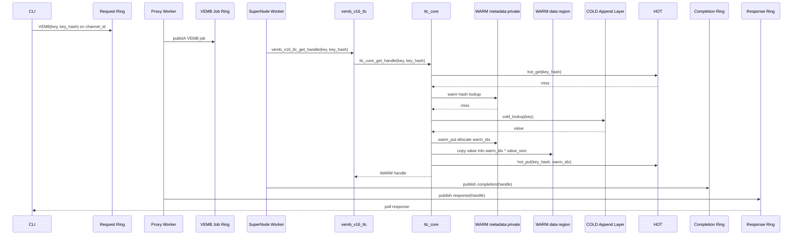

# VEMB V16 TLC WARM 共享数据模型

日期：2026-05-22

## 核心结论

VEMB V16 中，TLC 是 SuperNode 内部的分层内存管理器。`VADD/VEMB/VSIM` 由 SuperNode 执行，CLI 通过 proxy-managed channel 与目标 SuperNode 交互，VEMB response 返回 WARM handle，CLI 再从对应 WARM data region 读取向量。

```text
CLI local config -> consistent_hash(vector_key) -> target supernode_id
CLI/vemb_v16_bench -> Proxy channel -> SuperNode worker -> vemb_v16_tlc -> tlc_core
VEMB response -> {region_id, offset, bytes}
CLI read -> regions[region_id].mapped_addr + offset
```

关键约束：

```text
consistent_hash 在 CLI 中完成
Proxy 不负责 hash/region 配置/计算
Proxy 负责 channel 生命周期、channel_id 管理、Proxy <-> SuperNode 数据交互
SuperNode 负责 VADD/VEMB/VSIM 和 TLC HOT/WARM/COLD
WARM handle 永远指向 WARM data region，不直接指向 COLD
```

## 总体架构



说明：

- CLI 从本地配置读取 proxy、SuperNode、hash ring 和 WARM region。
- CLI 本地执行 `consistent_hash(vector_key)`，选择目标 SuperNode。
- CLI 向 proxy 申请绑定到目标 SuperNode 的 channel。
- Proxy 管理 `channel_id`、CLI request/response ring 生命周期，以及 Proxy worker 到 SuperNode worker 的 job/completion ring。
- Proxy 不下发拓扑/hash/region，不做 VEMB/VSIM 计算，不读写 WARM/COLD。
- SuperNode worker 执行 VADD/VEMB，内部调用 `vemb_v16_tlc`；`tlc_core` 管理 HOT、WARM metadata、bitmap lock、COLD，WARM vector bytes 写到 `warm_provider` 映射出的 data region。
- 当前 P0 代码中，`vemb_v16_proxy_create()` 仍负责 `vemb_v16_warm_provider_open()` 和 `vemb_v16_tlc_create()`；代码中已记录 TODO，后续要移动到 SuperNode 初始化路径，语义是 `supernode owns storage`。

多 SuperNode 拓扑单独维护在：

```text
docs/VEMB_V16_MULTI_SUPERNODE_HASH_RING_DESIGN.md
```

该拓扑使用两个关键约束：

```text
consistent_hash 在 CLI 中完成
proxy 与 SuperNode 一一对应
```

## TLC 数据模型

```text
HOT:
  SuperNode 私有 cache/index
  目标是 L3 cache resident
  key -> warm_slot
  不暴露给 CLI

WARM:
  SuperNode 私有 metadata/index:
    key -> warm_slot
    slot state / bitmap lock / access_count / eviction metadata
  共享 data region:
    slot_id -> vector bytes
    provider 可以是 shm，也可以是 UB
    CLI 根据 {region_id, offset, bytes} 直接读取

COLD:
  append-only 冷/溢出层
  可以是 remote UB，也可以是本地 SSD/mmap file
  不存全量数据
```

关键澄清：

```text
WARM 不是 data region + HOT Layer。
WARM = shared data region + SuperNode private metadata/index。
HOT = 独立上一层 cache，只缓存 key -> warm_slot。
```

WARM data region 使用 packed vector arena：

```text
slot_id * value_size -> vector bytes
vector_slot[N][1200B]
```

### 元数据 / 用户数据分离设计

TLC 中 WARM 被拆成两类内存：

```text
用户数据:
  WARM data region
  只存 packed vector bytes
  由 vemb_v16_warm_provider_open() mmap 出来
  backend 可以是 POSIX SHM，也可以是 UB path
  CLI/client 可根据 handle 直接读取

元数据:
  HOT index
  WARM entries/hash table/bitmap lock
  COLD append/read-through metadata
  key_hash/key bytes/state/access_count/eviction fields
  由 tlc_core 在 SuperNode 本地 heap 上分配
  不暴露给 CLI/client
```

这个设计的核心是：共享/UB 区域只承载大块 vector bytes，不放 key、hash table、锁、状态位等控制信息。SuperNode 独占 TLC metadata 和一致性控制，CLI/client 只拿 `{region_id, offset, bytes}` 去读 payload。

好处：

1. 大 vector 数据可以通过 SHM/UB 共享给 client，避免 VEMB response 复制 1200B payload。
2. HOT/WARM metadata 保持 SuperNode 私有，更容易做到 cache-friendly，也避免跨进程锁和 metadata ABI 约束。
3. 后续 WARM 淘汰、slot 复用、generation、TTL 等策略只改 metadata，不需要改变 WARM data region 的 packed vector ABI。
4. UB 模式下只要求 UB region 支持 mmap 和 payload 读写；metadata 分配不依赖 UB allocator。

COLD read-through 不直接把 COLD handle 返回给 CLI：

```text
read COLD
promote/write WARM
return WARM handle
```

这样 CLI 永远只读 WARM region，协议保持简单。

## 配置与 ABI

CLI 启动配置中，`cli` 描述 CLI 自己要使用的 hash 算法和可 mmap 的 WARM region map；`nodes[]` 描述每组一一对应的 Proxy 和 SuperNode 初始化资源。CLI 根据 `cli.hash` 对 `vector_key` 做 `consistent_hash` 得到 `node_id`，再连接对应 node 的 `proxy.endpoint` 申请 channel。

```yaml
cli:
  id: cli-0
  hash:
    algorithm: consistent_hash
  warm_regions:
    - region_id: 0
      node_id: 0
      provider: shm
      path: /vemb_warm_0
      mmap_offset: 0
      bytes: 1073741824
      value_size: 1200
    - region_id: 1
      node_id: 1
      provider: ub
      path: /dev/obmm_shmdev2
      mmap_offset: 0
      bytes: 1073741824
      value_size: 1200

nodes:
  - id: 0
    proxy:
      endpoint: /tmp/vemb_proxy_0.sock
    supernode:
      tlc:
        warm:
          region_id: 0
          provider: shm
          path: /vemb_warm_0
          mmap_offset: 0
          bytes: 1073741824
          value_size: 1200
  - id: 1
    proxy:
      endpoint: /tmp/vemb_proxy_1.sock
    supernode:
      tlc:
        warm:
          region_id: 1
          provider: ub
          path: /dev/obmm_shmdev2
          mmap_offset: 0
          bytes: 1073741824
          value_size: 1200
```

说明：

- `cli.hash` 只给 CLI 本地路由使用，Proxy 不持有 hash ring。
- `cli.warm_regions[]` 是 CLI 需要 mmap 的所有 SuperNode WARM data region；VEMB response 的 `region_id` 必须能在这里查到。
- `node.id` 同时标识 Proxy 和 SuperNode 这一对实例。
- `node.proxy.endpoint` 是 CLI 连接 Proxy、申请 channel 的地址。
- `node.supernode.tlc.warm` 是该 SuperNode 初始化 TLC 时使用的 WARM data region descriptor，应与 `cli.warm_regions[]` 中同 `region_id` 的条目一致。
- 当前 P0 中，每个 SuperNode 的 `warm_layer` 只映射一个 WARM data region；也就是一个 `node.supernode.tlc.warm` 对应一个 `region_id`。
- 后续如果一个 `warm_layer` 需要映射多个 region，应把配置扩展为 `node.supernode.tlc.warm.regions[]`，并在 TLC metadata 中增加 `warm_slot -> region_id + offset` 映射。
- SuperNode 不再单独暴露给 CLI 一个 endpoint；Proxy 和 SuperNode 一起初始化，Proxy 负责与本地对应 SuperNode 的数据交互。
- P0 暂时不需要在 CLI 配置里暴露 `hot/cold`：HOT 是 SuperNode 私有 cache，COLD 是 SuperNode 私有 append 层；二者不被 CLI mmap 读取。

关键结构：

```c
typedef enum {
    VEMB_REGION_LOCAL_SHM = 1,
    VEMB_REGION_UB = 2,
} vemb_region_backend_t;

typedef struct vemb_region_desc {
    uint32_t region_id;
    uint32_t supernode_id;
    uint32_t storage_class;
    uint32_t backend_type;
    uint32_t dim;
    uint32_t value_size;
    uint64_t mmap_offset;
    uint64_t region_bytes;
    char path[256];
} vemb_region_desc_t;

typedef struct vemb_cli_region {
    uint32_t region_id;
    uint32_t supernode_id;
    uint32_t backend_type;
    uint32_t value_size;
    uint64_t region_bytes;
    void *mapping_addr;
    void *mapped_addr;
} vemb_cli_region_t;

typedef struct vemb_vector_handle {
    uint32_t region_id;
    uint32_t bytes;
    uint64_t offset;
    uint64_t key_hash;           /* Optional debug/check field; not used for address lookup. */
} vemb_vector_handle_t;

typedef struct tlc_warm_region {
    uint32_t region_id;
    uint32_t backend_type;
    void *mapped_addr;
    uint64_t region_bytes;
    uint32_t value_size;
} tlc_warm_region_t;
```

`warm_slot/warm_idx` 可以作为 debug 字段保留，但不应该成为跨进程协议的唯一定位信息。

`vemb_vector_handle_t` 中真正用于定位 vector 的字段是：

```text
region_id + offset + bytes
```

`key_hash` 不参与寻址。它只用于日志、调试、请求/handle 一致性校验，以及后续 slot 复用或 stale handle 排查。

## 初始化时序



初始化边界：

```text
WARM vector payload: warm_provider 映射出的 shared shm 或 UB region
TLC/HOT/WARM/COLD metadata: tlc_core 使用本地 zcalloc 分配
VADD/VEMB 执行线程: SuperNode worker
channel 生命周期和 response ring: proxy/channel worker
```

`vemb_v16_warm_provider_open()` 是 WARM 用户数据区的初始化入口：

```text
input:
  backend_type = shm | ub
  region_id
  path / shm name
  mmap_offset
  region_bytes = max_vectors * value_size

local shm:
  shm_open(path)
  ftruncate(region_bytes)
  mmap(MAP_SHARED)

ub:
  open(path, O_RDWR)
  mmap(MAP_SHARED, offset=mmap_offset)

output:
  provider->desc.region_id
  provider->desc.backend_type
  provider->desc.path
  provider->desc.mmap_offset
  provider->desc.region_bytes
  provider->mapped_addr
```

`vemb_v16_tlc_create()` 只消费 warm provider 返回的 `mapped_addr/region_id/region_bytes/value_size`。它不会再为 vector payload 自己分配大块内存；`tlc_core_create()` 只分配 HOT/WARM/COLD metadata，并把 `core->warm_data` 指向 warm provider 的 mapped region。

Linux 上 `vemb_v16_warm_provider_open()` 会先尝试 `MAP_HUGETLB`，失败后 fallback 到普通 `MAP_SHARED`。这个分支上方保留 TODO，原因是 Linux server 需要 HugeTLB 尝试，但 macOS 编译测试没有 `MAP_HUGETLB`。

## Channel 生命周期



`channel_id` 由 proxy 单调分配。Proxy 负责 CLI channel 创建、回收和异常清理，维护 `channel_id -> SuperNode worker context` 绑定，并把 request ring 上的 VADD/VEMB 转成 typed job ring descriptor。SuperNode 只写 completion ring，不直接持有 response ring。

## VEMB 时序



热路径读取逻辑：

```c
const vemb_vector_handle_t *h = &resp->handle;
const vemb_cli_region_t *r = &cli->regions[h->region_id];

if (!r->mapped_addr)
    return VEMB_ERR;
if ((uint64_t)h->offset + h->bytes > r->region_bytes)
    return VEMB_ERR;

const void *vector = (const uint8_t *)r->mapped_addr + h->offset;
```

P0 校验：

```text
region_id 存在
mapped_addr 非空
offset + bytes 不越界
bytes == 1200
```

## VADD 时序



当前 P0 的 `VADD` 是 inline vector payload：request ring 到 proxy 后复制进 `vemb_v16_vadd_job_t`，再由 SuperNode 写 TLC。后续如需降低大 payload 对 request ring/job ring 的压力，再引入 client-side staging buffer。

## COLD Read-Through 时序



## Linux 运行命令

编译：

```bash
make -C src vemb_v16_server
make -C benchmark vemb_v16_bench
```

ARM SVE 机器可用：

```bash
make -C src vemb_v16_server USE_SVE=yes
make -C benchmark vemb_v16_bench
```

本地 POSIX SHM 模式启动 server：

```bash
./src/vemb_v16_server \
  --socket /tmp/vemb_v16.sock \
  --vector-region /vemb_v16_vectors \
  --warm-backend shm \
  --dim 300 \
  --max-vectors 131072 \
  --loglevel notice
```

本地 POSIX SHM 模式 benchmark：

```bash
./benchmark/vemb_v16_bench \
  --socket /tmp/vemb_v16.sock \
  --dim 300 \
  --prefill 65536 \
  --ops 200000 \
  --threads 8 \
  --pipeline 1 \
  --mode mixed-80r20w
```

TCP 模式启动 server。默认 TCP 端口是 `6391`，这里显式写出便于跨机器或多实例调试：

```bash
./src/vemb_v16_server \
  --transport tcp \
  --tcp-host 127.0.0.1 \
  --tcp-port 6391 \
  --proxy-io-threads 8 \
  --supernode-workers 16 \
  --vector-region /vemb_v16_vectors \
  --warm-backend shm \
  --dim 300 \
  --max-vectors 131072 \
  --loglevel notice
```

如需同时保留本机 UDS 控制面和 TCP transport，可将 `--transport tcp` 改为 `--transport both`。当前实现要求显式启用 `--proxy-io-threads N` 与 `--supernode-workers N`，二者均需为正数；`proxy I/O worker` 统一负责 TCP fd 管理与 SHM request ring 轮询，Linux 下内部使用 `epoll`，非 Linux 使用 `poll`。VEMB/VADD 主路径统一走 `proxy_io_worker -> supernode_worker` SPSC shard queue，用于降低高连接数压测时的线程膨胀和 queue 扫描成本。

TCP 模式 benchmark 连通性测试：

```bash
./benchmark/vemb_v16_bench \
  --transport tcp \
  --host 127.0.0.1 \
  --port 6391 \
  --dim 300 \
  --prefill 0 \
  --ops 100000 \
  --threads 8 \
  --pipeline 1 \
  --mode ping
```

TCP 模式只返回 WARM handle 的 VEMB benchmark：

```bash
./benchmark/vemb_v16_bench \
  --transport tcp \
  --host 127.0.0.1 \
  --port 6391 \
  --dim 300 \
  --prefill 65536 \
  --ops 200000 \
  --threads 8 \
  --pipeline 1 \
  --mode vemb-handle
```

TCP 模式完整返回 vector 的 VEMB benchmark 使用 `vemb-inline-vector`。`vemb-read-vector` 依赖 client 本地 mmap WARM/vector region，不作为 TCP 跨主机读 vector 语义：

```bash
./benchmark/vemb_v16_bench \
  --transport tcp \
  --host 127.0.0.1 \
  --port 6391 \
  --dim 300 \
  --prefill 65536 \
  --ops 200000 \
  --threads 8 \
  --pipeline 1 \
  --mode vemb-inline-vector
```

TCP 模式线程扫描可用逗号列表；bench 会按顺序分别执行每个线程数：

```bash
./benchmark/vemb_v16_bench \
  --transport tcp \
  --host 127.0.0.1 \
  --port 6391 \
  --dim 300 \
  --prefill 65536 \
  --ops 200000 \
  --threads 8,16,24,32,48 \
  --pipeline 32 \
  --mode vemb-inline-vector \
  --timeout-ms 120000
```

UB 模式启动 server。`--vector-region` 必须是 Linux server 上可 `open(O_RDWR)` 且可 `mmap(MAP_SHARED)` 的 UB 设备或文件路径；`--warm-mmap-offset` 传 UB warm 区域起始偏移。

```bash
./src/vemb_v16_server \
  --socket /tmp/vemb_v16.sock \
  --vector-region /path/to/ub/device_or_file \
  --warm-backend ub \
  --warm-mmap-offset 0 \
  --dim 300 \
  --max-vectors 131072 \
  --loglevel notice
```

UB 模式 benchmark 与本地 SHM 模式一致，client 会从 server 返回的 channel descriptor 中读取 warm backend、region path、mmap offset 和 region size：

```bash
./benchmark/vemb_v16_bench \
  --socket /tmp/vemb_v16.sock \
  --dim 300 \
  --prefill 65536 \
  --ops 200000 \
  --threads 8 \
  --pipeline 1 \
  --mode vemb-supernode-read
```

常用 benchmark mode：

```bash
--mode ping
--mode vadd-inline
--mode vemb-handle
--mode vemb-read-vector
--mode vemb-supernode-read
--mode mixed-80r20w
```

Linux HugeTLB：`vemb_v16_warm_provider_open()` 会在 Linux 上先尝试 `MAP_HUGETLB`，失败后 fallback 到普通 `MAP_SHARED`。如需 HugeTLB 真正生效，需要预留 huge pages，例如：

```bash
sudo sysctl -w vm.nr_hugepages=512
grep Huge /proc/meminfo
```

清理：

```bash
pkill -f vemb_v16_server
rm -f /tmp/vemb_v16.sock
ls /dev/shm | grep vemb_v16
```

## 当前代码状态

已落地：

1. `vemb_v16_warm_provider` 支持本地 POSIX SHM 和 UB path mmap，统一产出 WARM data region。
2. `vemb_v16_tlc` 消费 warm provider，返回 `{region_id, offset, bytes, key_hash}` 形式的 WARM handle。
3. `tlc_core` 的 HOT/WARM/COLD metadata 使用本地 heap 分配，WARM vector payload 写入 shared shm/UB region。
4. `VADD_INLINE` 由 proxy 转成 typed job，SuperNode worker 调用 `vemb_v16_tlc_put()`。
5. `VEMB_HANDLE` 由 SuperNode worker 调用 `vemb_v16_tlc_get_handle()`，response 返回 WARM handle；client 再按 handle 读取 WARM data region。
6. COLD read-through 支持 `cold_lookup -> warm_put -> return WARM handle` 的 promote 路径。

仍待处理：

1. 当前 warm provider/TLC 初始化仍在 `vemb_v16_proxy_create()`；TODO 是迁到 SuperNode 初始化，保持 `supernode owns storage`。
2. 内部 key 当前保留 `key_hash + key bytes`，field 附近已有 TODO 评估后续是否改成 canonical `uint64_t key_hash`。
3. `write_ts_ns` / `ttl_ns` 暂不赋值，field 附近已有 TODO，属于后续淘汰策略。
4. 当前 WARM append 满后 fallback 到 COLD append，还没有完整的 WARM slot 淘汰/复用/generation 机制。
5. Linux HugeTLB 是 best-effort：有 `MAP_HUGETLB` 时先尝试，失败会自动 fallback 到普通 `MAP_SHARED`。
