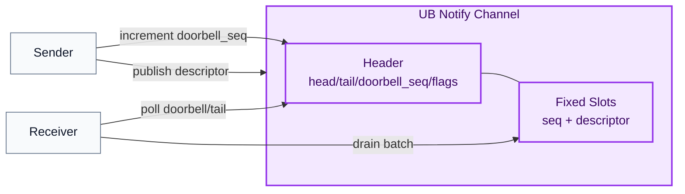
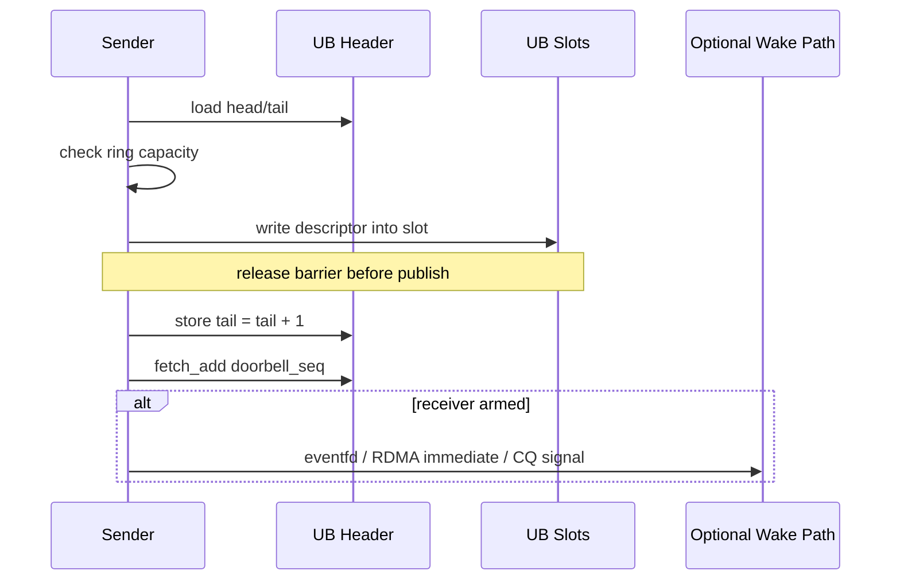
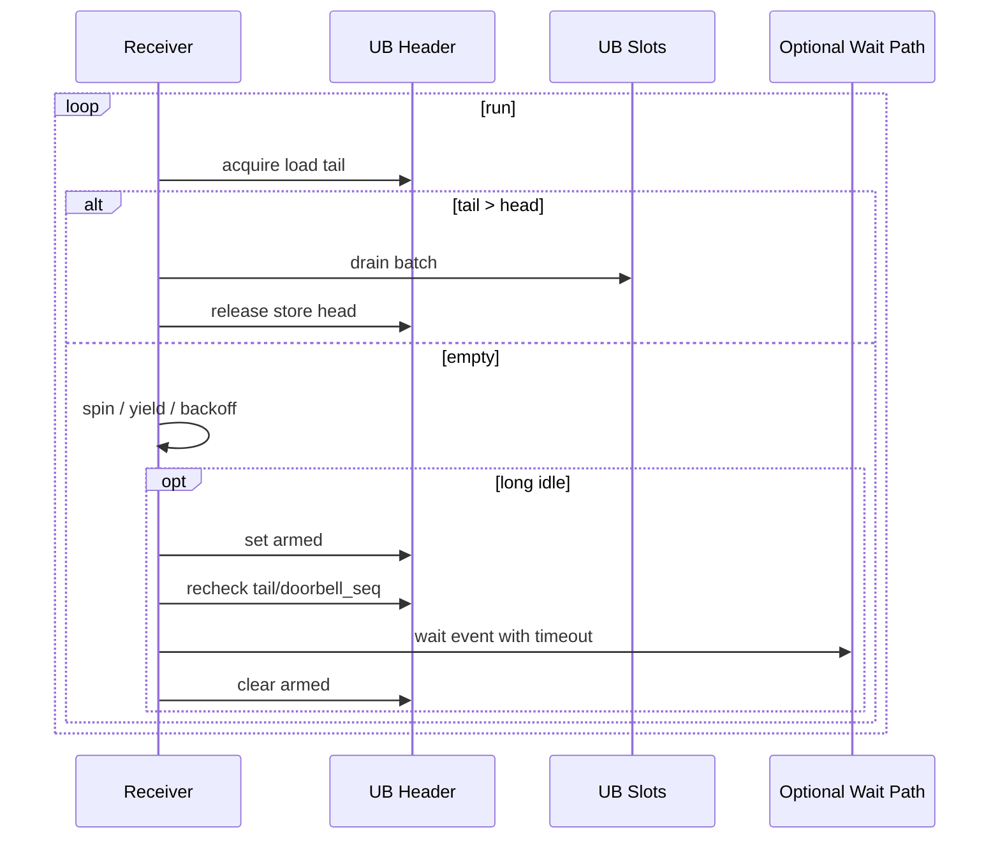

# VEMB V16 UB Sender/Receiver Notify 设计

日期：2026-06-08

## 核心结论

基于 UB 实现 sender/receiver 通知机制时，推荐把问题拆成两层：

```text
1. UB 承载共享队列和共享状态。
2. 通知语义通过 doorbell counter + receiver polling/backoff 实现。
```

第一阶段不依赖完整 Aeron Media Driver，也不直接引入 libfabric / UCX。推荐实现为：

```text
UB notify channel =
  DPDK-style fixed ring
  + Aeron-style position / idle strategy
  + doorbell_seq 单调递增通知计数
```

如果底层 UB/RDMA 支持 `Write With Immediate` 或 completion/event queue，再把 `doorbell_seq` 的更新扩展为硬件通知；如果是同机进程间通信，可用 `eventfd` 或 `futex` 作为 idle fallback。

## 设计目标

```text
1. sender 向 receiver 发送小 descriptor / notification。
2. 热路径无 syscall，优先使用 UB shared ring polling。
3. 空闲时允许 receiver 从 busy spin 降级到 yield / sleep / event wait。
4. 不丢通知：doorbell 使用单调递增 counter，不使用 bool。
5. publish-consume 必须使用 release/acquire，保证 slot payload 先于 tail/doorbell 可见。
6. 第一阶段优先 SPSC；多 sender 场景优先拆成多条 SPSC channel。
```

## 整体架构



## Channel 数据结构

第一阶段建议 SPSC ring。每个 sender/receiver pair 使用独立 channel，避免 MPSC/MPMC 的 CAS 和缓存争用。

```c
typedef struct vemb_v16_ub_notify_header {
    _Alignas(64) atomic_uint_fast64_t head;         /* receiver advances */
    _Alignas(64) atomic_uint_fast64_t tail;         /* sender advances */
    _Alignas(64) atomic_uint_fast64_t doorbell_seq; /* sender increments */
    _Alignas(64) atomic_uint_fast32_t armed;        /* optional idle hint */
    uint32_t slot_count;
    uint32_t slot_mask;
    uint32_t slot_size;
    uint32_t flags;
} vemb_v16_ub_notify_header_t;

typedef struct vemb_v16_ub_notify_slot {
    uint64_t seq;
    uint32_t op;
    uint32_t payload_len;
    uint64_t payload_handle;
    uint64_t req_id;
    uint8_t inline_payload[32];
} vemb_v16_ub_notify_slot_t;
```

字段说明：

```text
head / tail:
  标准 ring position

doorbell_seq:
  单调递增通知 counter
  只提示 receiver 有新事件发生
  不作为数据完整性依据

armed:
  可选 idle hint
  receiver 准备进入低功耗 wait 前置位
  sender 可根据 armed 决定是否触发 eventfd / immediate

slot.seq:
  可选 slot-level sequence
  用于检测 slot 是否已完整发布
```

## Sender 时序



伪代码：

```c
int ub_notify_publish(channel, descriptor) {
    tail = atomic_load_relaxed(&ch->tail);
    head = atomic_load_acquire(&ch->head);
    if (tail - head >= ch->slot_count)
        return FULL;

    slot = &ch->slots[tail & ch->slot_mask];
    memcpy(slot, descriptor, sizeof(*descriptor));

    atomic_store_release(&ch->tail, tail + 1);
    atomic_fetch_add_release(&ch->doorbell_seq, 1);

    if (atomic_load_acquire(&ch->armed))
        optional_wake_receiver();

    return OK;
}
```

关键规则：

```text
1. descriptor 写入必须先于 tail 发布。
2. tail 发布必须先于或等价先于 doorbell_seq 更新。
3. doorbell_seq 是 counter，不是 bool，避免 wake 合并导致丢通知。
4. ring full 时返回 FULL/BUSY，由调用方 backpressure。
```

## Receiver 时序



推荐消费端状态机：

```text
hot:
  连续 poll，追求最低延迟

warm:
  cpu_relax / yield，降低空转

idle:
  设置 armed
  再检查一次 tail/doorbell_seq
  若仍无 work，进入 eventfd / CQ / wait object

wake:
  清除 armed
  batch drain ring
```

伪代码：

```c
for (;;) {
    uint32_t n = ub_notify_drain_batch(ch, max_batch);
    if (n > 0) {
        idle = 0;
        continue;
    }

    if (idle < SPIN_BUDGET) {
        cpu_relax();
        idle++;
        continue;
    }

    if (idle < YIELD_BUDGET) {
        sched_yield();
        idle++;
        continue;
    }

    atomic_store_release(&ch->armed, 1);

    /*
     * Prevent lost wake: after arming, recheck the shared state before sleep.
     */
    if (ub_notify_available(ch) == 0)
        optional_wait_with_timeout();

    atomic_store_release(&ch->armed, 0);
    idle = 0;
}
```

这个模式和 libfabric 的 `fi_trywait()` 思路一致：从 poll 切换到 wait 前，必须再检查一次共享状态，避免 completion 刚好到达而 wait 端错过信号。

## 同机与跨机通知路径

```text
同机:
  hot path: shared ring polling
  idle path: eventfd / futex

跨机:
  hot path: UB ring polling
  idle path: RDMA Write With Immediate / provider CQ / UCX active message / libfabric wait object
```

注意：

```text
eventfd / futex 适合同机进程或线程。
远端写 UB memory 通常不会自动唤醒另一台机器上的 futex wait。
跨机真正 wake 需要底层 fabric 支持 immediate / CQ / event queue。
```

## Aeron 与 DPDK 的关系

二者都可以借鉴，但层级不同：

```text
DPDK rte_ring:
  高性能队列 primitive
  fixed-size FIFO
  支持 SP/SC、MP/MC、bulk enqueue/dequeue

Aeron:
  完整 messaging / transport 系统
  Publication / Subscription / Log Buffer / Media Driver
  包含 stream position、flow control、backpressure、idle strategy
```

对 UB notify 的推荐取舍：

```text
底层结构:
  参考 DPDK ring，保持固定 slot 和 head/tail 简洁热路径。

上层语义:
  参考 Aeron，使用 position、backpressure、batch drain、idle strategy。

不建议:
  第一阶段照搬完整 Aeron Media Driver。
```

可以理解为：

```text
结构像 DPDK
语义吸收简化 Aeron
```

Aeron 不是 DPDK ring 的封装；它使用类似 ring/log-buffer 的思想，在其上构建了更完整的 messaging 语义。

## libfabric / UCX / eventfd 的位置

这些机制更适合作为 idle/wake 或 provider abstraction，而不是替代 UB 热路径。

```text
eventfd:
  同机 wakeup
  进入内核，延迟高于纯 polling

futex:
  同机 wait/wake
  适合用户态共享状态 + 内核 sleep

libfabric shm:
  同机 provider
  不依赖 RDMA

libfabric verbs:
  RDMA verbs provider
  依赖 InfiniBand / RoCE / iWARP 等 RDMA 能力

UCX:
  HPC 通信框架
  可覆盖 shm、rdma、active message 等 transport

RDMA Write With Immediate:
  写远端 memory 并通知远端 CQ
  最贴近跨机 sender/receiver wake
```

## libfabric 消费端平衡策略

libfabric 的高性能消费端不是纯 poll，也不是纯 sleep，而是可调的混合策略：

```text
1. CQ / counter polling:
   延迟最低，CPU 空转最高。

2. Blocking CQ read:
   空闲时节省 CPU，唤醒延迟更高。

3. Wait object / wait set:
   聚合多个 CQ / counter / event queue。

4. fi_trywait:
   从 poll 切换到 wait 前处理竞态，避免丢通知。

5. Progress model:
   FI_PROGRESS_MANUAL 由应用线程推进进度。
   FI_PROGRESS_AUTO 由 provider 后台推进，可能引入内部线程。
```

对应到 UB notify，建议实现同样的状态机：

```text
spin N 次
yield/backoff M 次
设置 armed
recheck tail/doorbell_seq
进入 wait/event/CQ
醒来后 batch drain
```

## 延迟量级

以下仅作为工程量级判断，实际取决于硬件、provider、NUMA、绑核、busy polling 策略：

| 机制 | 典型延迟量级 | 说明 |
|---|---:|---|
| UB ring polling | ~50ns-500ns | 热路径无 syscall，跨 NUMA/远端 UB 会更高 |
| eventfd | ~0.5us-2us syscall path，sleep wake 常见 3us-20us+ | 同机低功耗 wake |
| UCX shm/rdma | shm 亚微秒到 ~1us，RDMA 小消息常见 ~1us-3us | 取决于 transport/provider |
| libfabric shm/verbs | shm 亚微秒级，verbs/RDMA 常见 ~1us-3us | provider 差异大 |
| RDMA Write With Immediate | 常见 ~1us-3us | 写远端并通知 CQ |
| TCP/socket | 常见 10us-50us+ | 通用可靠路径 |

## 与当前 VEMB V16 的关系

当前仓库已经有可复用的设计基础：

```text
src/vemb_v16_aeron_ring.h:
  fixed-slot SPSC ring
  acquire/release publish-consume

docs/VEMB_V16_IMPLEMENTATION_TODO.md:
  Linux pooled worker 已使用 eventfd 做 completion/job queue wakeup

docs/VEMB_V16_REMOTE_VSIM_UB_META_DESIGN.md:
  UB remote meta / shared allocator 已经要求共享状态 publish-consume
```

建议后续演进：

```text
P0:
  实现 UB SPSC notify ring + doorbell_seq + receiver polling/backoff。

P1:
  多 sender 场景先拆成 sender x receiver 多条 SPSC channel。

P2:
  同机 idle fallback 接 eventfd。

P3:
  跨机 idle fallback 接 RDMA immediate / libfabric CQ / UCX active message。
```

## 关键规则汇总

```text
1. UB notify 热路径先做 polling，不依赖 syscall。
2. doorbell_seq 必须是单调 counter，不能是 bool。
3. sender 先写 slot，再 release 发布 tail，再更新 doorbell。
4. receiver 从 poll 切到 wait 前必须重新检查 tail/doorbell。
5. 优先 SPSC；MPSC/MPMC 只在确有必要时引入。
6. eventfd/futex 适合同机，不适合作为跨机 remote UB wake 的唯一机制。
7. 跨机真正 wake 依赖 fabric immediate / CQ / event queue。
```
