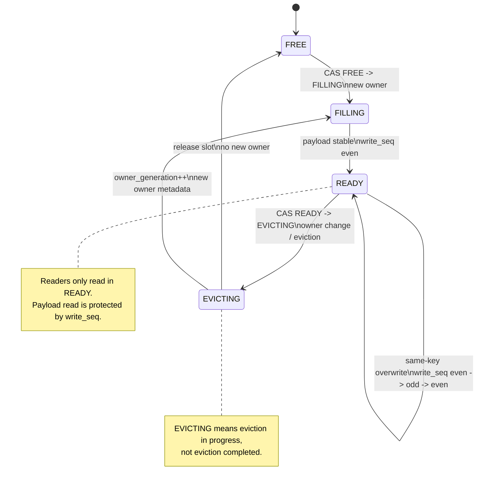

# VEMB V16 UB WARM Hash Cache 与淘汰设计

日期：2026-06-12

## 分配模式对比示意图

### 旧版 region append-only 分配模式

旧版 WARM region 把 payload 区域看成线性 append log。每次写入只递增
`shared_allocator.next_slot`，不会在 region 内按 key 定位，也不会复用旧 slot。

```text
UB WARM region N

+-------------------------+--------------------------------------------------+
| shared_allocator 64B    | payload slot array                               |
| next_slot = 5           |                                                  |
+-------------------------+--------------------------------------------------+
                          |
                          v
        +--------+--------+--------+--------+--------+--------+--------+
slot    |   0    |   1    |   2    |   3    |   4    |   5    |   6    |
        +--------+--------+--------+--------+--------+--------+--------+
owner   | keyA   | keyB   | keyC   | keyD   | keyE   | FREE   | FREE   |
        +--------+--------+--------+--------+--------+--------+--------+
                                                   ^
                                                   |
new key -> select region -> fetch_add(next_slot) --+
```

写入流程：

```text
new key
  -> select warm region
  -> atomic_fetch_add(shared_allocator.next_slot)
  -> 得到 local_slot
  -> 写 payload
  -> 返回 handle(region_id, local_slot, offset)

region full
  -> fallback next region
  -> all regions full 时 cold spill / invalid warm handle
```

这个模型简单，但长期运行时有两个核心问题：

```text
1. 旧 slot 不会在同一 region 内被淘汰复用。
2. region 写满后只能换 region 或降级，无法作为 bounded cache 稳态运行。
```

### 当前 hash / set-associative 分配模式

当前 WARM region 把 payload slot 组织成 bounded hash cache。key 先映射到固定
set，只在该 set 的 ways 内查找 same-key、FREE slot 或 victim slot。

```text
UB WARM region N

+--------------------------+
| warm_region_header 64B   |
+--------------------------+
| slot_meta array          |  64B * capacity_slots
| state / key_hash /       |
| owner_generation /       |
| write_seq / cold_state   |
+--------------------------+
| payload slot array       |  value_size * capacity_slots
+--------------------------+

key_hash
  |
  v
set_id = mix(key_hash) & (set_count - 1)
  |
  v

set 0:  +-------+-------+-------+-------+
        | way 0 | way 1 | way 2 | way 3 |
        +-------+-------+-------+-------+

set 1:  +-------+-------+-------+-------+
        | keyA  | FREE  | keyB  | keyC  |
        +-------+-------+-------+-------+
                  ^
                  |
new key maps here-+

set 2:  +-------+-------+-------+-------+
        | keyD  | keyE  | keyF  | keyG  |
        +-------+-------+-------+-------+
                  |
                  v
              set full:
              choose READY victim in this set
              owner_generation++
              overwrite payload
```

写入流程：

```text
new key
  -> set_id = mix(key_hash) & mask
  -> scan fixed ways in set
  -> same-key slot: overwrite in place, owner_generation 不变
  -> FREE slot: claim and fill
  -> set full: select victim way, owner_generation++, overwrite
  -> publish slot_meta READY
  -> async publish remote_meta candidate
```

读路径不信任旧 handle 本身，必须用 `slot_meta` 兜底校验：

```text
handle(region_id, local_slot, owner_generation)
  -> locate slot_meta[local_slot]
  -> key_hash / owner_generation / write_seq / state 校验
  -> 校验通过才读取 payload
  -> 校验失败视为 stale handle，走 miss/fallback 路径
```

因此当前模型的核心变化是：

```text
append-only:
  slot 只向前分配，满了换 region，不解决稳态淘汰。

hash/set-associative:
  key 被约束在固定 set 内，slot 可覆盖复用，旧 handle 由 owner_generation/write_seq 拒绝。
```

## 核心结论

旧版 UB WARM region 使用 `shared_allocator.next_slot` 做 append-style 分配：

```text
new key -> select region -> atomic_fetch_add(next_slot) -> local_slot
region full -> fallback next region
all regions full -> cold spill / invalid warm handle
```

这个模型适合第一阶段验证共享 UB payload 和跨 SuperNode handle，但不适合长期运行的内存淘汰。当前实现已切换为：

```text
slot_meta:
  payload slot 的权威状态，和 payload 位于同一个 UB warm region

remote_meta:
  key -> candidate handle 的远端查询 cache/index，可以过期

payload:
  按 hash/set-associative 选择 slot，可覆盖复用
```

核心规则：

```text
remote_meta 命中只代表“可能在这里”
slot_meta 校验通过才代表“这个 handle 当前仍有效”
```

## 当前实现状态

已落地第一版 bounded hash-cache 淘汰：

- WARM slot 的权威状态由 `slot_meta` 承担，读路径使用 `owner_generation + write_seq` 校验 stale handle 与半写 payload。
- 写路径先在 key 对应 set 内找 same-key slot，再找 FREE slot，最后选择可覆盖 READY victim；不做全 region scan。
- same-key overwrite 不切换 owner，只更新 `write_seq` 和 payload。
- victim 覆盖会递增 `owner_generation`，旧 handle 会在后续读路径被拒绝并计入 `warm_stale_handle_reject`。
- 当前第一版是 WARM cache 语义，COLD-aware only-evict-committed、append/replay 和 replica/Paxos 仍在后续设计中。
- 对外 stats 已暴露 `warm_eviction_success`、`warm_eviction_fail`、`warm_same_key_overwrite`、`warm_stale_handle_reject` 等实现指标。

## 目标

- 去掉 `next_slot` 作为长期分配策略，避免 region 满后只能 cold spill。
- 避免全局 free list 和全 region eviction scan。
- 支持 set 内局部淘汰，降低跨进程竞争范围。
- 保留 remote VSIM key2 的 `remote_meta` 快速 lookup 路径。
- 允许 `remote_meta` lazy invalidation，最终正确性由 `slot_meta` 兜底。
- 支持 COLD-backed cache 模式；UB primary + replica/Paxos 设计单独维护在 `docs/VEMB_V16_UB_WARM_REPLICA_PAXOS_DESIGN.md`。

## UB Region Layout

建议将 UB WARM region 从当前：

```text
[ shared_allocator 64B ][ payload bytes... ]
```

演进为：

```text
[ warm_region_header 64B ]
[ optional set_meta array ]
[ slot_meta array, 64B * capacity_slots ]
[ payload array, value_size * capacity_slots ]
```

## slot_meta Struct

`slot_meta` 是每个 payload slot 的权威状态，建议 64B 对齐，避免跨 cacheline 读写：

```c
typedef enum vemb_v16_warm_slot_state {
    VEMB_V16_WARM_SLOT_FREE = 0,
    VEMB_V16_WARM_SLOT_FILLING = 1,
    VEMB_V16_WARM_SLOT_READY = 2,
    VEMB_V16_WARM_SLOT_EVICTING = 3,
} vemb_v16_warm_slot_state_t;

typedef enum vemb_v16_warm_slot_cold_state {
    VEMB_V16_WARM_SLOT_COLD_NONE = 0,
    VEMB_V16_WARM_SLOT_COLD_PENDING = 1,
    VEMB_V16_WARM_SLOT_COLD_COMMITTED = 2,
} vemb_v16_warm_slot_cold_state_t;

typedef struct vemb_v16_warm_slot_meta {
    _Atomic uint32_t state;        /* FREE, FILLING, READY, EVICTING */
    uint32_t region_id;
    uint32_t local_slot;
    uint32_t bytes;
    _Atomic uint64_t owner_generation;
    _Atomic uint64_t write_seq;    /* odd = writing, even = stable */
    uint64_t key_hash;
    uint64_t key_fingerprint;
    _Atomic uint64_t last_access_ns;
    _Atomic uint32_t clock_bit;
    _Atomic uint32_t cold_state;   /* NONE, PENDING, COMMITTED */
} vemb_v16_warm_slot_meta_t;       /* target: 64B */

_Static_assert(sizeof(vemb_v16_warm_slot_meta_t) == 64,
               "vemb_v16_warm_slot_meta_t must be one UB cacheline");
```

## owner_generation 与 write_seq

读多写少场景下，建议使用 `owner_generation + write_seq odd/even` 组合：

```text
owner_generation:
  slot owner epoch。
  只在 slot 从一个 key 切换到另一个 key、FREE 后复用、delete 后复用时递增。
  same-key overwrite 不递增。

write_seq:
  payload stability sequence。
  每次写 payload 都更新。
  odd  = writer in progress
  even = stable readable
```

职责拆分：

```text
owner_generation 解决旧 handle 指向被复用 slot 的问题。
write_seq 解决读到半写 payload 的问题。
```

读路径只做 atomic load，不需要 `refcnt++/--`，避免读多场景下频繁写共享 `slot_meta` cacheline。

## slot_meta.state 状态机

状态机：

```text
FREE -> FILLING -> READY -> EVICTING -> FILLING -> READY
                     |
                     v
                   FREE
```

slot owner 切换完整链路：

```text
READY(old owner)
  -> EVICTING(old owner being invalidated)
  -> FILLING(new owner being written)
  -> READY(new owner)
```

也就是：

```text
READY(keyA)
  -- CAS state READY -> EVICTING -->
EVICTING(keyA invalidating)
  -- owner_generation++, write new owner metadata -->
FILLING(keyB writing)
  -- payload stable, write_seq even -->
READY(keyB)
```

`EVICTING` 表示“淘汰进行中 / 旧 owner 正在被驱逐”，不是淘汰完成。完成后要么：

```text
EVICTING -> FREE
```

要么进入新 owner 写入：

```text
EVICTING -> FILLING -> READY
```

same-key overwrite 不走 owner 切换链路：

```text
READY(keyA)
  -- write_seq even -> odd -> even -->
READY(keyA)
```

流程图：



状态语义：

```text
FREE:
  slot 当前没有有效 payload。
  writer 可以通过 CAS 抢占:
    FREE -> FILLING

FILLING:
  writer 正在初始化 FREE slot 或把 victim 写成新 owner。
  reader 看到 FILLING 必须当 miss/retry。
  写完成后:
    FILLING -> READY

READY:
  slot 当前保存一个有效 vector。
  reader 只有看到 READY，且 owner_generation/key_hash/bytes 校验通过，
  才能进入 write_seq 保护的 payload read。
  same-key overwrite 不需要改变 state，只需要抢 write_seq。
  换 owner / eviction 可以通过 CAS 抢占:
    READY -> EVICTING

EVICTING:
  slot 已被某个 writer 选为 victim，准备换 owner。
  新 reader 看到 EVICTING 必须 miss/retry。
  evictor 确认 old owner 可安全覆盖后:
    EVICTING -> FILLING
  如果只是释放 slot:
    EVICTING -> FREE
```

## 典型读写流程

FREE slot 写入：

```text
1. CAS state: FREE -> FILLING。
2. CAS/write write_seq 为 odd。
3. owner_generation++。
4. 更新 key_hash / key_fingerprint / bytes / cold_state。
5. 写 payload bytes。
6. store write_seq = next even with release。
7. store state = READY with release。
8. publish remote_meta candidate handle。
```

读路径使用 seqlock 风格：

```text
retry:
  1. load state with acquire。
  2. 如果 state != READY，返回 miss/retry。
  3. seq1 = load write_seq with acquire。
  4. 如果 seq1 是 odd，retry。
  5. 读取 owner_generation / key_hash / bytes。
  6. 校验:
       owner_generation == handle.owner_generation
       key_hash == lookup_key_hash
       bytes == expected_bytes
  7. 读取 payload。
  8. seq2 = load write_seq with acquire。
  9. 如果 seq1 != seq2 或 seq2 是 odd，retry。
  10. success。
```

same-key overwrite：

```text
1. 找到 same-key READY slot。
2. CAS write_seq even -> odd。
3. 写 payload bytes。
4. 更新 bytes / cold_state / last_access_ns。
5. store write_seq = old + 2 with release。
6. owner_generation 不递增。
7. remote_meta 不需要因为 same-key overwrite 更新 owner_generation。
```

换 owner / 淘汰覆盖：

```text
1. CAS state: READY -> EVICTING。
2. 确认旧 owner 可以安全覆盖。
3. CAS write_seq even -> odd。
4. owner_generation++。
5. 更新 key_hash / key_fingerprint / bytes / cold_state。
6. 写新 payload bytes。
7. store write_seq = old + 2 with release。
8. store state = READY with release。
9. publish 新 remote_meta candidate handle。
```

关键约束：

```text
1. 只有 READY 可以被 reader 读取。
2. write_seq odd 时 payload 不稳定，reader 必须 retry。
3. owner_generation 只在 slot 换 owner / 复用 / delete 后复用时递增。
4. same-key overwrite 不递增 owner_generation。
5. remote_meta 返回的 handle 必须经过 slot_meta 校验。
6. 未达到可覆盖条件的 READY slot 不允许被淘汰。
```

## remote_meta Entry V2

remote_meta 对外发布的是 candidate locator，不保存 payload 权威字段：

```c
typedef struct vemb_v16_remote_meta_entry_v2 {
    _Atomic uint32_t version;      /* odd = publishing, even = stable */
    uint32_t flags;
    uint64_t key_hash;
    uint64_t key_fingerprint;
    uint32_t region_id;
    uint32_t local_slot;
    uint64_t owner_generation;
    uint64_t offset;
    uint8_t reserved[16];
} vemb_v16_remote_meta_entry_v2_t; /* target: 64B */

_Static_assert(sizeof(vemb_v16_remote_meta_entry_v2_t) == 64,
               "vemb_v16_remote_meta_entry_v2_t must be one UB cacheline");
```

remote_meta 不保存：

```text
bytes
state
cold_state
write_seq
last_access
```

这些字段全部以 `slot_meta` 为准。remote_meta lookup 命中后，只能得到候选：

```text
{region_id, local_slot, offset, owner_generation}
```

是否真的可读必须继续校验 `slot_meta`。

## Handle ABI

当前 handle 主要是：

```text
{region_id, offset, bytes, key_hash}
```

支持 slot 复用后，需要增加：

```text
{region_id, local_slot, offset, bytes, key_hash, owner_generation}
```

读路径必须使用 `local_slot` 找到 `slot_meta[local_slot]`，并校验：

```text
slot_meta.state == READY
slot_meta.key_hash == handle.key_hash
slot_meta.owner_generation == handle.owner_generation
slot_meta.bytes == handle.bytes
slot_meta.write_seq 为 stable even，且读前读后一致
```

## Set-Associative Placement

推荐第一版使用 8-way set-associative WARM cache；如果需要先降低复杂度，可以从 4-way 起步：

```text
ways = 8
set_count = capacity_slots / ways
set = hash(key) % set_count
candidate slots = [set * ways, set * ways + ways)
```

它是 direct-mapped 和 fully-associative 的折中：

```text
direct-mapped:
  slot = hash(key) % capacity_slots
  lookup 最快，但冲突时只能覆盖同一个 slot

fully-associative:
  key 可以放任意 slot
  冲突少，但 lookup/eviction 接近全局扫描

set-associative:
  key 只能放在一个小 set 的 N 个 ways 中
  lookup/eviction 只扫描 N 个 slot，冲突率明显低于 direct-mapped
```

因为 remote_meta 保存 candidate locator，远端 VSIM key2 不需要从 hash 反推唯一 set；remote_meta 命中后读目标 `slot_meta` 做最终校验即可。

## 替换 shared_allocator 的写入流程

`shared_allocator_alloc()` 的长期语义应从“返回下一个 free slot”改成“为 key 选择可写 slot”。建议逐步改名为 `warm_cache_place()` 或类似接口。

写入流程：

```text
1. 根据 key_hash 选择 warm region。
2. 在 region 内计算 set = hash(key) % set_count。
3. 扫描 set 的 ways：
     a. 如果已有 same key_hash/fingerprint 的 READY slot，选择原地覆盖。
     b. 如果存在 FREE slot，选择 FREE slot。
     c. 否则选择可淘汰 READY victim。
4. same-key overwrite:
     CAS write_seq even -> odd
     写 payload bytes
     store write_seq = next even
     owner_generation 不递增
5. FREE slot:
     CAS state FREE -> FILLING
     write_seq 置 odd
     owner_generation++
     写 key_hash / fingerprint / payload bytes
     store write_seq = next even
     store state = READY
6. victim slot:
     CAS state READY -> EVICTING
     确认旧 owner 可安全覆盖
     CAS write_seq even -> odd
     state = FILLING
     owner_generation++
     写 key_hash / fingerprint / payload bytes
     store write_seq = next even
     store state = READY
7. publish remote_meta:
     key -> {region_id, local_slot, offset, owner_generation}
```

same-key overwrite 不递增 `owner_generation`，因为语义是“该 key 的 payload 总是最新”。payload 写入过程由 `write_seq` odd/even 保护，避免 reader 读到半写 vector。


## VADD 冲突处理策略

推荐策略：

```text
8-way set-associative
+ bounded retry
+ same-key overwrite
+ FREE slot first
+ only evict COLD_COMMITTED victim
+ region fallback
+ COLD-only final fallback
```

WARM 是 cache，不要求每次 VADD 都必须进入 WARM。写入可靠性由 COLD commit 保证；WARM placement 失败时，不应该让写请求长时间自旋或失败。

建议写入决策：

```text
VADD key vector:
  1. 先写 COLD，或进入 COLD_PENDING。
  2. 选择 primary warm region。
  3. 在 region 内计算 set = hash(key) % set_count。
  4. 对当前 set 做 bounded retry，例如 2~3 次：
       a. 找 same-key READY slot，CAS write_seq even -> odd 后原地覆盖。
       b. 找 FREE slot，CAS FREE -> FILLING 后写入。
       c. 找可淘汰 READY victim，要求 cold_state == COLD_COMMITTED。
  5. 当前 set 无可写 slot 或 CAS 连续失败，则 fallback 到下一个候选 region。
  6. 所有 region 都失败，则 COLD-only，本次不发布可读 WARM handle。
```

不同冲突类型：

```text
同 key 并发 VADD:
  使用 CAS write_seq even -> odd 抢占 same-key slot。
  CAS 成功的 writer 获得写权。
  CAS 失败的 writer bounded retry。
  owner_generation 不递增，最终语义是 last writer wins。

不同 key 落到同一个 set:
  先找 FREE。
  无 FREE 时选择 COLD_COMMITTED victim。
  无 victim 时 region fallback / COLD-only。

remote_meta stale:
  不影响正确性。
  remote_meta 返回旧 handle 时，slot_meta.owner_generation 或 key_hash 校验会失败。
  可在 verify fail 时做 lazy cleanup。
```

建议第一版参数：

```text
ways = 8
target warm load <= 70%
high watermark = 80%
low watermark = 70%
bounded retry = 2~3 rounds per set
```

## 内存淘汰策略

第一版不做全局 LRU，也不做全 region scan。淘汰只发生在当前 key 命中的 set 内，使用 set 内 CLOCK/LRU-lite：

```text
set = hash(key) % set_count
candidate slots = [set * ways, set * ways + ways)
```

核心原则：

```text
WARM 是 cache。
remote_meta 可以 stale，但 payload read 必须 slot_meta 校验。
前台淘汰必须 bounded retry，不能让 VADD 长时间自旋。
后台负责水位控制和推进 COLD_PENDING，而不是在热路径上做重活。
```

Victim 选择：

```text
1. FREE slot
   不算淘汰，直接 CAS FREE -> FILLING。

2. READY && cold_state == COLD_COMMITTED && clock_bit == 0
   最优 victim。

3. READY && cold_state == COLD_COMMITTED && last_access 最旧
   次优 victim。

4. 其他状态跳过:
   FILLING
   EVICTING
   COLD_PENDING
   write_seq odd
```

前台淘汰流程：

```text
1. 在 set 内选择 candidate victim。
2. CAS victim.state: READY -> EVICTING。
3. CAS 失败:
     换 victim 或 retry 当前 set。
4. CAS 成功后再次确认:
     cold_state == COLD_COMMITTED
     write_seq 是 stable even
     owner_generation/key_hash 没有被其他 writer 改变
5. 如果确认失败:
     state 恢复 READY
     换 victim 或 fallback。
6. CAS write_seq even -> odd。
7. store state = FILLING。
8. owner_generation++。
9. 更新 key_hash / key_fingerprint / bytes / cold_state。
10. 写新 payload bytes。
11. store write_seq = next even with release。
12. store state = READY with release。
13. publish 新 remote_meta candidate handle。
```

旧 remote_meta 不需要同步删除。旧 handle 会在 `slot_meta.owner_generation` 或 `key_hash` 校验时失败：

```text
remote_meta lookup hit
slot_meta verify failed
if remote_meta.owner_generation != slot_meta.owner_generation ||
   remote_meta.key_hash != slot_meta.key_hash:
  CAS clear stale remote_meta entry
```

## COLD 状态

`cold_state` 表示是否已有 COLD 副本：

```text
COLD_NONE:
  当前 slot 还没有 COLD 副本。
  不允许被淘汰。

COLD_PENDING:
  当前 slot 的 payload 已写入 WARM，但 COLD 写入/提交还在进行中。
  不允许被淘汰。

COLD_COMMITTED:
  当前 slot 的 payload 已经成功写入 COLD。
  可以作为 eviction victim，被覆盖或释放。
```

淘汰必须检查：

```text
slot_meta.state == READY
slot_meta.cold_state == COLD_COMMITTED
```

UB primary + replica/Paxos 方向不放在本文展开，见 `docs/VEMB_V16_UB_WARM_REPLICA_PAXOS_DESIGN.md`。

## 分阶段落地

建议按以下顺序演进：

```text
Phase 1: handle 扩展
  增加 local_slot/owner_generation 字段。
  remote_meta entry 同步增加 owner_generation/local_slot。

Phase 2: slot_meta layout
  UB region 增加 slot_meta array。
  仍保留 next_slot 分配，但写入时初始化 slot_meta。
  所有 read path 增加 slot_meta verify。

Phase 3: remote_meta cache 语义
  remote_meta 不再视为权威位置。
  lookup hit 后必须 slot_meta verify。
  verify fail 进入 retry / miss / lazy cleanup。

Phase 4: hash/set-associative placement
  shared_allocator 从 next_slot 切到 set 内 placement。
  支持 same-key overwrite、FREE slot、set 内 victim。

Phase 5: COLD-aware eviction
  增加 cold_state。
  只有 COLD_COMMITTED victim 可淘汰。
  接入 COLD fallback。

Phase 6: 优化
  write_seq retry backoff。
  per-set victim_hand。
  per-region/per-set stats。
  stale remote_meta lazy cleanup。
```

## 需要补充的统计

建议新增统计：

```text
warm_hash_lookup
warm_slot_verify_ok
warm_slot_verify_stale
warm_same_key_overwrite
warm_free_slot_alloc
warm_evict_attempt
warm_evict_success
warm_evict_skip_cold_pending
warm_evict_skip_write_busy
warm_rehydrate_from_cold
remote_meta_stale
remote_meta_lazy_clear
```
